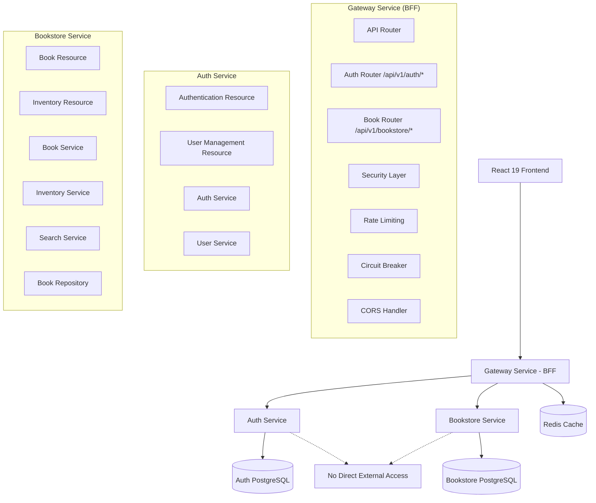

# Bookstore Service Design Document

## Overview

The Bookstore Service is a Spring Boot 3.5.6 microservice that provides book catalog and inventory management capabilities. It follows the established three-tier architecture pattern and integrates seamlessly with the existing Gateway Service and Auth Service. The service uses PostgreSQL for data persistence and implements modern Java 21 features throughout the codebase.

## Architecture

### Three-Tier Architecture Implementation

```
org.gripday.bookstore/
├── presentation/web/          # REST controllers (BookResource, InventoryResource)
├── domain/service/           # Business logic (BookService, InventoryService, SearchService)
├── infrastructure/repository/ # Data access (BookRepository, CategoryRepository)
└── BookstoreServiceApplication.java
```

### Service Integration



## Backend for Frontend (BFF) Integration

### Gateway Service as API Umbrella

The Gateway Service acts as the unified entry point for all React 19 frontend applications, providing:

- **Unified API Surface**: Single endpoint for all microservice operations
  - Authentication: `/api/v1/auth/*` → Auth Service
  - Bookstore: `/api/v1/bookstore/*` → Bookstore Service
- **Authentication Handling**: JWT token validation and user context propagation across all services
- **CORS Management**: React 19 development server support (localhost:5173) and production policies
- **Rate Limiting**: Per-user and per-endpoint rate limiting for all microservice operations
- **Circuit Breaker**: Fault tolerance and graceful degradation for all microservice failures

### Frontend-Optimized Responses

The bookstore service provides responses optimized for React 19 consumption:

```java
public record BookCatalogResponse(
    List<BookDto> books,
    PaginationInfo pagination,
    FilterOptions availableFilters,
    SearchSuggestions suggestions
) {}

public record PaginationInfo(
    int currentPage,
    int totalPages,
    long totalElements,
    int pageSize,
    boolean hasNext,
    boolean hasPrevious
) {}

public record FilterOptions(
    List<String> categories,
    PriceRange priceRange,
    List<String> authors
) {}
```

### Gateway Service Routing Configuration

```yaml
# Gateway Service Configuration
spring:
  cloud:
    gateway:
      routes:
        - id: bookstore-catalog
          uri: lb://bookstore-service
          predicates:
            - Path=/api/v1/bookstore/books/**
          filters:
            - name: RequestRateLimiter
              args:
                redis-rate-limiter.replenishRate: 10
                redis-rate-limiter.burstCapacity: 20
        
        - id: bookstore-inventory
          uri: lb://bookstore-service
          predicates:
            - Path=/api/v1/bookstore/inventory/**
          filters:
            - name: CircuitBreaker
              args:
                name: bookstore-circuit-breaker
                fallbackUri: forward:/fallback/bookstore
```

## Components and Interfaces

### Presentation Layer (presentation.web)

#### BookResource (accessed via Gateway Service BFF)
- `GET /api/v1/bookstore/books` - Paginated book listing with search and filter capabilities
- `GET /api/v1/bookstore/books/{id}` - Individual book details
- `POST /api/v1/bookstore/books` - Create new book (admin only)
- `PUT /api/v1/bookstore/books/{id}` - Update book information (admin only)
- `DELETE /api/v1/bookstore/books/{id}` - Remove book from catalog (admin only)

#### InventoryResource (accessed via Gateway Service BFF)
- `GET /api/v1/bookstore/inventory/{bookId}` - Get current inventory levels
- `PUT /api/v1/bookstore/inventory/{bookId}` - Update inventory quantity (admin only)
- `POST /api/v1/bookstore/inventory/bulk-update` - Bulk inventory operations (admin only)

**Note**: All endpoints are accessed through the Gateway Service which routes to internal service endpoints. Direct external access to bookstore service is not permitted.

### Domain Layer (domain.service)

#### BookService
```java
public class BookService {
    public Page<BookDto> findBooks(BookSearchCriteria criteria, Pageable pageable);
    public Optional<BookDto> findBookById(Long id);
    public BookDto createBook(CreateBookRequest request, UserContext userContext);
    public BookDto updateBook(Long id, UpdateBookRequest request, UserContext userContext);
    public void deleteBook(Long id, UserContext userContext);
}
```

#### InventoryService
```java
public class InventoryService {
    public InventoryDto getInventory(Long bookId);
    public InventoryDto updateInventory(Long bookId, UpdateInventoryRequest request, UserContext userContext);
    public List<InventoryDto> bulkUpdateInventory(List<BulkInventoryRequest> requests, UserContext userContext);
    public boolean isBookAvailable(Long bookId, int requestedQuantity);
}
```

#### SearchService
```java
public class SearchService {
    public Page<BookDto> searchByTitle(String title, Pageable pageable);
    public Page<BookDto> searchByAuthor(String author, Pageable pageable);
    public Page<BookDto> searchByCategory(String category, Pageable pageable);
    public Page<BookDto> searchByPriceRange(BigDecimal minPrice, BigDecimal maxPrice, Pageable pageable);
}
```

### Infrastructure Layer (infrastructure.repository)

#### BookRepository
```java
@Repository
public interface BookRepository extends JpaRepository<Book, Long> {
    Page<Book> findByTitleContainingIgnoreCase(String title, Pageable pageable);
    Page<Book> findByAuthorContainingIgnoreCase(String author, Pageable pageable);
    Page<Book> findByCategoryName(String categoryName, Pageable pageable);
    Page<Book> findByPriceBetween(BigDecimal minPrice, BigDecimal maxPrice, Pageable pageable);
    @Query("SELECT b FROM Book b WHERE b.available = true")
    Page<Book> findAvailableBooks(Pageable pageable);
}
```

## Data Models

### Book Entity
```java
@Entity
@Table(name = "books")
public class Book {
    @Id
    @GeneratedValue(strategy = GenerationType.IDENTITY)
    private Long id;
    
    @Column(nullable = false)
    private String title;
    
    @Column(nullable = false)
    private String author;
    
    @Column(unique = true, nullable = false)
    private String isbn;
    
    @Column(columnDefinition = "TEXT")
    private String description;
    
    @Column(nullable = false, precision = 10, scale = 2)
    private BigDecimal price;
    
    @ManyToOne(fetch = FetchType.LAZY)
    @JoinColumn(name = "category_id")
    private Category category;
    
    @OneToOne(mappedBy = "book", cascade = CascadeType.ALL, fetch = FetchType.LAZY)
    private Inventory inventory;
    
    @Column(nullable = false)
    private boolean available = true;
    
    @CreationTimestamp
    private LocalDateTime createdAt;
    
    @UpdateTimestamp
    private LocalDateTime updatedAt;
}
```

### Inventory Entity
```java
@Entity
@Table(name = "inventory")
public class Inventory {
    @Id
    @GeneratedValue(strategy = GenerationType.IDENTITY)
    private Long id;
    
    @OneToOne(fetch = FetchType.LAZY)
    @JoinColumn(name = "book_id", nullable = false)
    private Book book;
    
    @Column(nullable = false)
    private int quantity = 0;
    
    @Column(nullable = false)
    private int reservedQuantity = 0;
    
    @Column(nullable = false)
    private int lowStockThreshold = 5;
    
    @CreationTimestamp
    private LocalDateTime createdAt;
    
    @UpdateTimestamp
    private LocalDateTime updatedAt;
}
```

### Category Entity
```java
@Entity
@Table(name = "categories")
public class Category {
    @Id
    @GeneratedValue(strategy = GenerationType.IDENTITY)
    private Long id;
    
    @Column(nullable = false, unique = true)
    private String name;
    
    @Column(columnDefinition = "TEXT")
    private String description;
    
    @OneToMany(mappedBy = "category", cascade = CascadeType.ALL)
    private List<Book> books = new ArrayList<>();
}
```

### DTOs and Records
```java
public record BookDto(
    Long id,
    String title,
    String author,
    String isbn,
    String description,
    BigDecimal price,
    String categoryName,
    boolean available,
    int availableQuantity,
    LocalDateTime createdAt,
    LocalDateTime updatedAt
) {}

public record CreateBookRequest(
    String title,
    String author,
    String isbn,
    String description,
    BigDecimal price,
    Long categoryId,
    int initialQuantity
) {}

public record UpdateBookRequest(
    String title,
    String author,
    String description,
    BigDecimal price,
    Long categoryId
) {}

public record InventoryDto(
    Long bookId,
    String bookTitle,
    int quantity,
    int reservedQuantity,
    int availableQuantity,
    int lowStockThreshold,
    boolean lowStock,
    LocalDateTime lastUpdated
) {}

public record BookSearchCriteria(
    String title,
    String author,
    String category,
    BigDecimal minPrice,
    BigDecimal maxPrice,
    Boolean availableOnly
) {}
```

## Error Handling

### Custom Exception Classes
```java
public class BookNotFoundException extends RuntimeException {
    public BookNotFoundException(Long bookId) {
        super("Book not found with ID: " + bookId);
    }
}

public class InsufficientInventoryException extends RuntimeException {
    public InsufficientInventoryException(Long bookId, int requested, int available) {
        super("Insufficient inventory for book ID: " + bookId + 
              ". Requested: " + requested + ", Available: " + available);
    }
}

public class DuplicateIsbnException extends RuntimeException {
    public DuplicateIsbnException(String isbn) {
        super("Book with ISBN already exists: " + isbn);
    }
}
```

### Global Exception Handler
```java
@RestControllerAdvice
public class BookstoreExceptionHandler {
    
    @ExceptionHandler(BookNotFoundException.class)
    public ResponseEntity<ErrorResponse> handleBookNotFound(BookNotFoundException ex) {
        var error = new ErrorResponse(
            "RESOURCE_NOT_FOUND",
            ex.getMessage(),
            "The requested book could not be found",
            Instant.now(),
            // ... additional fields
        );
        return ResponseEntity.status(HttpStatus.NOT_FOUND).body(error);
    }
    
    @ExceptionHandler(InsufficientInventoryException.class)
    public ResponseEntity<ErrorResponse> handleInsufficientInventory(InsufficientInventoryException ex) {
        var error = new ErrorResponse(
            "DOMAIN_INSUFFICIENT_INVENTORY",
            ex.getMessage(),
            "Not enough inventory available for the requested operation",
            Instant.now(),
            // ... additional fields
        );
        return ResponseEntity.status(HttpStatus.CONFLICT).body(error);
    }
}
```

## Testing Strategy

### Unit Testing Focus
- **BookService**: Test core business logic for book CRUD operations and validation
- **InventoryService**: Test inventory management and availability calculations
- **SearchService**: Test search functionality and filtering logic
- **Repository Layer**: Test custom query methods and data access patterns

### Integration Testing
- **API Endpoints**: Test REST controllers with mock authentication context
- **Database Operations**: Test repository methods with @DataJpaTest
- **Service Integration**: Test service layer interactions with @SpringBootTest

### Test Data Strategy
```java
@TestConfiguration
public class BookstoreTestConfiguration {
    
    @Bean
    @Primary
    public BookTestDataFactory bookTestDataFactory() {
        return new BookTestDataFactory();
    }
}

public class BookTestDataFactory {
    public Book createTestBook() {
        return Book.builder()
            .title("Test Book")
            .author("Test Author")
            .isbn("978-0123456789")
            .description("A test book for unit testing")
            .price(new BigDecimal("29.99"))
            .available(true)
            .build();
    }
}
```

## Security Integration

### JWT Authentication Integration
```java
@Component
public class UserContextExtractor {
    
    public UserContext extractFromJwt(String jwtToken) {
        // Extract user context from JWT claims
        var claims = jwtDecoder.decode(jwtToken).getClaims();
        
        return new UserContext(
            claims.get("userId", Long.class),
            claims.get("username", String.class),
            claims.get("email", String.class),
            extractRoles(claims),
            extractPermissions(claims),
            claims.get("department", String.class),
            claims.get("organizationId", String.class),
            extractCustomClaims(claims)
        );
    }
}
```

### Authorization Enforcement
```java
@PreAuthorize("hasRole('ADMIN')")
public BookDto createBook(CreateBookRequest request, UserContext userContext) {
    // Implementation
}

@PreAuthorize("hasRole('ADMIN')")
public InventoryDto updateInventory(Long bookId, UpdateInventoryRequest request, UserContext userContext) {
    // Implementation
}
```

## Configuration

### Database Configuration
```yaml
spring:
  datasource:
    url: jdbc:postgresql://localhost:5432/bookstore_db
    username: ${DB_USERNAME:bookstore_user}
    password: ${DB_PASSWORD:bookstore_pass}
  
  jpa:
    hibernate:
      ddl-auto: validate
    show-sql: false
    properties:
      hibernate:
        dialect: org.hibernate.dialect.PostgreSQLDialect
        format_sql: true
  
  liquibase:
    change-log: classpath:db/changelog/db.changelog-master.xml
```

### Redis Caching Configuration
```yaml
spring:
  data:
    redis:
      host: ${REDIS_HOST:localhost}
      port: ${REDIS_PORT:6379}
      password: ${REDIS_PASSWORD:}
      timeout: 2000ms
  
  cache:
    type: redis
    redis:
      time-to-live: 600000  # 10 minutes
```

### React 19 Frontend Integration

#### Gateway Service Configuration (BFF Pattern)
```yaml
# Gateway Service handles all external access for all microservices
spring:
  cloud:
    gateway:
      routes:
        # Auth Service Routes
        - id: auth-login
          uri: lb://auth-service
          predicates:
            - Path=/api/v1/auth/login
          filters:
            - name: RequestRateLimiter
              args:
                redis-rate-limiter.replenishRate: 5
                redis-rate-limiter.burstCapacity: 10
        
        - id: auth-users
          uri: lb://auth-service
          predicates:
            - Path=/api/v1/auth/users/**
          filters:
            - name: CircuitBreaker
              args:
                name: auth-circuit-breaker
                fallbackUri: forward:/fallback/auth
        
        # Bookstore Service Routes
        - id: bookstore-catalog
          uri: lb://bookstore-service
          predicates:
            - Path=/api/v1/bookstore/books/**
          filters:
            - name: RequestRateLimiter
              args:
                redis-rate-limiter.replenishRate: 10
                redis-rate-limiter.burstCapacity: 20
            - name: CircuitBreaker
              args:
                name: bookstore-circuit-breaker
                fallbackUri: forward:/fallback/bookstore
        
        - id: bookstore-inventory
          uri: lb://bookstore-service
          predicates:
            - Path=/api/v1/bookstore/inventory/**
          filters:
            - name: CircuitBreaker
              args:
                name: bookstore-circuit-breaker
                fallbackUri: forward:/fallback/bookstore
      
      globalcors:
        cors-configurations:
          '[/**]':
            allowedOrigins: 
              - "http://localhost:5173"  # Vite + React 19 dev server
              - "https://bookstore.gripday.org"  # Production
            allowedMethods: [GET, POST, PUT, DELETE, OPTIONS]
            allowedHeaders: "*"
            allowCredentials: true
            maxAge: 3600
```

#### Frontend-Optimized Response DTOs
```java
// Enhanced response for React 19 state management
public record BookCatalogResponse(
    List<BookDto> books,
    PaginationMetadata pagination,
    FilterMetadata filters,
    SearchMetadata search
) {}

public record PaginationMetadata(
    int currentPage,
    int totalPages,
    long totalElements,
    int pageSize,
    boolean hasNext,
    boolean hasPrevious,
    String nextPageUrl,
    String previousPageUrl
) {}

public record FilterMetadata(
    List<CategoryFilter> categories,
    PriceRangeFilter priceRange,
    List<AuthorFilter> authors,
    AvailabilityFilter availability
) {}
```

#### React 19 Usage Examples
```javascript
// All API calls through Gateway Service BFF - unified access pattern
// Authentication through Gateway
const loginResponse = await fetch('/api/v1/auth/login', {
  method: 'POST',
  headers: { 'Content-Type': 'application/json' },
  body: JSON.stringify({ username, password })
}).then(res => res.json());

const token = loginResponse.token;

// Bookstore operations through Gateway
const { data: books, pagination, filters } = await fetch('/api/v1/bookstore/books', {
  headers: {
    'Authorization': `Bearer ${token}`,
    'Content-Type': 'application/json'
  }
}).then(res => res.json());

// User management through Gateway (admin only)
const users = await fetch('/api/v1/auth/users', {
  headers: {
    'Authorization': `Bearer ${token}`,
    'Content-Type': 'application/json'
  }
}).then(res => res.json());

// Unified React 19 state management structure
const appState = {
  auth: { user: {...}, token: '...', isAuthenticated: true },
  bookstore: { 
    books: [...], 
    pagination: { currentPage: 1, totalPages: 10, hasNext: true },
    filters: { categories: [...], priceRange: {...} }
  },
  admin: { users: [...] }  // admin role only
};
```

### OpenAPI Documentation
```java
@Configuration
public class OpenApiConfiguration {
    
    @Bean
    public OpenAPI bookstoreOpenAPI() {
        return new OpenAPI()
            .info(new Info()
                .title("Bookstore Service API")
                .description("Book catalog and inventory management service")
                .version("v1.0"))
            .addSecurityItem(new SecurityRequirement().addList("bearerAuth"))
            .components(new Components()
                .addSecuritySchemes("bearerAuth", 
                    new SecurityScheme()
                        .type(SecurityScheme.Type.HTTP)
                        .scheme("bearer")
                        .bearerFormat("JWT")));
    }
}