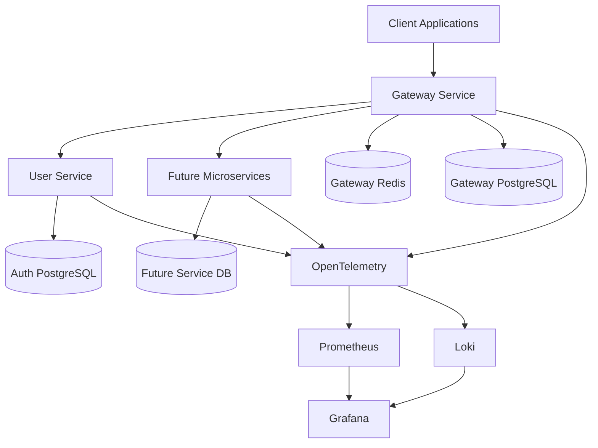
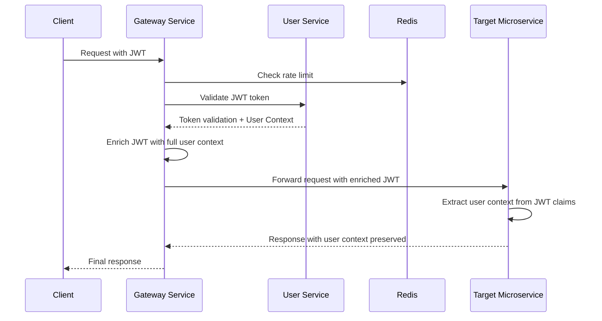
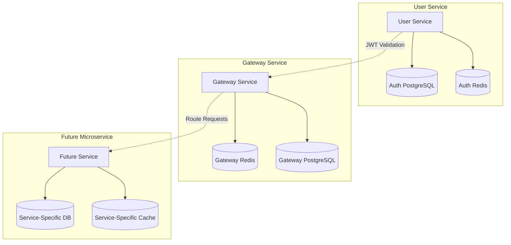

# Design Document

## Overview

The microservices platform is designed as an extensible foundation that enables secure, scalable, and observable microservice architectures. Built on Spring Boot 3.5.6 and Spring Cloud 2025.0.0, the platform provides two core services that work together to create a robust foundation for any microservices ecosystem. The auth service acts as the centralized authentication, authorization, and user lifecycle management hub for all connected microservices, ensuring consistent security policies and user management across the entire platform.

**Extensibility Design Principles:**

- **Container Orchestration**: Docker Compose for local development and Kubernetes for staging/production service networking
- **Centralized Security**: JWT-based authentication that can protect endpoints across any connected microservice
- **User Context Propagation**: Seamless user information flow through JWT claims to all services
- **Standardized Patterns**: Consistent three-tier architecture, error handling, and API standards
- **Independent Deployment**: Each service maintains its own Docker Compose configuration and deployment lifecycle

The platform follows reactive programming principles, implements security through JWT and OAuth2, and provides full observability through OpenTelemetry integration. Each microservice is organized using three-tier architecture with clear separation between presentation, domain, and data access layers, enforced through ArchUnit and Spring Modulith testing. The architecture supports development and deployment through Docker Compose with environment-specific configurations.

## Maven Build System Architecture

### Maven Enforcement Strategy

**Design Rationale:** Apache Maven serves as the exclusive build automation and dependency management tool for the entire microservices platform. This enforces consistent build processes, standardized project structure, centralized dependency management, and seamless integration with containerization and CI/CD pipelines. The Maven-first approach ensures predictable builds, simplified onboarding, and maintainable project organization across all microservices.

**Key Benefits:**

- **Standardized Build Process**: Consistent compilation, testing, and packaging across all services
- **Centralized Dependency Management**: Parent POM controls versions and prevents conflicts
- **Project Structure Consistency**: Standard Maven directory layout enforced across services
- **Plugin Standardization**: Consistent code quality, testing, and packaging plugins
- **CI/CD Integration**: Seamless integration with Docker builds and deployment pipelines
- **Developer Experience**: Familiar tooling and consistent commands across all services

### Multi-Module Maven Project Structure

**Parent POM Configuration (gripday/pom.xml):**

```xml
<?xml version="1.0" encoding="UTF-8"?>
<project xmlns="http://maven.apache.org/POM/4.0.0"
         xmlns:xsi="http://www.w3.org/2001/XMLSchema-instance"
         xsi:schemaLocation="http://maven.apache.org/POM/4.0.0
         http://maven.apache.org/xsd/maven-4.0.0.xsd">
    <modelVersion>4.0.0</modelVersion>

    <groupId>org.gripday</groupId>
    <artifactId>gripday</artifactId>
    <version>1.0.0-SNAPSHOT</version>
    <packaging>pom</packaging>

    <name>Gripday Microservices Platform</name>
    <description>Extensible microservices platform with centralized authentication and gateway</description>

    <properties>
        <maven.compiler.source>21</maven.compiler.source>
        <maven.compiler.target>21</maven.compiler.target>
        <project.build.sourceEncoding>UTF-8</project.build.sourceEncoding>
        <project.reporting.outputEncoding>UTF-8</project.reporting.outputEncoding>

        <!-- Spring Boot and Cloud versions -->
        <spring-boot.version>3.5.6</spring-boot.version>
        <spring-cloud.version>2025.0.0</spring-cloud.version>

        <!-- Database and persistence -->
        <postgresql.version>42.7.3</postgresql.version>
        <liquibase.version>4.29.2</liquibase.version>
        <hibernate.version>6.6.1.Final</hibernate.version>

        <!-- Security and JWT -->
        <spring-security.version>6.4.1</spring-security.version>
        <jjwt.version>0.12.6</jjwt.version>

        <!-- Observability -->
        <micrometer.version>1.14.1</micrometer.version>
        <opentelemetry.version>1.42.1</opentelemetry.version>

        <!-- Testing -->
        <junit.version>5.11.3</junit.version>
        <testcontainers.version>1.20.3</testcontainers.version>
        <archunit.version>1.3.0</archunit.version>
        <spring-modulith.version>1.3.0</spring-modulith.version>

        <!-- Build plugins -->
        <maven-compiler-plugin.version>3.13.0</maven-compiler-plugin.version>
        <maven-surefire-plugin.version>3.5.2</maven-surefire-plugin.version>
        <jacoco-maven-plugin.version>0.8.12</jacoco-maven-plugin.version>
        <spotbugs-maven-plugin.version>4.8.6.4</spotbugs-maven-plugin.version>
        <checkstyle-maven-plugin.version>3.5.0</checkstyle-maven-plugin.version>
    </properties>

    <modules>
        <module>gripday-user-service</module>
        <module>gripday-gateway-service</module>
    </modules>

    <dependencyManagement>
        <dependencies>
            <!-- Spring Boot BOM -->
            <dependency>
                <groupId>org.springframework.boot</groupId>
                <artifactId>spring-boot-dependencies</artifactId>
                <version>${spring-boot.version}</version>
                <type>pom</type>
                <scope>import</scope>
            </dependency>

            <!-- Spring Cloud BOM -->
            <dependency>
                <groupId>org.springframework.cloud</groupId>
                <artifactId>spring-cloud-dependencies</artifactId>
                <version>${spring-cloud.version}</version>
                <type>pom</type>
                <scope>import</scope>
            </dependency>

            <!-- Database dependencies -->
            <dependency>
                <groupId>org.postgresql</groupId>
                <artifactId>postgresql</artifactId>
                <version>${postgresql.version}</version>
            </dependency>

            <dependency>
                <groupId>org.liquibase</groupId>
                <artifactId>liquibase-core</artifactId>
                <version>${liquibase.version}</version>
            </dependency>

            <!-- JWT dependencies -->
            <dependency>
                <groupId>io.jsonwebtoken</groupId>
                <artifactId>jjwt-api</artifactId>
                <version>${jjwt.version}</version>
            </dependency>

            <dependency>
                <groupId>io.jsonwebtoken</groupId>
                <artifactId>jjwt-impl</artifactId>
                <version>${jjwt.version}</version>
                <scope>runtime</scope>
            </dependency>

            <dependency>
                <groupId>io.jsonwebtoken</groupId>
                <artifactId>jjwt-jackson</artifactId>
                <version>${jjwt.version}</version>
                <scope>runtime</scope>
            </dependency>

            <!-- Testing dependencies -->
            <dependency>
                <groupId>org.testcontainers</groupId>
                <artifactId>testcontainers-bom</artifactId>
                <version>${testcontainers.version}</version>
                <type>pom</type>
                <scope>import</scope>
            </dependency>

            <dependency>
                <groupId>com.tngtech.archunit</groupId>
                <artifactId>archunit-junit5</artifactId>
                <version>${archunit.version}</version>
                <scope>test</scope>
            </dependency>

            <dependency>
                <groupId>org.springframework.modulith</groupId>
                <artifactId>spring-modulith-bom</artifactId>
                <version>${spring-modulith.version}</version>
                <type>pom</type>
                <scope>import</scope>
            </dependency>
        </dependencies>
    </dependencyManagement>

    <build>
        <pluginManagement>
            <plugins>
                <!-- Compiler plugin with Java 21 -->
                <plugin>
                    <groupId>org.apache.maven.plugins</groupId>
                    <artifactId>maven-compiler-plugin</artifactId>
                    <version>${maven-compiler-plugin.version}</version>
                    <configuration>
                        <source>21</source>
                        <target>21</target>
                        <compilerArgs>
                            <arg>--enable-preview</arg>
                        </compilerArgs>
                    </configuration>
                </plugin>

                <!-- Spring Boot Maven plugin -->
                <plugin>
                    <groupId>org.springframework.boot</groupId>
                    <artifactId>spring-boot-maven-plugin</artifactId>
                    <version>${spring-boot.version}</version>
                    <executions>
                        <execution>
                            <goals>
                                <goal>repackage</goal>
                            </goals>
                        </execution>
                    </executions>
                </plugin>

                <!-- Surefire for unit tests -->
                <plugin>
                    <groupId>org.apache.maven.plugins</groupId>
                    <artifactId>maven-surefire-plugin</artifactId>
                    <version>${maven-surefire-plugin.version}</version>
                    <configuration>
                        <includes>
                            <include>**/*Test.java</include>
                            <include>**/*Tests.java</include>
                        </includes>
                        <excludes>
                            <exclude>**/*IntegrationTest.java</exclude>
                            <exclude>**/*IT.java</exclude>
                        </excludes>
                    </configuration>
                </plugin>

                <!-- JaCoCo for code coverage -->
                <plugin>
                    <groupId>org.jacoco</groupId>
                    <artifactId>jacoco-maven-plugin</artifactId>
                    <version>${jacoco-maven-plugin.version}</version>
                    <executions>
                        <execution>
                            <goals>
                                <goal>prepare-agent</goal>
                            </goals>
                        </execution>
                        <execution>
                            <id>report</id>
                            <phase>test</phase>
                            <goals>
                                <goal>report</goal>
                            </goals>
                        </execution>
                    </executions>
                </plugin>

                <!-- SpotBugs for static analysis -->
                <plugin>
                    <groupId>com.github.spotbugs</groupId>
                    <artifactId>spotbugs-maven-plugin</artifactId>
                    <version>${spotbugs-maven-plugin.version}</version>
                    <configuration>
                        <effort>Max</effort>
                        <threshold>Low</threshold>
                        <xmlOutput>true</xmlOutput>
                    </configuration>
                </plugin>

                <!-- Checkstyle for code style -->
                <plugin>
                    <groupId>org.apache.maven.plugins</groupId>
                    <artifactId>maven-checkstyle-plugin</artifactId>
                    <version>${checkstyle-maven-plugin.version}</version>
                    <configuration>
                        <configLocation>checkstyle.xml</configLocation>
                        <includeTestSourceDirectory>true</includeTestSourceDirectory>
                        <violationSeverity>warning</violationSeverity>
                    </configuration>
                </plugin>
            </plugins>
        </pluginManagement>

        <plugins>
            <!-- Apply common plugins to all modules -->
            <plugin>
                <groupId>org.apache.maven.plugins</groupId>
                <artifactId>maven-compiler-plugin</artifactId>
            </plugin>

            <plugin>
                <groupId>org.apache.maven.plugins</groupId>
                <artifactId>maven-surefire-plugin</artifactId>
            </plugin>

            <plugin>
                <groupId>org.jacoco</groupId>
                <artifactId>jacoco-maven-plugin</artifactId>
            </plugin>
        </plugins>
    </build>

    <profiles>
        <!-- Minimal Maven profiles - rely primarily on Spring profiles -->
        <profile>
            <id>code-quality</id>
            <build>
                <plugins>
                    <plugin>
                        <groupId>com.github.spotbugs</groupId>
                        <artifactId>spotbugs-maven-plugin</artifactId>
                        <executions>
                            <execution>
                                <goals>
                                    <goal>check</goal>
                                </goals>
                            </execution>
                        </executions>
                    </plugin>

                    <plugin>
                        <groupId>org.apache.maven.plugins</groupId>
                        <artifactId>maven-checkstyle-plugin</artifactId>
                        <executions>
                            <execution>
                                <goals>
                                    <goal>check</goal>
                                </goals>
                            </execution>
                        </executions>
                    </plugin>
                </plugins>
            </build>
        </profile>
    </profiles>
</project>
```

### Service-Specific Maven Configuration

**User Service POM (gripday-user-service/pom.xml):**

```xml
<?xml version="1.0" encoding="UTF-8"?>
<project xmlns="http://maven.apache.org/POM/4.0.0"
         xmlns:xsi="http://www.w3.org/2001/XMLSchema-instance"
         xsi:schemaLocation="http://maven.apache.org/POM/4.0.0
         http://maven.apache.org/xsd/maven-4.0.0.xsd">
    <modelVersion>4.0.0</modelVersion>

    <parent>
        <groupId>org.gripday</groupId>
        <artifactId>gripday</artifactId>
        <version>1.0.0-SNAPSHOT</version>
    </parent>

    <artifactId>gripday-user-service</artifactId>
    <packaging>jar</packaging>

    <name>Gripday User Service</name>
    <description>Centralized authentication and user management service</description>

    <dependencies>
        <!-- Spring Boot starters -->
        <dependency>
            <groupId>org.springframework.boot</groupId>
            <artifactId>spring-boot-starter-web</artifactId>
        </dependency>

        <dependency>
            <groupId>org.springframework.boot</groupId>
            <artifactId>spring-boot-starter-data-jpa</artifactId>
        </dependency>

        <dependency>
            <groupId>org.springframework.boot</groupId>
            <artifactId>spring-boot-starter-security</artifactId>
        </dependency>

        <dependency>
            <groupId>org.springframework.boot</groupId>
            <artifactId>spring-boot-starter-oauth2-authorization-server</artifactId>
        </dependency>

        <dependency>
            <groupId>org.springframework.boot</groupId>
            <artifactId>spring-boot-starter-validation</artifactId>
        </dependency>

        <dependency>
            <groupId>org.springframework.boot</groupId>
            <artifactId>spring-boot-starter-actuator</artifactId>
        </dependency>

        <dependency>
            <groupId>org.springframework.boot</groupId>
            <artifactId>spring-boot-starter-data-redis</artifactId>
        </dependency>

        <!-- Database -->
        <dependency>
            <groupId>org.postgresql</groupId>
            <artifactId>postgresql</artifactId>
        </dependency>

        <dependency>
            <groupId>org.liquibase</groupId>
            <artifactId>liquibase-core</artifactId>
        </dependency>

        <!-- JWT -->
        <dependency>
            <groupId>io.jsonwebtoken</groupId>
            <artifactId>jjwt-api</artifactId>
        </dependency>

        <dependency>
            <groupId>io.jsonwebtoken</groupId>
            <artifactId>jjwt-impl</artifactId>
        </dependency>

        <dependency>
            <groupId>io.jsonwebtoken</groupId>
            <artifactId>jjwt-jackson</artifactId>
        </dependency>

        <!-- OpenAPI documentation -->
        <dependency>
            <groupId>org.springdoc</groupId>
            <artifactId>springdoc-openapi-starter-webmvc-ui</artifactId>
        </dependency>

        <!-- Observability -->
        <dependency>
            <groupId>io.micrometer</groupId>
            <artifactId>micrometer-tracing-bridge-otel</artifactId>
        </dependency>

        <dependency>
            <groupId>io.opentelemetry</groupId>
            <artifactId>opentelemetry-exporter-otlp</artifactId>
        </dependency>

        <!-- Testing -->
        <dependency>
            <groupId>org.springframework.boot</groupId>
            <artifactId>spring-boot-starter-test</artifactId>
            <scope>test</scope>
        </dependency>

        <dependency>
            <groupId>org.springframework.security</groupId>
            <artifactId>spring-security-test</artifactId>
            <scope>test</scope>
        </dependency>

        <dependency>
            <groupId>org.testcontainers</groupId>
            <artifactId>postgresql</artifactId>
            <scope>test</scope>
        </dependency>

        <dependency>
            <groupId>org.testcontainers</groupId>
            <artifactId>junit-jupiter</artifactId>
            <scope>test</scope>
        </dependency>

        <dependency>
            <groupId>com.tngtech.archunit</groupId>
            <artifactId>archunit-junit5</artifactId>
            <scope>test</scope>
        </dependency>

        <dependency>
            <groupId>org.springframework.modulith</groupId>
            <artifactId>spring-modulith-starter-test</artifactId>
            <scope>test</scope>
        </dependency>
    </dependencies>

    <build>
        <plugins>
            <plugin>
                <groupId>org.springframework.boot</groupId>
                <artifactId>spring-boot-maven-plugin</artifactId>
            </plugin>
        </plugins>
    </build>
</project>
```

**Gateway Service POM (gripday-gateway-service/pom.xml):**

```xml
<?xml version="1.0" encoding="UTF-8"?>
<project xmlns="http://maven.apache.org/POM/4.0.0"
         xmlns:xsi="http://www.w3.org/2001/XMLSchema-instance"
         xsi:schemaLocation="http://maven.apache.org/POM/4.0.0
         http://maven.apache.org/xsd/maven-4.0.0.xsd">
    <modelVersion>4.0.0</modelVersion>

    <parent>
        <groupId>org.gripday</groupId>
        <artifactId>gripday</artifactId>
        <version>1.0.0-SNAPSHOT</version>
    </parent>

    <artifactId>gripday-gateway-service</artifactId>
    <packaging>jar</packaging>

    <name>Gripday Gateway Service</name>
    <description>API Gateway with routing, authentication, and rate limiting</description>

    <dependencies>
        <!-- Spring Cloud Gateway -->
        <dependency>
            <groupId>org.springframework.cloud</groupId>
            <artifactId>spring-cloud-starter-gateway</artifactId>
        </dependency>

        <dependency>
            <groupId>org.springframework.boot</groupId>
            <artifactId>spring-boot-starter-security</artifactId>
        </dependency>

        <dependency>
            <groupId>org.springframework.boot</groupId>
            <artifactId>spring-boot-starter-data-redis-reactive</artifactId>
        </dependency>

        <dependency>
            <groupId>org.springframework.boot</groupId>
            <artifactId>spring-boot-starter-actuator</artifactId>
        </dependency>

        <!-- Circuit breaker -->
        <dependency>
            <groupId>org.springframework.cloud</groupId>
            <artifactId>spring-cloud-starter-circuitbreaker-reactor-resilience4j</artifactId>
        </dependency>

        <!-- JWT -->
        <dependency>
            <groupId>io.jsonwebtoken</groupId>
            <artifactId>jjwt-api</artifactId>
        </dependency>

        <dependency>
            <groupId>io.jsonwebtoken</groupId>
            <artifactId>jjwt-impl</artifactId>
        </dependency>

        <dependency>
            <groupId>io.jsonwebtoken</groupId>
            <artifactId>jjwt-jackson</artifactId>
        </dependency>

        <!-- OpenAPI documentation -->
        <dependency>
            <groupId>org.springdoc</groupId>
            <artifactId>springdoc-openapi-starter-webflux-ui</artifactId>
        </dependency>

        <!-- Observability -->
        <dependency>
            <groupId>io.micrometer</groupId>
            <artifactId>micrometer-tracing-bridge-otel</artifactId>
        </dependency>

        <dependency>
            <groupId>io.opentelemetry</groupId>
            <artifactId>opentelemetry-exporter-otlp</artifactId>
        </dependency>

        <!-- Testing -->
        <dependency>
            <groupId>org.springframework.boot</groupId>
            <artifactId>spring-boot-starter-test</artifactId>
            <scope>test</scope>
        </dependency>

        <dependency>
            <groupId>org.springframework.security</groupId>
            <artifactId>spring-security-test</artifactId>
            <scope>test</scope>
        </dependency>

        <dependency>
            <groupId>org.testcontainers</groupId>
            <artifactId>redis</artifactId>
            <scope>test</scope>
        </dependency>

        <dependency>
            <groupId>org.testcontainers</groupId>
            <artifactId>junit-jupiter</artifactId>
            <scope>test</scope>
        </dependency>

        <dependency>
            <groupId>com.tngtech.archunit</groupId>
            <artifactId>archunit-junit5</artifactId>
            <scope>test</scope>
        </dependency>
    </dependencies>

    <build>
        <plugins>
            <plugin>
                <groupId>org.springframework.boot</groupId>
                <artifactId>spring-boot-maven-plugin</artifactId>
            </plugin>
        </plugins>
    </build>
</project>
```

### Maven Directory Structure Enforcement

**Standard Maven Directory Layout:**

```
gripday/                    # Parent project root
├── pom.xml                         # Parent POM
├── README.md                       # Platform documentation
├── docker-compose.yml             # Platform-wide services
├── .gitignore                      # Git ignore rules
├── checkstyle.xml                  # Code style configuration
│
├── gripday-user-service/           # Auth service module
│   ├── pom.xml                     # Service-specific POM
│   ├── Dockerfile                  # Container configuration
│   ├── docker-compose.yml         # Service-specific compose
│   ├── src/
│   │   ├── main/
│   │   │   ├── java/
│   │   │   │   └── org/gripday/authservice/
│   │   │   │       ├── presentation/
│   │   │   │       ├── domain/
│   │   │   │       ├── infrastructure/
│   │   │   │       └── AuthServiceApplication.java
│   │   │   └── resources/
│   │   │       ├── application.yml
│   │   │       ├── application-local.yml
│   │   │       ├── application-staging.yml
│   │   │       ├── application-production.yml
│   │   │       └── db/changelog/
│   │   │           └── db.changelog-master.xml
│   │   └── test/
│   │       ├── java/
│   │       │   └── org/gripday/authservice/
│   │       │       ├── architecture/
│   │       │       ├── integration/
│   │       │       └── unit/
│   │       └── resources/
│   │           └── application-test.yml
│   └── docs/                       # Service documentation
│       ├── api/
│       ├── architecture/
│       └── deployment/
│
└── gripday-gateway-service/        # Gateway service module
    ├── pom.xml                     # Service-specific POM
    ├── Dockerfile                  # Container configuration
    ├── docker-compose.yml         # Service-specific compose
    ├── src/
    │   ├── main/
    │   │   ├── java/
    │   │   │   └── org/gripday/gatewayservice/
    │   │   │       ├── config/
    │   │   │       ├── filter/
    │   │   │       ├── security/
    │   │   │       ├── service/
    │   │   │       └── GatewayServiceApplication.java
    │   │   └── resources/
    │   │       ├── application.yml
    │   │       ├── application-local.yml
    │   │       ├── application-staging.yml
    │   │       └── application-production.yml
    │   └── test/
    │       ├── java/
    │       │   └── org/gripday/gatewayservice/
    │       │       ├── architecture/
    │       │       ├── integration/
    │       │       └── unit/
    │       └── resources/
    │           └── application-test.yml
    └── docs/                       # Service documentation
        ├── api/
        ├── architecture/
        └── deployment/
```

### Maven Integration with Docker and CI/CD

**Dockerfile Integration with Maven:**

```dockerfile
# User Service Dockerfile
FROM eclipse-temurin:21-jre-alpine

# Create application user
RUN addgroup -g 1001 -S appuser && \
    adduser -u 1001 -S appuser -G appuser

# Set working directory
WORKDIR /app

# Copy Maven-built JAR
COPY target/gripday-user-service-*.jar app.jar

# Change ownership
RUN chown -R appuser:appuser /app

# Switch to non-root user
USER appuser

# Expose port
EXPOSE 8080

# Health check
HEALTHCHECK --interval=30s --timeout=3s --start-period=5s --retries=3 \
    CMD curl -f http://localhost:8080/actuator/health || exit 1

# Run application
ENTRYPOINT ["java", "-jar", "app.jar"]
```

**Maven Build Commands:**

```bash
# Build entire platform
mvn clean compile

# Run tests for all modules
mvn test

# Run integration tests
mvn verify

# Package all services
mvn package

# Build Docker images (requires Docker)
mvn package && docker-compose build

# Run code quality checks
mvn clean compile -Pcode-quality

# Generate test coverage reports
mvn clean test jacoco:report

# Build specific service
mvn clean package -pl gripday-user-service

# Skip tests for faster builds (development only)
mvn package -DskipTests
```

### Maven Enforcement Rules

**Enforcer Plugin Configuration (added to parent POM):**

```xml
<plugin>
    <groupId>org.apache.maven.plugins</groupId>
    <artifactId>maven-enforcer-plugin</artifactId>
    <version>3.5.0</version>
    <executions>
        <execution>
            <id>enforce-maven</id>
            <goals>
                <goal>enforce</goal>
            </goals>
            <configuration>
                <rules>
                    <!-- Require Maven 3.9.0+ -->
                    <requireMavenVersion>
                        <version>[3.9.0,)</version>
                    </requireMavenVersion>

                    <!-- Require Java 21 -->
                    <requireJavaVersion>
                        <version>[21,)</version>
                    </requireJavaVersion>

                    <!-- No duplicate dependencies -->
                    <banDuplicatePomDependencyVersions/>

                    <!-- Require dependency convergence -->
                    <dependencyConvergence/>

                    <!-- Ban problematic dependencies -->
                    <bannedDependencies>
                        <excludes>
                            <!-- Ban Gradle -->
                            <exclude>org.gradle:*</exclude>
                            <!-- Ban SBT -->
                            <exclude>org.scala-sbt:*</exclude>
                            <!-- Ban Ant -->
                            <exclude>org.apache.ant:*</exclude>
                            <!-- Ban old logging frameworks -->
                            <exclude>commons-logging:commons-logging</exclude>
                            <exclude>log4j:log4j</exclude>
                        </excludes>
                    </bannedDependencies>

                    <!-- Require specific file presence -->
                    <requireFilesExist>
                        <files>
                            <file>${project.basedir}/src/main/java</file>
                            <file>${project.basedir}/src/test/java</file>
                            <file>${project.basedir}/src/main/resources</file>
                        </files>
                    </requireFilesExist>
                </rules>
            </configuration>
        </execution>
    </executions>
</plugin>
```

**Alternative Build Tool Prevention:**

- Enforcer plugin explicitly bans Gradle, SBT, and Ant dependencies
- CI/CD pipelines validate presence of `pom.xml` files
- Docker builds rely exclusively on Maven-generated JAR files
- Documentation and examples use only Maven commands
- Development setup scripts assume Maven installation

## Architecture

### High-Level Architecture



### Service Communication Flow with User Context Propagation



## Java 21 Features Implementation

### Modern Java Syntax and Language Features

**Design Rationale:** Active utilization of Java 21 features improves code readability, maintainability, and performance while leveraging the latest language capabilities. The platform adopts a pragmatic approach, using modern features where they provide clear benefits without over-engineering simple solutions.

**Implementation Strategy:**

- Use `var` for local variable type inference to improve readability
- Implement records for immutable DTOs and value objects
- Apply text blocks for multi-line strings (SQL, JSON templates)
- Use pattern matching for cleaner type checking and control flow
- Leverage enhanced switch expressions for improved logic flow
- Apply virtual threads for improved concurrency where beneficial

The platform actively leverages Java 21 features to improve code readability, maintainability, and performance. All code implementations utilize contemporary Java syntax and language constructs.

### Local Variable Type Inference with var

**Service Layer Implementation:**

```java
@Service
public class UserService {

  public UserDto authenticateUser(LoginRequest request) {
    var username = request.getUsername();
    var password = request.getPassword();

    var userOptional = userRepository.findByUsernameOrEmail(username, username);
    if (userOptional.isEmpty()) {
      throw new AuthenticationException("User not found");
    }

    var user = userOptional.get();
    var encodedPassword = user.getPasswordHash();

    if (!passwordEncoder.matches(password, encodedPassword)) {
      throw new AuthenticationException("Invalid credentials");
    }

    var authorities = user.getAuthorities().stream().map(Authority::getName).collect(Collectors.toSet());

    return UserDto.builder().id(user.getId()).username(user.getUsername()).email(user.getEmail()).roles(authorities).build();
  }
}
```

### Records for Data Transfer Objects

**Immutable DTOs using Records:**

```java
// User context record for JWT claims
public record UserContext(
  Long userId,
  String username,
  String email,
  Set<String> roles,
  Set<String> permissions,
  String department,
  String organizationId,
  Map<String, Object> customClaims
) {
  // Compact constructor for validation
  public UserContext {
    Objects.requireNonNull(userId, "User ID cannot be null");
    Objects.requireNonNull(username, "Username cannot be null");
    roles = roles != null ? Set.copyOf(roles) : Set.of();
    permissions = permissions != null ? Set.copyOf(permissions) : Set.of();
    customClaims = customClaims != null ? Map.copyOf(customClaims) : Map.of();
  }

  public boolean hasRole(String role) {
    return roles.contains(role);
  }

  public boolean hasPermission(String permission) {
    return permissions.contains(permission);
  }
}

// API request/response records
public record LoginRequest(@NotBlank String username, @NotBlank String password, boolean rememberMe) {}

public record SignupRequest(
  @NotBlank @Size(min = 3, max = 50) String username,
  @NotBlank @Email String email,
  @NotBlank @Size(min = 8, max = 100) String password,
  @NotBlank String firstName,
  @NotBlank String lastName,
  String tenantId
) {}

public record RefreshTokenRequest(@NotBlank String refreshToken) {}

public record TokenResponse(String accessToken, String refreshToken, String tokenType, long expiresIn, UserContext user) {}

public record UserRegistrationResponse(Long userId, String username, String email, String firstName, String lastName, boolean emailVerified, Instant createdAt, String message) {}

public record ErrorDetail(String field, String code, String message, Object rejectedValue) {}

public record ApiError(String code, String message, String details, Instant timestamp, String path, String method, String correlationId, String requestId, List<ErrorDetail> fields) {}
```

### Simple Authentication Response Handling

**Simple Authentication Result Classes:**

```java
// Simple success response
public record AuthenticationSuccess(UserContext user, String accessToken, String refreshToken, String correlationId, Instant timestamp) {}

// Simple failure response
public record AuthenticationFailure(String reason, String errorCode, String correlationId, Instant timestamp) {}

// Simple service with straightforward logic
@Service
public class AuthenticationService {

  public ResponseEntity<?> handleAuthenticationSuccess(AuthenticationSuccess success) {
    return ResponseEntity.ok(new TokenResponse(success.accessToken(), success.refreshToken(), "Bearer", 900, success.user()));
  }

  public ResponseEntity<?> handleAuthenticationFailure(AuthenticationFailure failure) {
    return ResponseEntity.status(HttpStatus.UNAUTHORIZED).body(
      new ApiError(failure.errorCode(), "Authentication failed", failure.reason(), failure.timestamp(), "/api/v1/auth/login", "POST", failure.correlationId(), generateRequestId(), List.of())
    );
  }
}
```

### Pattern Matching and Switch Expressions

**Simple Error Handling:**

```java
@RestControllerAdvice
public class GlobalExceptionHandler {

  @ExceptionHandler(ValidationException.class)
  public ResponseEntity<ApiError> handleValidationException(ValidationException ex, HttpServletRequest request) {
    var errorResponse = createErrorResponse("VALIDATION_ERROR", "Request validation failed", ex.getMessage(), request, ex.getFieldErrors());
    return ResponseEntity.badRequest().body(errorResponse);
  }

  @ExceptionHandler(AuthenticationException.class)
  public ResponseEntity<ApiError> handleAuthenticationException(AuthenticationException ex, HttpServletRequest request) {
    var errorResponse = createErrorResponse("AUTH_INVALID_CREDENTIALS", "Invalid username or password", ex.getMessage(), request, List.of());
    return ResponseEntity.status(HttpStatus.UNAUTHORIZED).body(errorResponse);
  }

  @ExceptionHandler(AccessDeniedException.class)
  public ResponseEntity<ApiError> handleAccessDeniedException(AccessDeniedException ex, HttpServletRequest request) {
    var errorResponse = createErrorResponse("AUTH_INSUFFICIENT_PERMISSIONS", "Insufficient permissions for this operation", ex.getMessage(), request, List.of());
    return ResponseEntity.status(HttpStatus.FORBIDDEN).body(errorResponse);
  }

  @ExceptionHandler(Exception.class)
  public ResponseEntity<ApiError> handleGenericException(Exception ex, HttpServletRequest request) {
    var errorResponse = createErrorResponse("SYSTEM_INTERNAL_ERROR", "Internal system error", "An unexpected error occurred", request, List.of());
    return ResponseEntity.status(HttpStatus.INTERNAL_SERVER_ERROR).body(errorResponse);
  }

  private ApiError createErrorResponse(String code, String message, String details, HttpServletRequest request, List<ErrorDetail> fields) {
    return new ApiError(code, message, details, Instant.now(), request.getRequestURI(), request.getMethod(), MDC.get("correlationId"), generateRequestId(), fields);
  }
}
```

### Text Blocks for Multi-line Strings

**SQL Queries and JSON Templates:**

```java
@Repository
public class UserRepository {

  private static final String FIND_USERS_WITH_ROLES_QUERY = """
    SELECT u.*, a.name as authority_name
    FROM users u
    LEFT JOIN user_authorities ua ON u.id = ua.user_id
    LEFT JOIN authorities a ON ua.authority_id = a.id
    WHERE u.enabled = true
    AND (:username IS NULL OR u.username ILIKE :username)
    AND (:email IS NULL OR u.email ILIKE :email)
    ORDER BY u.created_at DESC
    """;

  @Query(value = FIND_USERS_WITH_ROLES_QUERY, nativeQuery = true)
  List<UserProjection> findUsersWithRoles(@Param("username") String username, @Param("email") String email);
}

@Component
public class PostmanCollectionGenerator {

  private static final String AUTHENTICATION_TEST_SCRIPT = """
    pm.test("Status code is 200", function () {
        pm.response.to.have.status(200);
    });

    pm.test("Response has access token", function () {
        var jsonData = pm.response.json();
        pm.expect(jsonData).to.have.property('accessToken');
        pm.globals.set("access_token", jsonData.accessToken);
    });

    pm.test("Response has user information", function () {
        var jsonData = pm.response.json();
        pm.expect(jsonData).to.have.property('user');
        pm.expect(jsonData.user).to.have.property('username');
    });
    """;

  private static final String LOGIN_REQUEST_BODY = """
    {
      "username": "{{username}}",
      "password": "{{password}}",
      "rememberMe": true
    }
    """;
}
```

### Enhanced instanceof with Pattern Variables

**Simple JWT Token Processing:**

```java
@Component
public class JwtTokenProcessor {

  public UserContext extractUserContext(Map<String, Object> claims) {
    var userId = extractLong(claims.get("sub"));
    var username = extractString(claims.get("username"));
    var email = extractString(claims.get("email"));
    var roles = extractStringSet(claims.get("roles"));
    var permissions = extractStringSet(claims.get("permissions"));
    var department = extractString(claims.get("department"));
    var organizationId = extractString(claims.get("organization_id"));
    var customClaims = extractCustomClaims(claims);

    return new UserContext(userId, username, email, roles, permissions, department, organizationId, customClaims);
  }

  private String extractString(Object value) {
    if (value instanceof String) {
      return (String) value;
    }
    return null;
  }

  private Long extractLong(Object value) {
    if (value instanceof Long) {
      return (Long) value;
    }
    if (value instanceof Integer) {
      return ((Integer) value).longValue();
    }
    if (value instanceof String) {
      try {
        return Long.parseLong((String) value);
      } catch (NumberFormatException e) {
        return null;
      }
    }
    return null;
  }

  private Set<String> extractStringSet(Object value) {
    if (value instanceof List<?>) {
      return ((List<?>) value).stream().filter(String.class::isInstance).map(String.class::cast).collect(Collectors.toSet());
    }
    return Set.of();
  }
}
```

### Virtual Threads for Improved Concurrency

**Async Processing with Virtual Threads:**

```java
@Service
public class AsyncUserService {

  private final ExecutorService virtualThreadExecutor = Executors.newVirtualThreadPerTaskExecutor();

  public CompletableFuture<List<UserDto>> processUsersAsync(List<Long> userIds) {
    var futures = userIds
      .stream()
      .map((userId) -> CompletableFuture.supplyAsync(() -> processUser(userId), virtualThreadExecutor))
      .toList();

    return CompletableFuture.allOf(futures.toArray(new CompletableFuture[0])).thenApply((ignored) -> futures.stream().map(CompletableFuture::join).filter(Objects::nonNull).toList());
  }

  private UserDto processUser(Long userId) {
    try (var scope = new StructuredTaskScope.ShutdownOnFailure()) {
      var userTask = scope.fork(() -> userRepository.findById(userId));
      var rolesTask = scope.fork(() -> authorityRepository.findByUserId(userId));
      var auditTask = scope.fork(() -> auditLogRepository.findLatestByUserId(userId));

      scope.join();
      scope.throwIfFailed();

      var user = userTask.resultNow().orElse(null);
      if (user == null) return null;

      var roles = rolesTask.resultNow();
      var lastActivity = auditTask.resultNow();

      return UserDto.builder()
        .id(user.getId())
        .username(user.getUsername())
        .email(user.getEmail())
        .roles(roles.stream().map(Authority::getName).collect(Collectors.toSet()))
        .lastActivity(lastActivity.map(UserAuditLog::getCreatedAt).orElse(null))
        .build();
    } catch (InterruptedException | ExecutionException e) {
      Thread.currentThread().interrupt();
      throw new RuntimeException("Failed to process user: " + userId, e);
    }
  }
}
```

## Three-Tier Architecture Design

### Architectural Layers

**Design Rationale:** Three-tier architecture provides clear separation of concerns, improves maintainability, and enables independent testing of each layer. This pattern enforces proper dependency direction, prevents architectural violations, and makes the codebase more understandable for developers. ArchUnit and Spring Modulith testing ensure architectural compliance is maintained over time.

Each microservice follows a strict three-tier architecture pattern:

**Presentation Layer (Controllers/Web)**

- REST controllers and reactive handlers
- Request/response DTOs and validation
- Exception handlers and error responses
- OpenAPI documentation and contracts

**Domain Layer (Services/Domain)**

- Domain logic and domain services
- Transaction management and orchestration
- Domain models and domain rules
- Security and authorization logic

**Data Access Layer (Repositories/Infrastructure)**

- Spring Data JPA repositories with Hibernate 6.x ORM
- Jakarta Persistence API 3.1+ entities and annotations
- Database access with enhanced SQL generation and batch processing
- External service integrations
- Caching and session management with Hibernate second-level cache
- Infrastructure concerns and configurations

### Package Structure

````
org.gripday.{servicename}/        # Service-specific Package
├── presentation/                 # Presentation Layer (User Service)
│   ├── web/                      # REST controllers with Resource suffix
│   ├── dto/                      # Data transfer objects
│   ├── validation/               # Input validation
│   └── exception/                # Exception handlers
├── domain/                       # Domain Layer (User Service)
│   ├── service/                  # Domain services
│   ├── model/                    # Domain models
│   ├── security/                 # Security logic
│   └── config/                   # Domain configuration
├── infrastructure/               # Data Access Layer (User Service)
│   ├── repository/               # Data repositories
│   ├── entity/                   # JPA entities
│   ├── cache/                    # Caching logic
│   └── integration/              # External integrations
├── config/                       # Configuration classes (Gateway Service)
├── filter/                       # Gateway filters (Gateway Service)
├── security/                     # Security configuration (Gateway Service)
├── service/                      # Business logic services (Gateway Service)
└── {ServiceName}Application.java # Main application class

**Example Main Application Classes:**

**User Service Application:**
```java
package org.gripday.authservice;

@SpringBootApplication
@EnableJpaRepositories
@EnableScheduling
public class AuthServiceApplication {
    public static void main(String[] args) {
        SpringApplication.run(AuthServiceApplication.class, args);
    }
}
````

**Gateway Service Application:**

```java
package org.gripday.gatewayservice;

@SpringBootApplication
public class GatewayServiceApplication {

  public static void main(String[] args) {
    SpringApplication.run(GatewayServiceApplication.class, args);
  }
}
```

````

### Architectural Rules

1. **Layer Dependency Rules**
   - Presentation layer can only depend on Domain layer
   - Domain layer can only depend on Data Access layer
   - No circular dependencies between layers
   - Data Access layer has no dependencies on upper layers

2. **Package Naming Conventions**
   - REST controllers must be in `presentation.web` package with "Resource" suffix
   - Services must be in `domain.service` package
   - Repositories must be in `infrastructure.repository` package
   - Entities must be in `infrastructure.entity` package

3. **Component Restrictions**
   - REST controllers cannot directly access repositories
   - Repositories cannot access presentation layer components
   - Domain services act as the only bridge between layers
   - All @RestController classes must follow Resource naming convention

### Architectural Testing

**ArchUnit Rules:**
```java
@ArchTest
static final ArchRule layered_architecture = layeredArchitecture()
    .consideringOnlyDependenciesInLayers()
    .layer("Presentation").definedBy("..presentation..")
    .layer("Domain").definedBy("..domain..")
    .layer("Infrastructure").definedBy("..infrastructure..")
    .whereLayer("Presentation").mayNotBeAccessedByAnyLayer()
    .whereLayer("Domain").mayOnlyBeAccessedByLayers("Presentation")
    .whereLayer("Infrastructure").mayOnlyBeAccessedByLayers("Domain");

@ArchTest
static final ArchRule controllers_should_only_depend_on_services =
    classes().that().resideInAPackage("..presentation.web..")
    .should().onlyDependOnClassesThat()
    .resideInAnyPackage("..domain.service..", "java..", "org.springframework..", "..presentation.dto..");

@ArchTest
static final ArchRule rest_controllers_should_be_in_web_package =
    classes().that().areAnnotatedWith(RestController.class)
    .should().resideInAPackage("..presentation.web..");

@ArchTest
static final ArchRule rest_controllers_should_have_resource_suffix =
    classes().that().areAnnotatedWith(RestController.class)
    .should().haveSimpleNameEndingWith("Resource");

@ArchTest
static final ArchRule rest_controllers_should_follow_naming_conventions =
    classes().that().areAnnotatedWith(RestController.class)
    .should().resideInAPackage("..presentation.web..")
    .andShould().haveSimpleNameEndingWith("Resource");
````

**Spring Modulith Validation:**

```java
@Modulith
@ApplicationModuleTest
class ModularityTests {

  @Test
  void verifyModularity() {
    ApplicationModules.of(AuthServiceApplication.class).verify();
  }

  @Test
  void writeDocumentation() throws IOException {
    new Documenter(ApplicationModules.of(AuthServiceApplication.class)).writeModulesAsPlantUml().writeIndividualModulesAsPlantUml();
  }
}
```

## API Endpoints Documentation

### Authentication Endpoints

The authentication service provides the following REST endpoints for user management and authentication:

**Base URL:** `/api/v1/auth`

| Method | Endpoint   | Description                        | Request Body          | Response                   | Status Codes  |
| ------ | ---------- | ---------------------------------- | --------------------- | -------------------------- | ------------- |
| POST   | `/signup`  | Register new user account          | `SignupRequest`       | `UserRegistrationResponse` | 201, 400, 409 |
| POST   | `/login`   | Authenticate user with credentials | `LoginRequest`        | `TokenResponse`            | 200, 401, 423 |
| POST   | `/refresh` | Refresh JWT access token           | `RefreshTokenRequest` | `TokenResponse`            | 200, 401      |
| POST   | `/logout`  | Logout user and invalidate tokens  | None                  | None                       | 200, 401      |

**Request/Response Examples:**

**User Signup:**

```json
POST /api/v1/auth/signup
{
  "username": "johndoe",
  "email": "john.doe@example.com",
  "password": "SecurePassword123!",
  "firstName": "John",
  "lastName": "Doe",
  "tenantId": "tenant-123"
}

Response (201 Created):
{
  "userId": 1,
  "username": "johndoe",
  "email": "john.doe@example.com",
  "firstName": "John",
  "lastName": "Doe",
  "emailVerified": false,
  "createdAt": "2024-01-15T10:30:00Z",
  "message": "User registered successfully. Please verify your email."
}
```

**User Login:**

```json
POST /api/v1/auth/login
{
  "username": "johndoe",
  "password": "SecurePassword123!",
  "rememberMe": true
}

Response (200 OK):
{
  "accessToken": "eyJhbGciOiJIUzI1NiIsInR5cCI6IkpXVCJ9...",
  "refreshToken": "eyJhbGciOiJIUzI1NiIsInR5cCI6IkpXVCJ9...",
  "tokenType": "Bearer",
  "expiresIn": 900,
  "user": {
    "userId": 1,
    "username": "johndoe",
    "email": "john.doe@example.com",
    "roles": ["USER"],
    "permissions": ["READ_PROFILE"],
    "department": "Engineering",
    "organizationId": "tenant-123",
    "customClaims": {}
  }
}
```

### User Management Endpoints

**Base URL:** `/api/v1/users` (Admin-only endpoints)

| Method | Endpoint | Description            | Request Body        | Response        | Status Codes       |
| ------ | -------- | ---------------------- | ------------------- | --------------- | ------------------ |
| GET    | `/`      | List users (paginated) | Query params        | `Page<UserDto>` | 200, 403           |
| POST   | `/`      | Create new user        | `CreateUserRequest` | `UserDto`       | 201, 400, 403, 409 |
| GET    | `/{id}`  | Get user by ID         | None                | `UserDto`       | 200, 403, 404      |
| PUT    | `/{id}`  | Update user            | `UpdateUserRequest` | `UserDto`       | 200, 400, 403, 404 |
| DELETE | `/{id}`  | Delete user            | None                | None            | 204, 403, 404      |

## REST Controller Design Patterns

### Naming and Package Conventions

**Design Rationale:** Standardized REST controller naming and package conventions ensure consistent code organization, improve discoverability, and maintain architectural integrity across all microservices. The "Resource" suffix clearly identifies REST endpoints, while the `presentation.web` package structure enforces proper layering.

**Package Structure Requirements:**

- All @RestController classes must reside in `presentation.web` package
- All @RestController classes must have "Resource" suffix in their class names
- Controllers represent REST resources and should be named accordingly

**Example REST Controller Implementation:**

**User Service Controllers:**

```java
package org.gripday.authservice.presentation.web;

@RestController
@RequestMapping("/api/v1/auth")
@Tag(name = "Authentication", description = "User authentication, registration, and token management")
public class AuthenticationResource {

  private final AuthenticationService authenticationService;
  private final UserRegistrationService userRegistrationService;

  public AuthenticationResource(AuthenticationService authenticationService, UserRegistrationService userRegistrationService) {
    this.authenticationService = authenticationService;
    this.userRegistrationService = userRegistrationService;
  }

  @Operation(summary = "User signup", description = "Register a new user account with username, email, and password")
  @ApiResponses(
    value = {
      @ApiResponse(responseCode = "201", description = "User registered successfully"),
      @ApiResponse(responseCode = "400", description = "Invalid input data"),
      @ApiResponse(responseCode = "409", description = "Username or email already exists"),
    }
  )
  @PostMapping("/signup")
  public ResponseEntity<UserRegistrationResponse> signup(@Valid @RequestBody SignupRequest request) {
    var result = userRegistrationService.registerUser(request);
    return ResponseEntity.status(HttpStatus.CREATED).body(result);
  }

  @Operation(summary = "User login", description = "Authenticate user with username/email and password")
  @ApiResponses(
    value = {
      @ApiResponse(responseCode = "200", description = "Authentication successful"),
      @ApiResponse(responseCode = "401", description = "Invalid credentials"),
      @ApiResponse(responseCode = "423", description = "Account locked"),
    }
  )
  @PostMapping("/login")
  public ResponseEntity<TokenResponse> login(@Valid @RequestBody LoginRequest request) {
    var result = authenticationService.authenticateUser(request);
    return ResponseEntity.ok(result);
  }

  @Operation(summary = "Refresh token", description = "Refresh JWT access token using refresh token")
  @ApiResponses(
    value = { @ApiResponse(responseCode = "200", description = "Token refreshed successfully"), @ApiResponse(responseCode = "401", description = "Invalid or expired refresh token") }
  )
  @PostMapping("/refresh")
  @SecurityRequirement(name = "bearerAuth")
  public ResponseEntity<TokenResponse> refreshToken(@Valid @RequestBody RefreshTokenRequest request) {
    var result = authenticationService.refreshToken(request);
    return ResponseEntity.ok(result);
  }

  @Operation(summary = "User logout", description = "Logout user and invalidate tokens")
  @ApiResponses(value = { @ApiResponse(responseCode = "200", description = "Logout successful"), @ApiResponse(responseCode = "401", description = "Invalid token") })
  @PostMapping("/logout")
  @SecurityRequirement(name = "bearerAuth")
  public ResponseEntity<Void> logout(HttpServletRequest request) {
    authenticationService.logout(request);
    return ResponseEntity.ok().build();
  }
}

@RestController
@RequestMapping("/api/v1/users")
@Tag(name = "User Management", description = "User CRUD operations")
@SecurityRequirement(name = "bearerAuth")
@PreAuthorize("hasRole('ADMIN') or hasRole('SUPER_ADMIN')")
public class UserManagementResource {

  private final UserManagementService userManagementService;

  public UserManagementResource(UserManagementService userManagementService) {
    this.userManagementService = userManagementService;
  }

  @Operation(summary = "List users", description = "Get paginated list of users")
  @GetMapping
  public ResponseEntity<Page<UserDto>> getUsers(@RequestParam(defaultValue = "0") int page, @RequestParam(defaultValue = "20") int size, @RequestParam(required = false) String search) {
    var users = userManagementService.getUsers(page, size, search);
    return ResponseEntity.ok(users);
  }

  @Operation(summary = "Create user", description = "Create new user account")
  @PostMapping
  public ResponseEntity<UserDto> createUser(@Valid @RequestBody CreateUserRequest request) {
    var user = userManagementService.createUser(request);
    return ResponseEntity.status(HttpStatus.CREATED).body(user);
  }

  @Operation(summary = "Get user by ID", description = "Retrieve user details by ID")
  @GetMapping("/{id}")
  public ResponseEntity<UserDto> getUserById(@PathVariable Long id) {
    var user = userManagementService.getUserById(id);
    return ResponseEntity.ok(user);
  }

  @Operation(summary = "Update user", description = "Update existing user")
  @PutMapping("/{id}")
  public ResponseEntity<UserDto> updateUser(@PathVariable Long id, @Valid @RequestBody UpdateUserRequest request) {
    var user = userManagementService.updateUser(id, request);
    return ResponseEntity.ok(user);
  }

  @Operation(summary = "Delete user", description = "Delete user account")
  @DeleteMapping("/{id}")
  @PreAuthorize("hasRole('SUPER_ADMIN')")
  public ResponseEntity<Void> deleteUser(@PathVariable Long id) {
    userManagementService.deleteUser(id);
    return ResponseEntity.noContent().build();
  }
}
```

**Gateway Service Controllers:**

```java
package org.gripday.gatewayservice.presentation.web;

@RestController
@RequestMapping("/api/v1/gateway")
@Tag(name = "Gateway Management", description = "Gateway configuration and monitoring")
public class GatewayManagementResource {

  private final GatewayConfigurationService gatewayConfigurationService;

  public GatewayManagementResource(GatewayConfigurationService gatewayConfigurationService) {
    this.gatewayConfigurationService = gatewayConfigurationService;
  }

  @Operation(summary = "Get routes", description = "List all configured routes")
  @GetMapping("/routes")
  public ResponseEntity<List<RouteDto>> getRoutes() {
    var routes = gatewayConfigurationService.getAllRoutes();
    return ResponseEntity.ok(routes);
  }

  @Operation(summary = "Get route by ID", description = "Get specific route configuration")
  @GetMapping("/routes/{routeId}")
  public ResponseEntity<RouteDto> getRoute(@PathVariable String routeId) {
    var route = gatewayConfigurationService.getRoute(routeId);
    return ResponseEntity.ok(route);
  }
}

@RestController
@RequestMapping("/api/v1/monitoring")
@Tag(name = "Monitoring", description = "Gateway monitoring and health checks")
public class MonitoringResource {

  private final MonitoringService monitoringService;

  public MonitoringResource(MonitoringService monitoringService) {
    this.monitoringService = monitoringService;
  }

  @Operation(summary = "Health check", description = "Gateway health status")
  @GetMapping("/health")
  public ResponseEntity<HealthStatus> getHealth() {
    var health = monitoringService.getHealthStatus();
    return ResponseEntity.ok(health);
  }

  @Operation(summary = "Metrics", description = "Gateway performance metrics")
  @GetMapping("/metrics")
  public ResponseEntity<GatewayMetrics> getMetrics() {
    var metrics = monitoringService.getMetrics();
    return ResponseEntity.ok(metrics);
  }
}
```

### Controller Design Guidelines

**Resource Naming Patterns:**

- `AuthenticationResource` - Handles authentication operations
- `UserManagementResource` - Manages user CRUD operations
- `GatewayManagementResource` - Gateway configuration management
- `MonitoringResource` - Health checks and monitoring endpoints

**Package Organization:**

```
org.gripday.authservice/
├── presentation/
│   └── web/
│       └── controller/
│           ├── AuthenticationResource.java
│           ├── UserManagementResource.java
│           └── ProfileManagementResource.java

org.gripday.gatewayservice/
├── presentation/
│   └── web/
│       └── controller/
│           ├── GatewayManagementResource.java
│           ├── MonitoringResource.java
│           └── RoutingConfigurationResource.java
```

**Architectural Validation:**

- ArchUnit tests enforce package placement in `presentation.web`
- ArchUnit tests validate "Resource" suffix for all @RestController classes
- Spring Modulith tests verify module boundaries and encapsulation
- Controllers can only depend on domain services, not infrastructure components

## HTTP Standards and Error Handling

### Standard HTTP Methods

The platform implements RESTful API design with consistent HTTP method usage:

**GET - Retrieve Resources**

```http
GET /api/v1/users          # List all users
GET /api/v1/users/{id}     # Get specific user
GET /api/v1/users/search?q=john  # Search users
```

**POST - Create Resources**

```http
POST /api/v1/users         # Create new user
POST /api/v1/auth/login    # Authenticate user
POST /api/v1/users/bulk    # Bulk create users
```

**PUT - Full Resource Update**

```http
PUT /api/v1/users/{id}     # Replace entire user resource
```

**PATCH - Partial Resource Update**

```http
PATCH /api/v1/users/{id}   # Update specific user fields
PATCH /api/v1/users/{id}/status  # Update user status only
```

**DELETE - Remove Resources**

```http
DELETE /api/v1/users/{id}  # Delete specific user
DELETE /api/v1/users/{id}/roles/{roleId}  # Remove role from user
```

### HTTP Status Code Standards

**Success Responses (2xx)**

- `200 OK` - Successful GET, PUT, PATCH operations
- `201 Created` - Successful POST operations with resource creation
- `202 Accepted` - Asynchronous operations accepted for processing
- `204 No Content` - Successful DELETE operations or updates with no response body

**Client Error Responses (4xx)**

- `400 Bad Request` - Invalid request syntax or validation errors
- `401 Unauthorized` - Authentication required or invalid credentials
- `403 Forbidden` - Valid authentication but insufficient permissions
- `404 Not Found` - Resource does not exist
- `405 Method Not Allowed` - HTTP method not supported for endpoint
- `409 Conflict` - Resource conflict (duplicate username, etc.)
- `422 Unprocessable Entity` - Valid syntax but semantic errors
- `429 Too Many Requests` - Rate limit exceeded

**Server Error Responses (5xx)**

- `500 Internal Server Error` - Unexpected server error
- `502 Bad Gateway` - Invalid response from upstream service
- `503 Service Unavailable` - Service temporarily unavailable
- `504 Gateway Timeout` - Upstream service timeout

### Consistent Error Response Format

**Standard Error Response Structure:**

```json
{
  "error": {
    "code": "VALIDATION_ERROR",
    "message": "Request validation failed",
    "details": "One or more fields contain invalid values",
    "timestamp": "2024-01-15T10:30:00Z",
    "path": "/api/v1/users",
    "method": "POST",
    "correlationId": "abc123-def456-ghi789",
    "requestId": "req-001-2024",
    "fields": [
      {
        "field": "email",
        "code": "INVALID_FORMAT",
        "message": "Email format is invalid",
        "rejectedValue": "invalid-email"
      },
      {
        "field": "username",
        "code": "ALREADY_EXISTS",
        "message": "Username already exists",
        "rejectedValue": "john.doe"
      }
    ]
  }
}
```

**Error Code Categories:**

```java
public enum ErrorCode {
  // Authentication & Authorization (AUTH_*)
  AUTH_INVALID_CREDENTIALS("AUTH_001", "Invalid username or password"),
  AUTH_TOKEN_EXPIRED("AUTH_002", "JWT token has expired"),
  AUTH_INSUFFICIENT_PERMISSIONS("AUTH_003", "Insufficient permissions for this operation"),
  AUTH_ACCOUNT_LOCKED("AUTH_004", "User account is locked"),

  // Validation Errors (VALIDATION_*)
  VALIDATION_REQUIRED_FIELD("VALIDATION_001", "Required field is missing"),
  VALIDATION_INVALID_FORMAT("VALIDATION_002", "Field format is invalid"),
  VALIDATION_OUT_OF_RANGE("VALIDATION_003", "Field value is out of allowed range"),

  // Resource Errors (RESOURCE_*)
  RESOURCE_NOT_FOUND("RESOURCE_001", "Requested resource not found"),
  RESOURCE_ALREADY_EXISTS("RESOURCE_002", "Resource already exists"),
  RESOURCE_CONFLICT("RESOURCE_003", "Resource state conflict"),

  // Domain Logic Errors (DOMAIN_*)
  DOMAIN_RULE_VIOLATION("DOMAIN_001", "Domain rule violation"),
  DOMAIN_OPERATION_NOT_ALLOWED("DOMAIN_002", "Operation not allowed in current state"),

  // System Errors (SYSTEM_*)
  SYSTEM_INTERNAL_ERROR("SYSTEM_001", "Internal system error"),
  SYSTEM_SERVICE_UNAVAILABLE("SYSTEM_002", "Service temporarily unavailable"),
  SYSTEM_TIMEOUT("SYSTEM_003", "Operation timeout"),

  // Rate Limiting (RATE_*)
  RATE_LIMIT_EXCEEDED("RATE_001", "Rate limit exceeded"),
  RATE_QUOTA_EXCEEDED("RATE_002", "API quota exceeded"),
}
```

### Global Exception Handler

**Centralized Error Handling:**

```java
@RestControllerAdvice
public class GlobalExceptionHandler {

  private static final Logger logger = LoggerFactory.getLogger(GlobalExceptionHandler.class);

  @ExceptionHandler(ValidationException.class)
  @ResponseStatus(HttpStatus.BAD_REQUEST)
  public ErrorResponse handleValidationException(ValidationException ex, HttpServletRequest request) {
    String correlationId = MDC.get("correlationId");

    ErrorResponse error = ErrorResponse.builder()
      .code(ex.getErrorCode().getCode())
      .message(ex.getErrorCode().getMessage())
      .details(ex.getMessage())
      .timestamp(Instant.now())
      .path(request.getRequestURI())
      .method(request.getMethod())
      .correlationId(correlationId)
      .requestId(generateRequestId())
      .fields(ex.getFieldErrors())
      .build();

    logger.warn("Validation error: {} - {}", correlationId, ex.getMessage());
    return error;
  }

  @ExceptionHandler(AuthenticationException.class)
  @ResponseStatus(HttpStatus.UNAUTHORIZED)
  public ErrorResponse handleAuthenticationException(AuthenticationException ex, HttpServletRequest request) {
    String correlationId = MDC.get("correlationId");

    ErrorResponse error = ErrorResponse.builder()
      .code(ErrorCode.AUTH_INVALID_CREDENTIALS.getCode())
      .message(ErrorCode.AUTH_INVALID_CREDENTIALS.getMessage())
      .timestamp(Instant.now())
      .path(request.getRequestURI())
      .method(request.getMethod())
      .correlationId(correlationId)
      .requestId(generateRequestId())
      .build();

    logger.warn("Authentication failed: {} - {}", correlationId, ex.getMessage());
    return error;
  }

  @ExceptionHandler(AccessDeniedException.class)
  @ResponseStatus(HttpStatus.FORBIDDEN)
  public ErrorResponse handleAccessDeniedException(AccessDeniedException ex, HttpServletRequest request) {
    String correlationId = MDC.get("correlationId");

    ErrorResponse error = ErrorResponse.builder()
      .code(ErrorCode.AUTH_INSUFFICIENT_PERMISSIONS.getCode())
      .message(ErrorCode.AUTH_INSUFFICIENT_PERMISSIONS.getMessage())
      .timestamp(Instant.now())
      .path(request.getRequestURI())
      .method(request.getMethod())
      .correlationId(correlationId)
      .requestId(generateRequestId())
      .build();

    logger.warn("Access denied: {} - {}", correlationId, ex.getMessage());
    return error;
  }

  @ExceptionHandler(ResourceNotFoundException.class)
  @ResponseStatus(HttpStatus.NOT_FOUND)
  public ErrorResponse handleResourceNotFoundException(ResourceNotFoundException ex, HttpServletRequest request) {
    String correlationId = MDC.get("correlationId");

    ErrorResponse error = ErrorResponse.builder()
      .code(ErrorCode.RESOURCE_NOT_FOUND.getCode())
      .message(ErrorCode.RESOURCE_NOT_FOUND.getMessage())
      .details(ex.getMessage())
      .timestamp(Instant.now())
      .path(request.getRequestURI())
      .method(request.getMethod())
      .correlationId(correlationId)
      .requestId(generateRequestId())
      .build();

    logger.info("Resource not found: {} - {}", correlationId, ex.getMessage());
    return error;
  }

  @ExceptionHandler(Exception.class)
  @ResponseStatus(HttpStatus.INTERNAL_SERVER_ERROR)
  public ErrorResponse handleGenericException(Exception ex, HttpServletRequest request) {
    String correlationId = MDC.get("correlationId");

    ErrorResponse error = ErrorResponse.builder()
      .code(ErrorCode.SYSTEM_INTERNAL_ERROR.getCode())
      .message(ErrorCode.SYSTEM_INTERNAL_ERROR.getMessage())
      .timestamp(Instant.now())
      .path(request.getRequestURI())
      .method(request.getMethod())
      .correlationId(correlationId)
      .requestId(generateRequestId())
      .build();

    logger.error("Unexpected error: {} - {}", correlationId, ex.getMessage(), ex);
    return error;
  }
}
```

### Content Type and Header Standards

**Request/Response Headers:**

```http
# Request Headers
Content-Type: application/json
Accept: application/json
Authorization: Bearer <jwt-token>
X-Correlation-ID: abc123-def456-ghi789
API-Version: 1.0

# Response Headers
Content-Type: application/json
X-Correlation-ID: abc123-def456-ghi789
X-Request-ID: req-001-2024
X-Rate-Limit-Remaining: 95
X-Rate-Limit-Reset: 1640998800
```

**Supported Content Types:**

- `application/json` - Primary format for all APIs
- `application/xml` - Alternative format for specific endpoints
- `text/plain` - Simple text responses for health checks
- `multipart/form-data` - File uploads

### Rate Limiting Error Responses

**Rate Limit Exceeded Response:**

```json
{
  "error": {
    "code": "RATE_001",
    "message": "Rate limit exceeded",
    "details": "Maximum 100 requests per minute exceeded",
    "timestamp": "2024-01-15T10:30:00Z",
    "path": "/api/v1/users",
    "method": "GET",
    "correlationId": "abc123-def456-ghi789",
    "requestId": "req-001-2024",
    "retryAfter": 60,
    "limit": 100,
    "remaining": 0,
    "resetTime": "2024-01-15T10:31:00Z"
  }
}
```

### Circuit Breaker Error Responses

**Service Unavailable Response:**

```json
{
  "error": {
    "code": "SYSTEM_002",
    "message": "Service temporarily unavailable",
    "details": "Auth service is currently unavailable due to circuit breaker",
    "timestamp": "2024-01-15T10:30:00Z",
    "path": "/api/v1/auth/validate",
    "method": "POST",
    "correlationId": "abc123-def456-ghi789",
    "requestId": "req-001-2024",
    "retryAfter": 30,
    "circuitState": "OPEN"
  }
}
```

## API Versioning Strategy

### Versioning Approaches

**Design Rationale:** Comprehensive API versioning enables platform evolution while maintaining backward compatibility for existing integrations. The multi-approach strategy (URL path, headers, content negotiation) provides flexibility for different client needs while ensuring smooth migration paths and clear deprecation policies.

The platform implements a API versioning strategy to ensure backward compatibility and smooth evolution:

**1. URL Path-Based Versioning**

```
/api/v1/auth/login
/api/v2/auth/login
/api/v1/users
/api/v2/users
```

**2. Header-Based Versioning**

```http
Accept: application/vnd.gripday.v1+json
API-Version: 1.0
Accept: application/vnd.gripday.v2+json
API-Version: 2.0
```

**3. Content Negotiation**

```http
Accept: application/json;version=1
Accept: application/xml;version=2
```

### Version Management

**Semantic Versioning (SemVer)**

- **Major Version**: Breaking changes requiring client updates
- **Minor Version**: New features with backward compatibility
- **Patch Version**: Bug fixes and security updates

**Version Support Policy**

- Support minimum 2 previous major versions
- 6-month deprecation notice for major version changes
- 12-month support window for deprecated versions
- Clear migration documentation and tooling

### API Evolution Patterns

**Backward Compatible Changes**

- Adding new optional fields to requests/responses
- Adding new endpoints
- Adding new query parameters with defaults
- Relaxing validation rules

**Breaking Changes (Require New Version)**

- Removing or renaming fields
- Changing field types or formats
- Modifying required fields
- Changing endpoint URLs or HTTP methods
- Altering authentication mechanisms

### Version Routing and Transformation

**Gateway-Level Version Handling**

```java
@Component
public class ApiVersionRoutingFilter implements GlobalFilter {

  @Override
  public Mono<Void> filter(ServerWebExchange exchange, GatewayFilterChain chain) {
    String version = extractVersion(exchange.getRequest());
    String targetPath = transformPath(exchange.getRequest().getPath(), version);

    ServerHttpRequest modifiedRequest = exchange.getRequest().mutate().path(targetPath).header("X-API-Version", version).build();

    return chain.filter(exchange.mutate().request(modifiedRequest).build());
  }
}
```

**Version-Specific DTOs**

```java
// V1 DTOs
@JsonTypeName("v1")
public class UserDtoV1 {

  private Long id;
  private String username;
  private String email;
}

// V2 DTOs with additional fields
@JsonTypeName("v2")
public class UserDtoV2 {

  private Long id;
  private String username;
  private String email;
  private String firstName;
  private String lastName;
  private Set<String> roles;
}
```

**Version Mapping Service**

```java
@Service
public class ApiVersionMappingService {

  public UserDtoV1 mapToV1(User user) {
    return UserDtoV1.builder().id(user.getId()).username(user.getUsername()).email(user.getEmail()).build();
  }

  public UserDtoV2 mapToV2(User user) {
    return UserDtoV2.builder()
      .id(user.getId())
      .username(user.getUsername())
      .email(user.getEmail())
      .firstName(user.getFirstName())
      .lastName(user.getLastName())
      .roles(user.getAuthorities().stream().map(Authority::getName).collect(Collectors.toSet()))
      .build();
  }
}
```

### Deprecation and Migration

**Deprecation Headers**

```http
HTTP/1.1 200 OK
Deprecation: true
Sunset: Sat, 31 Dec 2024 23:59:59 GMT
Link: </api/v2/users>; rel="successor-version"
Warning: 299 - "API version 1 is deprecated. Please migrate to version 2."
```

**Migration Documentation**

- Automated API documentation generation per version
- Migration guides with code examples
- Breaking change notifications
- Version compatibility matrix

### OpenAPI Specification per Version

**Version-Specific Documentation**

```yaml
# openapi-v1.yaml
openapi: 3.0.3
info:
  title: Gripday Platform API
  version: 1.0.0
  description: Version 1 of the Gripday Platform API

# openapi-v2.yaml
openapi: 3.0.3
info:
  title: Gripday Platform API
  version: 2.0.0
  description: Version 2 of the Gripday Platform API with enhanced features
```

## SpringDoc OpenAPI Documentation

### Comprehensive API Documentation Strategy

The platform implements API documentation using SpringDoc OpenAPI, providing interactive documentation, schema validation, and centralized API discovery across all microservices.

### SpringDoc Configuration

**Global OpenAPI Configuration:**

```java
@Configuration
@OpenAPIDefinition(
  info = @Info(
    title = "Gripday Platform API",
    version = "1.0.0",
    description = "Comprehensive microservices platform for authentication, authorization, and user management",
    contact = @Contact(name = "Gripday Platform Team", email = "api-support@gripday.com", url = "https://docs.gripday.com"),
    license = @License(name = "MIT License", url = "https://opensource.org/licenses/MIT")
  ),
  servers = {
    @Server(url = "https://api.gripday.com", description = "Production Server"),
    @Server(url = "https://api.gripday.website", description = "Staging Server"),
    @Server(url = "http://localhost:8080", description = "Local Development Server"),
  },
  security = { @SecurityRequirement(name = "bearerAuth"), @SecurityRequirement(name = "apiKey") }
)
@SecuritySchemes(
  {
    @SecurityScheme(name = "bearerAuth", type = SecuritySchemeType.HTTP, scheme = "bearer", bearerFormat = "JWT", description = "JWT Bearer token authentication"),
    @SecurityScheme(
      name = "apiKey",
      type = SecuritySchemeType.APIKEY,
      in = SecuritySchemeIn.HEADER,
      paramName = "X-API-Key",
      description = "API Key authentication for service-to-service communication"
    ),
  }
)
public class OpenApiConfig {

  @Bean
  public GroupedOpenApi authServiceApi() {
    return GroupedOpenApi.builder()
      .group("user-service")
      .pathsToMatch("/api/*/auth/**", "/api/*/users/**")
      .addOpenApiCustomizer((openApi) -> {
        openApi.info(new Info().title("User Service API").version("1.0.0").description("Authentication and user management service"));
      })
      .build();
  }

  @Bean
  public GroupedOpenApi gatewayServiceApi() {
    return GroupedOpenApi.builder()
      .group("gateway-service")
      .pathsToMatch("/api/*/gateway/**")
      .addOpenApiCustomizer((openApi) -> {
        openApi.info(new Info().title("Gateway Service API").version("1.0.0").description("API Gateway service for routing and rate limiting"));
      })
      .build();
  }

  @Bean
  public GroupedOpenApi publicApi() {
    return GroupedOpenApi.builder().group("public").pathsToMatch("/api/**").pathsToExclude("/api/*/internal/**").build();
  }

  @Bean
  public GroupedOpenApi internalApi() {
    return GroupedOpenApi.builder()
      .group("internal")
      .pathsToMatch("/api/*/internal/**")
      .addOpenApiCustomizer((openApi) -> {
        openApi.info(new Info().title("Internal APIs").version("1.0.0").description("Internal service-to-service APIs"));
      })
      .build();
  }
}
```

### API Documentation Annotations

**Controller Documentation:**

```java
@RestController
@RequestMapping("/api/v1/auth")
@Tag(name = "Authentication", description = "User authentication and token management")
@SecurityRequirement(name = "bearerAuth")
public class AuthController {

  @Operation(
    summary = "User login",
    description = "Authenticate user with username/email and password, returns JWT tokens",
    responses = {
      @ApiResponse(
        responseCode = "200",
        description = "Login successful",
        content = @Content(
          mediaType = "application/json",
          schema = @Schema(implementation = TokenResponse.class),
          examples = @ExampleObject(
            name = "Successful login",
            value = """
            {
              "accessToken": "eyJhbGciOiJIUzI1NiIsInR5cCI6IkpXVCJ9...",
              "refreshToken": "eyJhbGciOiJIUzI1NiIsInR5cCI6IkpXVCJ9...",
              "tokenType": "Bearer",
              "expiresIn": 900,
              "user": {
                "id": 1,
                "username": "john.doe",
                "email": "john.doe@example.com",
                "roles": ["USER"]
              }
            }
            """
          )
        )
      ),
      @ApiResponse(
        responseCode = "401",
        description = "Invalid credentials",
        content = @Content(
          mediaType = "application/json",
          schema = @Schema(implementation = ErrorResponse.class),
          examples = @ExampleObject(
            name = "Invalid credentials",
            value = """
            {
              "error": {
                "code": "AUTH_001",
                "message": "Invalid username or password",
                "timestamp": "2024-01-15T10:30:00Z",
                "path": "/api/v1/auth/login",
                "correlationId": "abc123-def456-ghi789"
              }
            }
            """
          )
        )
      ),
      @ApiResponse(responseCode = "429", description = "Rate limit exceeded", content = @Content(mediaType = "application/json", schema = @Schema(implementation = ErrorResponse.class))),
    }
  )
  @PostMapping("/login")
  public ResponseEntity<TokenResponse> login(
    @Parameter(description = "User login credentials", required = true, schema = @Schema(implementation = LoginRequest.class)) @Valid @RequestBody LoginRequest request,
    @Parameter(description = "Client IP address for audit logging", in = ParameterIn.HEADER, schema = @Schema(type = "string", example = "192.168.1.100")) @RequestHeader(
      value = "X-Forwarded-For",
      required = false
    ) String clientIp
  ) {
    // Implementation
  }

  @Operation(
    summary = "Get current user information",
    description = "Retrieve detailed information about the currently authenticated user",
    security = @SecurityRequirement(name = "bearerAuth")
  )
  @ApiResponses(
    {
      @ApiResponse(
        responseCode = "200",
        description = "User information retrieved successfully",
        content = @Content(mediaType = "application/json", schema = @Schema(implementation = UserDto.class))
      ),
      @ApiResponse(responseCode = "401", description = "Authentication required", content = @Content(schema = @Schema(implementation = ErrorResponse.class))),
    }
  )
  @GetMapping("/user-info")
  public ResponseEntity<UserDto> getCurrentUser(Authentication authentication) {
    // Implementation
  }
}
```

**DTO Schema Documentation:**

```java
@Schema(
  name = "LoginRequest",
  description = "User login credentials",
  example = """
  {
    "username": "john.doe",
    "password": "securePassword123",
    "rememberMe": true
  }
  """
)
public class LoginRequest {

  @Schema(description = "Username or email address", example = "john.doe", minLength = 3, maxLength = 50)
  @NotBlank(message = "Username is required")
  @Size(min = 3, max = 50, message = "Username must be between 3 and 50 characters")
  private String username;

  @Schema(description = "User password", example = "securePassword123", minLength = 8, maxLength = 100, format = "password")
  @NotBlank(message = "Password is required")
  @Size(min = 8, max = 100, message = "Password must be between 8 and 100 characters")
  private String password;

  @Schema(description = "Whether to extend session duration", example = "true", defaultValue = "false")
  private boolean rememberMe = false;
}

@Schema(name = "TokenResponse", description = "JWT token response with user information")
public class TokenResponse {

  @Schema(description = "JWT access token", example = "eyJhbGciOiJIUzI1NiIsInR5cCI6IkpXVCJ9...")
  private String accessToken;

  @Schema(description = "JWT refresh token", example = "eyJhbGciOiJIUzI1NiIsInR5cCI6IkpXVCJ9...")
  private String refreshToken;

  @Schema(description = "Token type", example = "Bearer", allowableValues = { "Bearer" })
  private String tokenType = "Bearer";

  @Schema(description = "Token expiration time in seconds", example = "900", minimum = "1")
  private long expiresIn;

  @Schema(description = "Authenticated user information")
  private UserDto user;
}

@Schema(name = "ErrorResponse", description = "Standard error response format")
public class ErrorResponse {

  @Schema(description = "Error details")
  private ErrorDetail error;

  @Schema(name = "ErrorDetail")
  public static class ErrorDetail {

    @Schema(description = "Error code", example = "AUTH_001")
    private String code;

    @Schema(description = "Human-readable error message", example = "Invalid username or password")
    private String message;

    @Schema(description = "Additional error details", example = "The provided credentials do not match any user account")
    private String details;

    @Schema(description = "Error timestamp", example = "2024-01-15T10:30:00Z", format = "date-time")
    private Instant timestamp;

    @Schema(description = "Request path that caused the error", example = "/api/v1/auth/login")
    private String path;

    @Schema(description = "HTTP method used", example = "POST")
    private String method;

    @Schema(description = "Correlation ID for request tracing", example = "abc123-def456-ghi789")
    private String correlationId;

    @Schema(description = "Field-specific validation errors")
    private List<FieldError> fields;
  }
}
```

### API Versioning Documentation

**Version-Specific Documentation:**

```java
@Configuration
public class VersionedOpenApiConfig {

  @Bean
  public GroupedOpenApi v1Api() {
    return GroupedOpenApi.builder()
      .group("v1")
      .pathsToMatch("/api/v1/**")
      .addOpenApiCustomizer((openApi) -> {
        openApi.info(new Info().title("Gripday Platform API v1").version("1.0.0").description("Version 1 of the Gripday Platform API - Basic functionality"));

        // Add deprecation notice for v1
        openApi.getInfo().addExtension("x-api-deprecated", true);
        openApi.getInfo().addExtension("x-api-sunset-date", "2024-12-31");
        openApi.getInfo().addExtension("x-api-successor-version", "v2");
      })
      .build();
  }

  @Bean
  public GroupedOpenApi v2Api() {
    return GroupedOpenApi.builder()
      .group("v2")
      .pathsToMatch("/api/v2/**")
      .addOpenApiCustomizer((openApi) -> {
        openApi.info(new Info().title("Gripday Platform API v2").version("2.0.0").description("Version 2 of the Gripday Platform API - Enhanced features and improved security"));
      })
      .build();
  }
}
```

### Interactive Documentation Features

**Swagger UI Customization:**

```java
@Configuration
public class SwaggerConfig {

  @Bean
  public OpenApiCustomizer openApiCustomizer() {
    return (openApi) -> {
      // Add custom extensions
      openApi.addExtension("x-logo", Map.of("url", "https://gripday.com/logo.png", "altText", "Gripday Platform"));

      // Add common responses
      Components components = openApi.getComponents();
      if (components == null) {
        components = new Components();
        openApi.setComponents(components);
      }

      // Add reusable error responses
      components.addResponses(
        "UnauthorizedError",
        new ApiResponse()
          .description("Authentication required")
          .content(new Content().addMediaType("application/json", new MediaType().schema(new Schema<>().$ref("#/components/schemas/ErrorResponse"))))
      );

      components.addResponses(
        "ForbiddenError",
        new ApiResponse()
          .description("Insufficient permissions")
          .content(new Content().addMediaType("application/json", new MediaType().schema(new Schema<>().$ref("#/components/schemas/ErrorResponse"))))
      );

      components.addResponses(
        "NotFoundError",
        new ApiResponse()
          .description("Resource not found")
          .content(new Content().addMediaType("application/json", new MediaType().schema(new Schema<>().$ref("#/components/schemas/ErrorResponse"))))
      );

      components.addResponses(
        "ValidationError",
        new ApiResponse()
          .description("Validation failed")
          .content(new Content().addMediaType("application/json", new MediaType().schema(new Schema<>().$ref("#/components/schemas/ErrorResponse"))))
      );
    };
  }
}
```

### Centralized API Portal

**Gateway-Level Documentation Aggregation:**

```java
@RestController
@RequestMapping("/docs")
@Tag(name = "Documentation", description = "API documentation and discovery")
public class DocumentationController {

  @Operation(summary = "Get available API documentation", description = "Retrieve list of all available API documentation endpoints")
  @GetMapping
  public ResponseEntity<ApiDocumentationIndex> getApiDocumentation() {
    ApiDocumentationIndex index = ApiDocumentationIndex.builder()
      .services(
        List.of(
          ServiceDocumentation.builder()
            .name("user-service")
            .title("Authentication Service")
            .version("1.0.0")
            .description("User authentication and management")
            .swaggerUrl("/docs/user-service/swagger-ui.html")
            .openApiUrl("/docs/user-service/v3/api-docs")
            .build(),
          ServiceDocumentation.builder()
            .name("gateway-service")
            .title("Gateway Service")
            .version("1.0.0")
            .description("API Gateway and routing")
            .swaggerUrl("/docs/gateway-service/swagger-ui.html")
            .openApiUrl("/docs/gateway-service/v3/api-docs")
            .build()
        )
      )
      .build();

    return ResponseEntity.ok(index);
  }

  @Operation(summary = "Download OpenAPI specification", description = "Download OpenAPI specification in JSON or YAML format")
  @GetMapping("/{service}/openapi.{format}")
  public ResponseEntity<String> downloadOpenApiSpec(
    @Parameter(description = "Service name", example = "user-service") @PathVariable String service,
    @Parameter(description = "Format", schema = @Schema(allowableValues = { "json", "yaml" })) @PathVariable String format
  ) {
    // Implementation to serve OpenAPI specs
    return ResponseEntity.ok().contentType("yaml".equals(format) ? MediaType.parseMediaType("application/yaml") : MediaType.APPLICATION_JSON).body(getOpenApiSpecification(service, format));
  }
}
```

### Documentation Testing and Validation

**OpenAPI Contract Testing:**

```java
@SpringBootTest
@AutoConfigureTestDatabase
class OpenApiContractTest {

  @Autowired
  private TestRestTemplate restTemplate;

  @Test
  void shouldGenerateValidOpenApiSpecification() {
    ResponseEntity<String> response = restTemplate.getForEntity("/v3/api-docs", String.class);

    assertThat(response.getStatusCode()).isEqualTo(HttpStatus.OK);

    // Validate OpenAPI specification
    OpenAPIV3Parser parser = new OpenAPIV3Parser();
    ParseOptions options = new ParseOptions();
    options.setResolve(true);

    SwaggerParseResult result = parser.readContents(response.getBody(), null, options);

    assertThat(result.getMessages()).isEmpty();
    assertThat(result.getOpenAPI()).isNotNull();
    assertThat(result.getOpenAPI().getInfo().getTitle()).isEqualTo("Gripday Platform API");
  }

  @Test
  void shouldIncludeAllEndpointsInDocumentation() {
    ResponseEntity<String> response = restTemplate.getForEntity("/v3/api-docs", String.class);

    OpenAPI openAPI = new OpenAPIV3Parser().readContents(response.getBody(), null, new ParseOptions()).getOpenAPI();

    // Verify all expected endpoints are documented
    assertThat(openAPI.getPaths()).containsKeys("/api/v1/auth/login", "/api/v1/auth/register", "/api/v1/auth/refresh", "/api/v1/users", "/api/v1/users/{id}");
  }
}
```

## Components and Interfaces

### Gateway Service (gripday-gateway-service)

**Package Structure:**

```
org.gripday.gatewayservice/
├── config/                        # Configuration classes
├── filter/                        # Gateway filters
├── security/                      # Security configuration
├── service/                       # Business logic services
├── dto/                          # Data transfer objects
├── exception/                    # Exception handlers
└── GatewayServiceApplication.java # Main application class
```

**Technology Stack:**

- Spring Cloud Gateway (Reactive)
- Spring Security (Reactive)
- Resilience4j for circuit breakers
- Redis for rate limiting and session storage

**Core Components:**

1. **Reactive Gateway Filter Chain**
   - Authentication Filter: Validates JWT tokens
   - Rate Limiting Filter: Redis-backed distributed rate limiting
   - Circuit Breaker Filter: Fault tolerance with Resilience4j
   - CORS Filter: Cross-origin request handling
   - Request/Response Transformation Filter

2. **Route Configuration**
   - Static routing configuration with container DNS resolution
   - Path-based and header-based routing
   - Load balancing strategies using container orchestration
   - Fallback mechanisms

3. **Security Integration**
   - JWT token validation with User Service
   - Role-based access control enforcement
   - Session management with Redis

**Key Interfaces:**

```java
// Route configuration
package org.gripday.gatewayservice.config;

@Component
public class DynamicRouteLocator implements RouteLocator

// Authentication filter
package org.gripday.gatewayservice.filter;

@Component
public class JwtAuthenticationGatewayFilterFactory extends AbstractGatewayFilterFactory

// Rate limiting
package org.gripday.gatewayservice.filter;

@Component
public class RedisRateLimitGatewayFilterFactory extends AbstractGatewayFilterFactory

// Gateway Service user context utilities (self-contained)
package org.gripday.gatewayservice.service;

@Component
public class GatewayUserContextExtractor {
    UserContext extractFromJwt(String token);
    UserContext getCurrentUserContext();
    boolean hasPermission(String permission);
    boolean hasRole(String role);
    Set<String> getUserPermissions();
    String getDepartment();
    String getOrganizationId();
    Map<String, Object> getCustomClaims();
}

// Gateway Service user context data transfer object
package org.gripday.gatewayservice.dto;

public class UserContext {
    private Long userId;
    private String username;
    private String email;
    private Set<String> roles;
    private Set<String> permissions;
    private String department;
    private String organizationId;
    private Map<String, Object> customClaims;
}
```

### CORS Configuration for Vite 6 + React 19 Development

**Design Rationale:** Simple and developer-friendly CORS configuration that enables seamless development with modern frontend frameworks like Vite 6 + React 19. The configuration provides secure defaults for production while allowing flexible development workflows.

**Development-Friendly CORS Setup:**

- Supports Vite's default development server (http://localhost:5173)
- Allows common React development ports (3000, 3001, 5173, 5174)
- Enables all necessary HTTP methods for REST API interactions
- Supports authentication headers and custom headers
- Configurable per environment (permissive for development, restrictive for production)

**Gateway Service CORS Configuration:**

```java
package org.gripday.gatewayservice.config;

@Configuration
@EnableWebFluxSecurity
public class CorsConfiguration {

  @Bean
  public CorsConfigurationSource corsConfigurationSource() {
    CorsConfiguration configuration = new CorsConfiguration();

    // Allow origins based on environment
    if (isLocalDevelopment()) {
      // Development: Allow common frontend development servers
      configuration.setAllowedOriginPatterns(Arrays.asList("http://localhost:*", "http://127.0.0.1:*", "https://localhost:*"));
    } else if (isStaging()) {
      // Staging: Allow staging frontend URLs
      configuration.setAllowedOrigins(Arrays.asList("https://staging-app.gripday.com", "https://gripday.website"));
    } else {
      // Production: Restrict to production domains only
      configuration.setAllowedOrigins(Arrays.asList("https://app.gripday.com", "https://gripday.com", "https://www.gripday.com"));
    }

    // Allow all common HTTP methods for REST APIs
    configuration.setAllowedMethods(Arrays.asList("GET", "POST", "PUT", "DELETE", "PATCH", "OPTIONS", "HEAD"));

    // Allow common headers for React/Vite applications
    configuration.setAllowedHeaders(Arrays.asList("Authorization", "Content-Type", "Accept", "Origin", "X-Requested-With", "X-Correlation-ID", "X-API-Version", "Cache-Control"));

    // Expose headers that frontend might need
    configuration.setExposedHeaders(Arrays.asList("X-Correlation-ID", "X-Request-ID", "X-Rate-Limit-Remaining", "X-Rate-Limit-Reset"));

    // Allow credentials for authentication
    configuration.setAllowCredentials(true);

    // Cache preflight requests for 1 hour in development, 24 hours in production
    configuration.setMaxAge(isLocalDevelopment() ? 3600L : 86400L);

    UrlBasedCorsConfigurationSource source = new UrlBasedCorsConfigurationSource();
    source.registerCorsConfiguration("/**", configuration);
    return source;
  }

  @Bean
  public WebFilter corsWebFilter() {
    return new CorsWebFilter(corsConfigurationSource());
  }

  private boolean isLocalDevelopment() {
    return Arrays.asList(environment.getActiveProfiles()).contains("local");
  }

  private boolean isStaging() {
    return Arrays.asList(environment.getActiveProfiles()).contains("staging");
  }
}
```

**Environment-Specific CORS Configuration:**

**Local Development (application-local.yml):**

```yaml
# gateway-service/application-local.yml
spring:
  profiles:
    active: local

gripday:
  cors:
    # Development: Very permissive for easy frontend development
    allowed-origins:
      - "http://localhost:3000" # Create React App default
      - "http://localhost:3001" # Alternative React port
      - "http://localhost:5173" # Vite default port
      - "http://localhost:5174" # Alternative Vite port
      - "http://127.0.0.1:5173" # Vite with 127.0.0.1
    allowed-origin-patterns:
      - "http://localhost:*" # Any localhost port
      - "http://127.0.0.1:*" # Any 127.0.0.1 port
    max-age: 3600 # 1 hour cache for development
    allow-credentials: true
```

**Staging Environment (application-staging.yml):**

```yaml
# gateway-service/application-staging.yml
spring:
  profiles:
    active: staging

gripday:
  cors:
    # Staging: Specific staging URLs only
    allowed-origins:
      - "https://staging-app.gripday.com"
      - "https://gripday.website"
    max-age: 86400 # 24 hours cache
    allow-credentials: true
```

**Production Environment (application-production.yml):**

```yaml
# gateway-service/application-production.yml
spring:
  profiles:
    active: production

gripday:
  cors:
    # Production: Strict domain restrictions
    allowed-origins:
      - "https://app.gripday.com"
      - "https://gripday.com"
      - "https://www.gripday.com"
    max-age: 86400 # 24 hours cache
    allow-credentials: true
```

**Vite 6 + React 19 Integration Example:**

**Vite Configuration (vite.config.js):**

```javascript
import { defineConfig } from "vite";
import react from "@vitejs/plugin-react";

export default defineConfig({
  plugins: [react()],
  server: {
    port: 5173,
    proxy: {
      "/api": {
        target: "http://localhost:8080", // Gateway Service
        changeOrigin: true,
        secure: false,
      },
    },
  },
  preview: {
    port: 5173,
  },
});
```

**React API Client Example:**

```javascript
// src/services/apiClient.js
const API_BASE_URL = import.meta.env.VITE_API_URL || "http://localhost:8080";

class ApiClient {
  constructor() {
    this.baseURL = API_BASE_URL;
  }

  async request(endpoint, options = {}) {
    const url = `${this.baseURL}${endpoint}`;

    const config = {
      headers: {
        "Content-Type": "application/json",
        Accept: "application/json",
        ...options.headers,
      },
      credentials: "include", // Important for CORS with credentials
      ...options,
    };

    // Add JWT token if available
    const token = localStorage.getItem("accessToken");
    if (token) {
      config.headers.Authorization = `Bearer ${token}`;
    }

    try {
      const response = await fetch(url, config);

      if (!response.ok) {
        throw new Error(`HTTP error! status: ${response.status}`);
      }

      return await response.json();
    } catch (error) {
      console.error("API request failed:", error);
      throw error;
    }
  }

  // Auth methods
  async login(credentials) {
    return this.request("/api/v1/auth/login", {
      method: "POST",
      body: JSON.stringify(credentials),
    });
  }

  async getCurrentUser() {
    return this.request("/api/v1/auth/user-info");
  }
}

export default new ApiClient();
```

**Environment Variables (.env files):**

```bash
# .env.local
VITE_API_URL=http://localhost:8080

# .env.staging
VITE_API_URL=https://api.gripday.website

# .env.production
VITE_API_URL=https://api.gripday.com
```

### CORS Troubleshooting for Frontend Development

**Common CORS Issues and Solutions:**

**1. "Access to fetch blocked by CORS policy"**

```bash
# Solution: Ensure your frontend development server is running on an allowed port
# Default Vite port (5173) is pre-configured
npm run dev  # Should start on http://localhost:5173
```

**2. "Credentials not included in CORS request"**

```javascript
// Solution: Ensure credentials are included in fetch requests
fetch("/api/v1/auth/login", {
  method: "POST",
  credentials: "include", // This is crucial
  headers: {
    "Content-Type": "application/json",
  },
  body: JSON.stringify(loginData),
});
```

**3. "Preflight request doesn't pass access control check"**

```yaml
# Solution: Verify OPTIONS method is allowed in CORS configuration
# This is already configured in the provided setup
```

**4. Custom Development Port**

```bash
# If using a different port, update the CORS configuration or use Vite proxy
# Option 1: Use Vite proxy (recommended)
# Configure vite.config.js proxy as shown above

# Option 2: Add your port to CORS allowed origins
# Update application-local.yml to include your custom port
```

**Quick Development Setup:**

```bash
# 1. Start backend services
cd gripday-gateway-service && docker compose up -d
cd ../gripday-user-service && docker compose up -d

# 2. Start Vite development server
cd ../frontend
npm install
npm run dev  # Starts on http://localhost:5173

# 3. Access your React app with full API access
# No additional CORS configuration needed!
```

**Production Deployment Notes:**

- CORS origins are automatically restricted based on Spring profiles
- Staging and production environments require explicit domain configuration
- Always use HTTPS in production environments
- Consider using a CDN with proper CORS headers for static assets

```

### User Service (gripday-user-service)

**Package Structure:**
```

org.gripday.authservice/
├── presentation/ # Presentation Layer
│ ├── controller/ # REST controllers
│ ├── dto/ # Data transfer objects
│ ├── validation/ # Input validation
│ └── exception/ # Exception handlers
├── domain/ # Domain Layer
│ ├── service/ # Domain services
│ ├── model/ # Domain models
│ ├── security/ # Security logic
│ └── config/ # Domain configuration
├── infrastructure/ # Data Access Layer
│ ├── repository/ # Data repositories
│ ├── entity/ # JPA entities
│ ├── cache/ # Caching logic
│ └── integration/ # External integrations
└── AuthServiceApplication.java # Main application class

````

**Technology Stack:**
- Spring Boot Web (Reactive optional)
- Spring Security with OAuth2
- Spring Data JPA with Hibernate 6.x
- Jakarta Persistence API (JPA 3.1+)
- PostgreSQL database
- Liquibase migrations with liquibase-core (xml changesets)

**Core Components:**

1. **Centralized Authentication Module**
   - OAuth2 authorization server for all microservices
   - JWT token generation and validation across the platform
   - Password encoding and validation
   - Multi-factor authentication support
   - Single sign-on (SSO) capabilities

2. **Centralized Authorization Module**
   - Role-based access control (RBAC) for all connected services
   - Permission management across microservices
   - Dynamic authorization policies
   - Service-specific permission scoping

3. **User Lifecycle Management Module**
   - User registration and profile management
   - Account provisioning and deprovisioning
   - User activity tracking and audit logs
   - Account status management (active, suspended, locked)

4. **Cross-Service Security Configuration**
   - OAuth2 resource server configuration for all services
   - JWT token configuration and validation endpoints
   - Service-to-service authentication
   - CORS and CSRF protection policies

### User Service CORS Configuration

**Simple CORS Setup for Direct API Access:**
```java
package org.gripday.authservice.config;

@Configuration
@EnableWebSecurity
public class AuthServiceCorsConfiguration {

    @Bean
    public CorsConfigurationSource authCorsConfigurationSource() {
        CorsConfiguration configuration = new CorsConfiguration();

        // Environment-based origins (same as Gateway Service)
        if (isLocalDevelopment()) {
            configuration.setAllowedOriginPatterns(Arrays.asList(
                "http://localhost:*",
                "http://127.0.0.1:*"
            ));
        } else if (isStaging()) {
            configuration.setAllowedOrigins(Arrays.asList(
                "https://staging-app.gripday.com",
                "https://gripday.website"
            ));
        } else {
            configuration.setAllowedOrigins(Arrays.asList(
                "https://app.gripday.com",
                "https://gripday.com"
            ));
        }

        configuration.setAllowedMethods(Arrays.asList(
            "GET", "POST", "PUT", "DELETE", "OPTIONS"
        ));

        configuration.setAllowedHeaders(Arrays.asList(
            "Authorization", "Content-Type", "Accept", "Origin"
        ));

        configuration.setAllowCredentials(true);
        configuration.setMaxAge(isLocalDevelopment() ? 3600L : 86400L);

        UrlBasedCorsConfigurationSource source = new UrlBasedCorsConfigurationSource();
        source.registerCorsConfiguration("/api/**", configuration);
        return source;
    }
}

**Key Interfaces:**
```java
// Centralized authentication controller with API versioning
package org.gripday.authservice.presentation.controller;

@RestController
@RequestMapping("/api")
public class AuthController {

    // Version 1 endpoints
    @PostMapping("/v1/auth/login")
    @PostMapping("/v1/auth/register")
    @PostMapping("/v1/auth/refresh")
    @GetMapping("/v1/auth/validate")
    @PostMapping("/v1/auth/logout")
    @GetMapping("/v1/auth/user-info")

    // Version 2 endpoints with enhanced features
    @PostMapping("/v2/auth/login")
    @PostMapping("/v2/auth/register")
    @PostMapping("/v2/auth/refresh")
    @GetMapping("/v2/auth/validate")
    @PostMapping("/v2/auth/logout")
    @GetMapping("/v2/auth/user-info")
    @PostMapping("/v2/auth/mfa/setup")
    @PostMapping("/v2/auth/mfa/verify")
}

// Authorization controller for cross-service permissions
package org.gripday.authservice.presentation.controller;

@RestController
public class AuthorizationController {
    @GetMapping("/auth/permissions/{userId}")
    @PostMapping("/auth/check-permission")
    @GetMapping("/auth/roles/{userId}")
}

// Centralized user service for all microservices
package org.gripday.authservice.domain.service;

@Service
public interface UserService {
    UserDto createUser(CreateUserRequest request);
    UserDto authenticate(LoginRequest request);
    TokenResponse generateTokens(User user);
    boolean validateToken(String token);
    Set<String> getUserPermissions(Long userId, String serviceId);
    boolean hasPermission(Long userId, String permission, String serviceId);
    UserContext extractUserContext(String token);
    TokenResponse enrichTokenWithContext(String token, Map<String, Object> customClaims);
}

// User Service user context utilities (self-contained)
package org.gripday.authservice.domain.service;

@Component
public class AuthUserContextExtractor {
    UserContext extractFromJwt(String token);
    UserContext getCurrentUserContext();
    boolean hasPermission(String permission);
    boolean hasRole(String role);
    Set<String> getUserPermissions();
    String getDepartment();
    String getOrganizationId();
    Map<String, Object> getCustomClaims();
}

// User Service user context data transfer object
package org.gripday.authservice.presentation.dto;

public class UserContext {
    private Long userId;
    private String username;
    private String email;
    private Set<String> roles;
    private Set<String> permissions;
    private String department;
    private String organizationId;
    private Map<String, Object> customClaims;
}

// User lifecycle management service
@Service
public interface UserLifecycleService {
    void activateUser(Long userId);
    void suspendUser(Long userId, String reason);
    void deleteUser(Long userId);
    UserActivityDto getUserActivity(Long userId);
}

// User management CRUD controller with role-based filtering and API versioning
@RestController
@RequestMapping("/api")
public class UserManagementController {

    // Version 1 endpoints
    @GetMapping("/v1/users")
    @PostMapping("/v1/users")
    @GetMapping("/v1/users/{id}")
    @PutMapping("/v1/users/{id}")
    @DeleteMapping("/v1/users/{id}")

    // Version 2 endpoints with enhanced features
    @GetMapping("/v2/users")
    @PostMapping("/v2/users")
    @GetMapping("/v2/users/{id}")
    @PutMapping("/v2/users/{id}")
    @DeleteMapping("/v2/users/{id}")
    @PostMapping("/v2/users/bulk")
    @GetMapping("/v2/users/search")
    @PostMapping("/v2/users/{id}/roles")
    @DeleteMapping("/v2/users/{id}/roles/{roleId}")
    @GetMapping("/v2/users/{id}/hierarchy")
    @PostMapping("/v2/users/{id}/profile-picture")
}

// User management service with role-based operations
@Service
public interface UserManagementService {
    Page<UserDto> getAllUsers(Pageable pageable, UserFilter filter, Authentication auth);
    UserDto getUserById(Long id, Authentication auth);
    UserDto createUser(CreateUserRequest request, Authentication auth);
    UserDto updateUser(Long id, UpdateUserRequest request, Authentication auth);
    void deleteUser(Long id, Authentication auth);
    List<UserDto> bulkCreateUsers(List<CreateUserRequest> requests, Authentication auth);
    Page<UserDto> searchUsers(String query, Pageable pageable, Authentication auth);
    UserDto assignRole(Long userId, Long roleId, Authentication auth);
    void removeRole(Long userId, Long roleId, Authentication auth);
    AuditLogDto getUserAuditLog(Long userId, Authentication auth);
}
````

## Database Per Microservice Pattern

### Design Rationale

**Database Per Microservice Pattern Implementation:** Each microservice owns its data and has its own dedicated database instance. This ensures data isolation, independent scaling, technology diversity, and autonomous deployment capabilities. The pattern prevents tight coupling between services and enables each service to choose the most appropriate database technology for its specific needs.

**Key Benefits:**

- **Data Isolation**: Each service has complete control over its data schema and access patterns
- **Independent Scaling**: Database resources can be scaled independently per service
- **Technology Diversity**: Services can choose different database technologies (PostgreSQL, MongoDB, etc.)
- **Autonomous Deployment**: Database migrations and schema changes are service-specific
- **Fault Isolation**: Database issues in one service don't affect others
- **Team Autonomy**: Different teams can manage their service's data independently

### Database Architecture Overview



### Service-Specific Database Configuration

**User Service Database (gripday_auth_db):**

- **Purpose**: User management, authentication, authorization data
- **Technology**: PostgreSQL 15+
- **Schema**: Users, authorities, user_authorities, audit logs
- **Access Pattern**: High read/write for authentication operations
- **Scaling**: Optimized for user lookup and JWT operations

**Gateway Service Database (gripday_gateway_db):**

- **Purpose**: Route configurations, rate limiting rules, circuit breaker state
- **Technology**: PostgreSQL 15+ (with Redis for caching)
- **Schema**: Routes, rate_limits, circuit_breaker_state, request_logs
- **Access Pattern**: High read for routing, moderate write for configuration
- **Scaling**: Optimized for fast route resolution and rate limiting

**Future Microservices:**

- **Flexibility**: Each service can choose its optimal database technology
- **Independence**: Complete schema and migration autonomy
- **Integration**: Services communicate via APIs, not shared databases

### Cross-Service Data Access Patterns

**API-Only Communication:**

- Services communicate exclusively through REST APIs
- No direct database access between services
- JWT tokens carry user context across service boundaries
- Eventual consistency through event-driven patterns when needed

**Data Consistency Strategies:**

- **Strong Consistency**: Within service boundaries using ACID transactions
- **Eventual Consistency**: Between services using event sourcing or saga patterns
- **Reference Data**: Services maintain their own copies of frequently accessed reference data
- **User Context**: Propagated through JWT claims, not database joins

**Example Cross-Service Integration:**

```java
// Gateway Service - No direct database access to User Service
@Component
public class UserContextService {

  private final AuthServiceClient authServiceClient;

  public UserContext validateAndEnrichToken(String jwt) {
    // Call User Service API, not database
    return authServiceClient.validateToken(jwt);
  }
}

// User Service - Owns user data exclusively
@RestController
public class AuthValidationController {

  @PostMapping("/internal/validate-token")
  public UserContext validateToken(@RequestBody TokenValidationRequest request) {
    // Access own database only
    return userService.validateAndExtractContext(request.getToken());
  }
}
```

## Data Models

### User Service Database Schema

**Liquibase XML Migration Configuration:**

**Design Rationale:** XML-based Liquibase migrations provide structured, version-controlled database schema management with clear separation from application code. Using liquibase-core and postgresql dependencies ensures PostgreSQL-specific optimizations while maintaining Spring Boot integration for automatic execution on startup.

All database schema changes will be managed through Liquibase XML migrations using liquibase-core and postgresql dependencies. Migrations will be executed automatically by Spring Boot on application startup, not through Maven plugin.

**Spring Boot JPA and Liquibase Configuration:**

```yaml
# application.yml
spring:
  jpa:
    hibernate:
      ddl-auto: validate
      naming:
        physical-strategy: org.hibernate.boot.model.naming.CamelCaseToUnderscoresNamingStrategy
        implicit-strategy: org.springframework.boot.orm.jpa.hibernate.SpringImplicitNamingStrategy
    properties:
      hibernate:
        dialect: org.hibernate.dialect.PostgreSQLDialect
        format_sql: true
        use_sql_comments: true
        highlight_sql: true
        # Hibernate 6.x specific settings
        cache:
          use_second_level_cache: true
          use_query_cache: true
          region:
            factory_class: org.hibernate.cache.jcache.JCacheRegionFactory
        # Jakarta Persistence API 3.1+ features
        jakarta:
          validation:
            mode: AUTO
        # Enhanced batch processing
        jdbc:
          batch_size: 20
          fetch_size: 50
        order_inserts: true
        order_updates: true
        batch_versioned_data: true
    show-sql: false
    open-in-view: false

  liquibase:
    enabled: true
    change-log: classpath:db/changelog/db.changelog-master.xml
    contexts: default
    default-schema: public
    liquibase-schema: public
    rollback-file: classpath:db/changelog/rollback.sql
    parameters:
      lockTimeout: 300s
```

**Maven Dependencies (pom.xml):**

```xml
<dependencies>
    <!-- Spring Data JPA with Hibernate 6.x -->
    <dependency>
        <groupId>org.springframework.boot</groupId>
        <artifactId>spring-boot-starter-data-jpa</artifactId>
    </dependency>

    <!-- Jakarta Persistence API 3.1+ -->
    <dependency>
        <groupId>jakarta.persistence</groupId>
        <artifactId>jakarta.persistence-api</artifactId>
    </dependency>

    <!-- Hibernate 6.x Core -->
    <dependency>
        <groupId>org.hibernate.orm</groupId>
        <artifactId>hibernate-core</artifactId>
    </dependency>

    <!-- Hibernate Validator with Jakarta Bean Validation -->
    <dependency>
        <groupId>org.hibernate.validator</groupId>
        <artifactId>hibernate-validator</artifactId>
    </dependency>

    <!-- PostgreSQL Driver -->
    <dependency>
        <groupId>org.postgresql</groupId>
        <artifactId>postgresql</artifactId>
        <scope>runtime</scope>
    </dependency>

    <!-- Liquibase -->
    <dependency>
        <groupId>org.liquibase</groupId>
        <artifactId>liquibase-core</artifactId>
    </dependency>

    <!-- Hibernate Second Level Cache (Optional) -->
    <dependency>
        <groupId>org.hibernate.orm</groupId>
        <artifactId>hibernate-jcache</artifactId>
    </dependency>
    <dependency>
        <groupId>org.ehcache</groupId>
        <artifactId>ehcache</artifactId>
    </dependency>
</dependencies>
```

**Liquibase Master Changelog (`db/changelog/db.changelog-master.xml`):**

```xml
<?xml version="1.0" encoding="UTF-8"?>
<databaseChangeLog xmlns="http://www.liquibase.org/xml/ns/dbchangelog"
                   xmlns:xsi="http://www.w3.org/2001/XMLSchema-instance"
                   xsi:schemaLocation="http://www.liquibase.org/xml/ns/dbchangelog http://www.liquibase.org/xml/ns/dbchangelog/dbchangelog-4.23.xsd">

    <include file="db/changelog/changes/001-create-users-table.xml" relativeToChangelogFile="false"/>
    <include file="db/changelog/changes/002-create-authorities-table.xml" relativeToChangelogFile="false"/>
    <include file="db/changelog/changes/003-create-user-authorities-table.xml" relativeToChangelogFile="false"/>
    <include file="db/changelog/changes/004-create-user-audit-log-table.xml" relativeToChangelogFile="false"/>
    <include file="db/changelog/changes/005-add-indexes.xml" relativeToChangelogFile="false"/>

</databaseChangeLog>
```

**Example Changeset (`db/changelog/changes/001-create-users-table.xml`):**

```xml
<?xml version="1.0" encoding="UTF-8"?>
<databaseChangeLog xmlns="http://www.liquibase.org/xml/ns/dbchangelog"
                   xmlns:xsi="http://www.w3.org/2001/XMLSchema-instance"
                   xsi:schemaLocation="http://www.liquibase.org/xml/ns/dbchangelog http://www.liquibase.org/xml/ns/dbchangelog/dbchangelog-4.23.xsd">

    <changeSet id="001-create-users-table" author="platform">
        <createTable tableName="users">
            <column name="id" type="BIGSERIAL">
                <constraints primaryKey="true" nullable="false"/>
            </column>
            <column name="username" type="VARCHAR(50)">
                <constraints nullable="false" unique="true"/>
            </column>
            <column name="email" type="VARCHAR(100)">
                <constraints nullable="false" unique="true"/>
            </column>
            <column name="password_hash" type="VARCHAR(255)">
                <constraints nullable="false"/>
            </column>
            <column name="first_name" type="VARCHAR(50)"/>
            <column name="last_name" type="VARCHAR(50)"/>
            <column name="enabled" type="BOOLEAN" defaultValueBoolean="true">
                <constraints nullable="false"/>
            </column>
            <column name="account_non_expired" type="BOOLEAN" defaultValueBoolean="true">
                <constraints nullable="false"/>
            </column>
            <column name="account_non_locked" type="BOOLEAN" defaultValueBoolean="true">
                <constraints nullable="false"/>
            </column>
            <column name="credentials_non_expired" type="BOOLEAN" defaultValueBoolean="true">
                <constraints nullable="false"/>
            </column>
            <column name="created_at" type="TIMESTAMP" defaultValueComputed="CURRENT_TIMESTAMP">
                <constraints nullable="false"/>
            </column>
            <column name="updated_at" type="TIMESTAMP" defaultValueComputed="CURRENT_TIMESTAMP">
                <constraints nullable="false"/>
            </column>
        </createTable>

        <createIndex indexName="idx_users_username" tableName="users">
            <column name="username"/>
        </createIndex>
        <createIndex indexName="idx_users_email" tableName="users">
            <column name="email"/>
        </createIndex>
        <createIndex indexName="idx_users_enabled" tableName="users">
            <column name="enabled"/>
        </createIndex>
    </changeSet>

</databaseChangeLog>
```

### Database Per Service Migration Strategy

**Independent Migration Lifecycle:**

- Each service manages its own database schema evolution
- Migrations run automatically on service startup via Spring Boot Liquibase integration
- No coordination required between services for schema changes
- Service teams have full autonomy over their data model

**Cross-Service Schema Changes:**

- API contract versioning handles interface changes between services
- Backward compatibility maintained through API versioning, not shared schema
- Data synchronization handled through event-driven patterns when needed
- No cascading schema dependencies between services

**User Service Database Tables:**

- **users**: Core user account information with security flags
- **authorities**: Role and permission definitions
- **user_authorities**: Many-to-many relationship between users and authorities
- **user_audit_log**: Simple audit trail for user management operations

### Gateway Service Database Schema

**Liquibase XML Migration Configuration:**

**Design Rationale:** Gateway service maintains its own database for route configurations, rate limiting rules, and operational state. This ensures the gateway can operate independently and scale its data storage according to routing and traffic management needs.

**Gateway Service Database Tables:**

- **routes**: Dynamic route configurations and load balancing rules
- **rate_limits**: Rate limiting policies and current usage counters
- **circuit_breaker_state**: Circuit breaker status and failure tracking
- **request_logs**: Request routing and performance audit trail

**Example Gateway Migration (V1\_\_Create_routes_table.xml):**

```xml
<?xml version="1.0" encoding="UTF-8"?>
<sql>
    <![CDATA[
        CREATE TABLE routes (
            id BIGSERIAL PRIMARY KEY,
            route_id VARCHAR(100) NOT NULL UNIQUE,
            service_name VARCHAR(100) NOT NULL,
            path_pattern VARCHAR(255) NOT NULL,
            target_uri VARCHAR(255) NOT NULL,
            load_balancer_type VARCHAR(50) DEFAULT 'ROUND_ROBIN',
            enabled BOOLEAN NOT NULL DEFAULT true,
            created_at TIMESTAMP NOT NULL DEFAULT CURRENT_TIMESTAMP,
            updated_at TIMESTAMP NOT NULL DEFAULT CURRENT_TIMESTAMP
        );

        CREATE TABLE rate_limits (
            id BIGSERIAL PRIMARY KEY,
            service_name VARCHAR(100) NOT NULL,
            path_pattern VARCHAR(255) NOT NULL,
            requests_per_minute INTEGER NOT NULL DEFAULT 100,
            burst_capacity INTEGER NOT NULL DEFAULT 200,
            enabled BOOLEAN NOT NULL DEFAULT true,
            created_at TIMESTAMP NOT NULL DEFAULT CURRENT_TIMESTAMP
        );

        CREATE TABLE circuit_breaker_state (
            id BIGSERIAL PRIMARY KEY,
            service_name VARCHAR(100) NOT NULL UNIQUE,
            state VARCHAR(20) NOT NULL DEFAULT 'CLOSED',
            failure_count INTEGER NOT NULL DEFAULT 0,
            last_failure_time TIMESTAMP,
            next_attempt_time TIMESTAMP,
            created_at TIMESTAMP NOT NULL DEFAULT CURRENT_TIMESTAMP,
            updated_at TIMESTAMP NOT NULL DEFAULT CURRENT_TIMESTAMP
        );

        -- Create indexes for performance
        CREATE INDEX idx_routes_service_name ON routes(service_name);
        CREATE INDEX idx_routes_enabled ON routes(enabled);
        CREATE INDEX idx_rate_limits_service_name ON rate_limits(service_name);
        CREATE INDEX idx_circuit_breaker_service_name ON circuit_breaker_state(service_name);
    ]]>
</sql>
```

### Jakarta Persistence API (JPA) Entity Models with Hibernate 6.x

**Design Rationale:** Hibernate 6.x provides enhanced performance, better SQL generation, and full Jakarta EE compatibility. The migration from javax.persistence to jakarta.persistence ensures future compatibility and access to the latest JPA 3.1+ features including improved criteria queries, entity graphs, and native query enhancements.

**Key Hibernate 6.x Features Utilized:**

- Enhanced SQL generation and query optimization
- Improved batch processing and lazy loading
- Better support for modern Java features (records, var, etc.)
- Jakarta Persistence API 3.1+ compatibility
- Enhanced entity graphs and fetch strategies

```java
package org.gripday.authservice.infrastructure.entity;

import jakarta.persistence.*;
import jakarta.validation.constraints.*;
import java.time.LocalDateTime;
import java.util.HashSet;
import java.util.Set;
import org.hibernate.annotations.*;

@Entity
@Table(name = "users")
@DynamicUpdate
@SelectBeforeUpdate
public class User {

  @Id
  @GeneratedValue(strategy = GenerationType.IDENTITY)
  private Long id;

  @Column(unique = true, nullable = false, length = 50)
  @NotBlank
  @Size(min = 3, max = 50)
  private String username;

  @Column(unique = true, nullable = false, length = 100)
  @NotBlank
  @Email
  @Size(max = 100)
  private String email;

  @Column(name = "password_hash", nullable = false, length = 255)
  @NotBlank
  private String passwordHash;

  @Column(name = "first_name", length = 50)
  @Size(max = 50)
  private String firstName;

  @Column(name = "last_name", length = 50)
  @Size(max = 50)
  private String lastName;

  @Column(nullable = false)
  private Boolean enabled = true;

  @Column(name = "account_non_expired", nullable = false)
  private Boolean accountNonExpired = true;

  @Column(name = "account_non_locked", nullable = false)
  private Boolean accountNonLocked = true;

  @Column(name = "credentials_non_expired", nullable = false)
  private Boolean credentialsNonExpired = true;

  @CreationTimestamp
  @Column(name = "created_at", nullable = false, updatable = false)
  private LocalDateTime createdAt;

  @UpdateTimestamp
  @Column(name = "updated_at", nullable = false)
  private LocalDateTime updatedAt;

  @ManyToMany(fetch = FetchType.LAZY)
  @JoinTable(name = "user_authorities", joinColumns = @JoinColumn(name = "user_id"), inverseJoinColumns = @JoinColumn(name = "authority_id"))
  @BatchSize(size = 20)
  private Set<Authority> authorities = new HashSet<>();

  // Constructors, getters, setters, equals, hashCode
}

@Entity
@Table(name = "authorities")
@Cacheable
@Cache(usage = CacheConcurrencyStrategy.READ_ONLY)
public class Authority {

  @Id
  @GeneratedValue(strategy = GenerationType.IDENTITY)
  private Long id;

  @Column(unique = true, nullable = false, length = 50)
  @NotBlank
  @Size(min = 2, max = 50)
  private String name;

  @Column(length = 255)
  @Size(max = 255)
  private String description;

  @CreationTimestamp
  @Column(name = "created_at", nullable = false, updatable = false)
  private LocalDateTime createdAt;

  // Constructors, getters, setters, equals, hashCode
}

@Entity
@Table(name = "user_audit_log")
@Immutable
public class UserAuditLog {

  @Id
  @GeneratedValue(strategy = GenerationType.IDENTITY)
  private Long id;

  @ManyToOne(fetch = FetchType.LAZY)
  @JoinColumn(name = "user_id", nullable = false)
  private User user;

  @Column(nullable = false, length = 100)
  @NotBlank
  private String action;

  @ManyToOne(fetch = FetchType.LAZY)
  @JoinColumn(name = "performed_by")
  private User performedBy;

  @Column(columnDefinition = "jsonb")
  @JdbcTypeCode(SqlTypes.JSON)
  private String details;

  @Column(name = "ip_address", length = 45)
  private String ipAddress;

  @Column(name = "user_agent", length = 500)
  private String userAgent;

  @CreationTimestamp
  @Column(name = "created_at", nullable = false, updatable = false)
  private LocalDateTime createdAt;

  // Constructors, getters, setters
}
```

### Gateway Service Jakarta Persistence Entities

```java
package org.gripday.gatewayservice.infrastructure.entity;

import jakarta.persistence.*;
import jakarta.validation.constraints.*;
import java.time.LocalDateTime;
import org.hibernate.annotations.*;

@Entity
@Table(name = "routes")
@DynamicUpdate
public class Route {

  @Id
  @GeneratedValue(strategy = GenerationType.IDENTITY)
  private Long id;

  @Column(name = "route_id", unique = true, nullable = false, length = 100)
  @NotBlank
  @Size(min = 3, max = 100)
  private String routeId;

  @Column(name = "service_name", nullable = false, length = 100)
  @NotBlank
  @Size(min = 2, max = 100)
  private String serviceName;

  @Column(name = "path_pattern", nullable = false, length = 255)
  @NotBlank
  private String pathPattern;

  @Column(name = "target_uri", nullable = false, length = 255)
  @NotBlank
  private String targetUri;

  @Enumerated(EnumType.STRING)
  @Column(name = "load_balancer_type", length = 50)
  private LoadBalancerType loadBalancerType = LoadBalancerType.ROUND_ROBIN;

  @Column(nullable = false)
  private Boolean enabled = true;

  @CreationTimestamp
  @Column(name = "created_at", nullable = false, updatable = false)
  private LocalDateTime createdAt;

  @UpdateTimestamp
  @Column(name = "updated_at", nullable = false)
  private LocalDateTime updatedAt;

  public enum LoadBalancerType {
    ROUND_ROBIN,
    WEIGHTED_RESPONSE_TIME,
    RANDOM,
  }
}

@Entity
@Table(name = "rate_limits")
@Cacheable
@Cache(usage = CacheConcurrencyStrategy.READ_WRITE)
public class RateLimit {

  @Id
  @GeneratedValue(strategy = GenerationType.IDENTITY)
  private Long id;

  @Column(name = "service_name", nullable = false, length = 100)
  @NotBlank
  private String serviceName;

  @Column(name = "path_pattern", nullable = false, length = 255)
  @NotBlank
  private String pathPattern;

  @Column(name = "requests_per_minute", nullable = false)
  @Min(1)
  @Max(10000)
  private Integer requestsPerMinute = 100;

  @Column(name = "burst_capacity", nullable = false)
  @Min(1)
  private Integer burstCapacity = 200;

  @Column(nullable = false)
  private Boolean enabled = true;

  @CreationTimestamp
  @Column(name = "created_at", nullable = false, updatable = false)
  private LocalDateTime createdAt;
}

@Entity
@Table(name = "circuit_breaker_state")
@DynamicUpdate
public class CircuitBreakerState {

  @Id
  @GeneratedValue(strategy = GenerationType.IDENTITY)
  private Long id;

  @Column(name = "service_name", unique = true, nullable = false, length = 100)
  @NotBlank
  private String serviceName;

  @Enumerated(EnumType.STRING)
  @Column(nullable = false, length = 20)
  private CircuitState state = CircuitState.CLOSED;

  @Column(name = "failure_count", nullable = false)
  @Min(0)
  private Integer failureCount = 0;

  @Column(name = "last_failure_time")
  private LocalDateTime lastFailureTime;

  @Column(name = "next_attempt_time")
  private LocalDateTime nextAttemptTime;

  @CreationTimestamp
  @Column(name = "created_at", nullable = false, updatable = false)
  private LocalDateTime createdAt;

  @UpdateTimestamp
  @Column(name = "updated_at", nullable = false)
  private LocalDateTime updatedAt;

  public enum CircuitState {
    CLOSED,
    OPEN,
    HALF_OPEN,
  }
}
```

### Spring Data JPA Repositories with Hibernate 6.x

```java
package org.gripday.authservice.infrastructure.repository;

import org.gripday.authservice.infrastructure.entity.User;
import org.springframework.data.jpa.repository.JpaRepository;
import org.springframework.data.jpa.repository.Query;
import org.springframework.data.jpa.repository.EntityGraph;
import org.springframework.data.repository.query.Param;
import org.springframework.stereotype.Repository;
import java.util.Optional;
import java.util.List;

@Repository
public interface UserRepository extends JpaRepository<User, Long> {

    @EntityGraph(attributePaths = {"authorities"})
    Optional<User> findByUsernameOrEmail(String username, String email);

    @EntityGraph(attributePaths = {"authorities"})
    Optional<User> findByUsername(String username);

    @Query("""
        SELECT u FROM User u
        JOIN FETCH u.authorities a
        WHERE u.enabled = true
        AND u.accountNonLocked = true
        AND a.name IN :roles
        """)
    List<User> findActiveUsersByRoles(@Param("roles") List<String> roles);

    @Query(value = """
        SELECT COUNT(*) FROM users u
        JOIN user_authorities ua ON u.id = ua.user_id
        JOIN authorities a ON ua.authority_id = a.id
        WHERE a.name = :role AND u.enabled = true
        """, nativeQuery = true)
    long countActiveUsersByRole(@Param("role") String role);

    boolean existsByUsername(String username);
    boolean existsByEmail(String email);
}

package org.gripday.gatewayservice.infrastructure.repository;

import org.gripday.gatewayservice.infrastructure.entity.Route;
import org.springframework.data.jpa.repository.JpaRepository;
import org.springframework.data.jpa.repository.Query;
import org.springframework.data.repository.query.Param;
import org.springframework.stereotype.Repository;
import java.util.List;
import java.util.Optional;

@Repository
public interface RouteRepository extends JpaRepository<Route, Long> {

    List<Route> findByEnabledTrueOrderByCreatedAtAsc();

    Optional<Route> findByRouteIdAndEnabledTrue(String routeId);

    List<Route> findByServiceNameAndEnabledTrue(String serviceName);

    @Query("""
        SELECT r FROM Route r
        WHERE r.enabled = true
        AND r.pathPattern LIKE :pathPattern
        ORDER BY LENGTH(r.pathPattern) DESC
        """)
    List<Route> findMatchingRoutes(@Param("pathPattern") String pathPattern);
}
```

### Hibernate 6.x Configuration

```java
package org.gripday.authservice.infrastructure.config;

import org.hibernate.cfg.AvailableSettings;
import org.springframework.boot.autoconfigure.orm.jpa.HibernatePropertiesCustomizer;
import org.springframework.context.annotation.Bean;
import org.springframework.context.annotation.Configuration;

@Configuration
public class HibernateConfig {

  @Bean
  public HibernatePropertiesCustomizer hibernatePropertiesCustomizer() {
    return (hibernateProperties) -> {
      // Enable Hibernate 6.x specific features
      hibernateProperties.put(AvailableSettings.USE_SECOND_LEVEL_CACHE, true);
      hibernateProperties.put(AvailableSettings.USE_QUERY_CACHE, true);
      hibernateProperties.put(AvailableSettings.CACHE_REGION_FACTORY, "org.hibernate.cache.jcache.JCacheRegionFactory");

      // Enhanced SQL generation
      hibernateProperties.put(AvailableSettings.USE_SQL_COMMENTS, true);
      hibernateProperties.put(AvailableSettings.FORMAT_SQL, true);
      hibernateProperties.put(AvailableSettings.HIGHLIGHT_SQL, true);

      // Batch processing optimization
      hibernateProperties.put(AvailableSettings.DEFAULT_BATCH_FETCH_SIZE, 16);
      hibernateProperties.put(AvailableSettings.STATEMENT_BATCH_SIZE, 20);

      // Jakarta Persistence API 3.1+ features
      hibernateProperties.put(AvailableSettings.JAKARTA_VALIDATION_MODE, "AUTO");
      hibernateProperties.put(AvailableSettings.JPA_VALIDATION_GROUP_PRE_PERSIST, "");
      hibernateProperties.put(AvailableSettings.JPA_VALIDATION_GROUP_PRE_UPDATE, "");
    };
  }
}
```

### Hibernate 6.x Performance Optimizations

**Enhanced Query Performance:**

- **Improved SQL Generation**: Hibernate 6.x generates more efficient SQL with better join optimization
- **Entity Graphs**: Use `@EntityGraph` for optimized fetch strategies and N+1 query prevention
- **Batch Processing**: Enhanced batch insert/update operations with configurable batch sizes
- **Query Plan Cache**: Improved query plan caching for better performance on repeated queries

**Modern Java Integration:**

- **Records Support**: Use Java records for read-only projections and DTOs
- **Optional Integration**: Better integration with Java Optional for null-safe operations
- **Stream API**: Enhanced support for Java Streams in query results
- **CompletableFuture**: Async query execution support for reactive programming

**Jakarta EE Compatibility:**

- **Jakarta Persistence API 3.1+**: Full compatibility with latest JPA specifications
- **Jakarta Bean Validation**: Integrated validation with Hibernate Validator
- **Jakarta Transactions**: Enhanced transaction management and propagation
- **Jakarta CDI**: Better integration with dependency injection frameworks

**Example Performance-Optimized Repository:**

```java
@Repository
public interface UserRepository extends JpaRepository<User, Long> {

    // Entity Graph for optimized loading
    @EntityGraph(attributePaths = {"authorities"})
    @Query("SELECT u FROM User u WHERE u.username = :username")
    Optional<User> findByUsernameWithAuthorities(@Param("username") String username);

    // Batch processing for bulk operations
    @Modifying
    @Query("UPDATE User u SET u.enabled = :enabled WHERE u.id IN :ids")
    int updateEnabledStatusBatch(@Param("enabled") boolean enabled, @Param("ids") List<Long> ids);

    // Projection with records (Java 14+)
    @Query("SELECT new org.gripday.authservice.dto.UserSummary(u.id, u.username, u.email) FROM User u WHERE u.enabled = true")
    List<UserSummary> findUserSummaries();

    // Stream processing for large datasets
    @QueryHints(@QueryHint(name = "org.hibernate.fetchSize", value = "50"))
    Stream<User> streamByEnabledTrue();
}

    private String description;
}

@Entity
@Table(name = "user_audit_log")
public class UserAuditLog {
    @Id
    @GeneratedValue(strategy = GenerationType.IDENTITY)
    private Long id;

    @ManyToOne
    @JoinColumn(name = "user_id")
    private User user;

    @Column(nullable = false)
    private String action;

    @ManyToOne
    @JoinColumn(name = "performed_by")
    private User performedBy;

    @Column(columnDefinition = "jsonb")
    private String details;

    @Column(name = "ip_address")
    private String ipAddress;

    @Column(name = "user_agent")
    private String userAgent;

    @CreationTimestamp
    @Column(name = "created_at")
    private LocalDateTime createdAt;
}

```

### User Management CRUD Operations Design

**Design Rationale:** Admin-only user management ensures security and data integrity by restricting user lifecycle operations to authorized administrators. This approach prevents unauthorized access to sensitive user data and maintains clear separation between regular users and administrative functions.

**Simple Admin-Only Access Control:**

```
Role          | User Management API Access | Create Users | Read Users | Update Users | Delete Users | Assign Roles
------------- | -------------------------- | ------------ | ---------- | ------------ | ------------ | ------------
SUPER_ADMIN   | ✓ Full Access              | All          | All        | All          | All          | All
ADMIN         | ✓ Full Access              | All          | All        | All          | All          | Limited
MANAGER       | ✗ Access Denied            | None         | None       | None         | None         | None
USER          | ✗ Access Denied            | None         | None       | None         | None         | None
```

**Simple Access Control Rules:**

- **Admin-Only Endpoints**: All user management CRUD operations require ADMIN or SUPER_ADMIN role
- **HTTP 403 Forbidden**: Non-administrative users receive 403 status for any user management endpoint access
- **Role-Based Operations**: SUPER_ADMIN has full access, ADMIN has full user management access but limited role assignment
- **Audit Trail**: All administrative operations are logged with full context

**Security Implementation:**

```java
@PreAuthorize("hasRole('ADMIN') or hasRole('SUPER_ADMIN')")
@RestController
@RequestMapping("/api/v1/users")
public class UserManagementController {

  @PreAuthorize("hasRole('SUPER_ADMIN') or (hasRole('ADMIN') and @userSecurityService.canManageUser(authentication, #userId))")
  @GetMapping("/{userId}")
  public ResponseEntity<UserDto> getUser(@PathVariable Long userId, Authentication authentication) {
    // Implementation with hierarchical access control
  }

  @PreAuthorize("hasRole('SUPER_ADMIN')")
  @PostMapping("/{userId}/roles")
  public ResponseEntity<Void> assignRole(@PathVariable Long userId, @RequestBody AssignRoleRequest request) {
    // Only SUPER_ADMIN can assign roles
  }
}
```

**Search and Pagination:**

- Full-text search across user fields
- Advanced filtering by role, status, creation date
- Cursor-based pagination for large datasets
- Export capabilities with role-based data filtering

### Redis Data Structures

**Rate Limiting:**

```
Key: rate_limit:{client_id}:{endpoint}
Value: {count: number, window_start: timestamp}
TTL: Rate limit window duration
```

**Session Storage:**

```
Key: session:{session_id}
Value: {user_id, authorities, created_at, expires_at}
TTL: Session timeout duration
```

## Error Handling

### Gateway Service Error Handling

1. **Circuit Breaker States**
   - Open: Return fallback response
   - Half-Open: Allow limited requests
   - Closed: Normal operation

2. **Rate Limiting Errors**
   - HTTP 429 Too Many Requests
   - Custom error response with retry information

3. **Authentication Errors**
   - HTTP 401 Unauthorized for invalid tokens
   - HTTP 403 Forbidden for insufficient permissions

### User Service Error Handling

1. **Validation Errors**
   - HTTP 400 Bad Request with detailed field errors
   - Custom validation messages

2. **Authentication Failures**
   - HTTP 401 for invalid credentials
   - Account lockout after failed attempts

3. **Database Errors**
   - Connection pool exhaustion handling
   - Transaction rollback mechanisms

## Testing Strategy

### Unit Testing

- **Gateway Service**: Test filters, route configurations, and security components
- **User Service**: Test authentication logic, user management, and JWT operations
- **Coverage Target**: 80% code coverage minimum

### Architectural Testing

- **ArchUnit Tests**: Enforce three-tier architecture rules and layer dependencies
- **Spring Modulith Tests**: Validate module boundaries and encapsulation
- **Package Structure Tests**: Ensure naming conventions and package organization
- **Dependency Rules Tests**: Prevent architectural violations and circular dependencies

### Integration Testing

- **Service-Specific Database Integration**: Test each service's Spring Data JPA repositories with Hibernate 6.x and Liquibase migrations independently
- **User Service Database**: Test user management, authentication, and authorization data operations
- **Gateway Service Database**: Test route configuration, rate limiting, and circuit breaker state management
- **Redis Integration**: Test service-specific caching and session management
- **Cross-Service Communication**: Test API-based communication without shared database dependencies
- **Database Isolation**: Verify services cannot access each other's databases

### Contract Testing

- **API Contracts**: Use Spring Cloud Contract for service contracts
- **Database Contracts**: Test database schema compatibility

### End-to-End Testing

- **Authentication Flow**: Complete OAuth2 and JWT flow testing
- **Rate Limiting**: Test distributed rate limiting across instances
- **Circuit Breaker**: Test fault tolerance and recovery mechanisms

## Container Orchestration Strategy

### Design Rationale

**Container-First Approach:** The platform uses container orchestration instead of traditional service discovery mechanisms like Eureka. This approach provides simpler deployment, better resource isolation, and leverages modern container orchestration capabilities for service networking and discovery.

**Environment-Specific Orchestration:**

- **Local Development**: Docker Compose with container DNS resolution
- **Staging/Production**: Kubernetes (minikube, podman desktop) with native service discovery
- **No External Dependencies**: Eliminates need for separate service registry infrastructure

### Local Development with Docker Compose

**Service Networking:**

```yaml
# docker-compose.yml
version: "3.8"
services:
  user-service:
    build: ./gripday-user-service
    container_name: gripday-user-service
    networks:
      - gripday-network
    environment:
      - SPRING_PROFILES_ACTIVE=local
      - GRIPDAY_DATABASE_HOST=user-postgres
      - GRIPDAY_CACHE_REDIS_HOST=user-redis
    depends_on:
      - user-postgres
      - user-redis

  gateway-service:
    build: ./gripday-gateway-service
    container_name: gripday-gateway-service
    ports:
      - "8080:8080"
    networks:
      - gripday-network
    environment:
      - SPRING_PROFILES_ACTIVE=local
      - GRIPDAY_AUTH_SERVICE_URL=http://user-service:8080
      - GRIPDAY_CACHE_REDIS_HOST=gateway-redis
    depends_on:
      - user-service
      - gateway-redis

networks:
  gripday-network:
    driver: bridge
```

**Gateway Service Configuration:**

```yaml
# application-local.yml
gripday:
  gateway:
    routes:
      user-service:
        uri: http://user-service:8080
        predicates:
          - Path=/api/*/auth/**
      future-service:
        uri: http://future-service:8080
        predicates:
          - Path=/api/*/future/**
```

### Kubernetes Integration

**Service Discovery with Kubernetes DNS:**

```yaml
# k8s/user-service-deployment.yaml
apiVersion: apps/v1
kind: Deployment
metadata:
  name: user-service
spec:
  replicas: 2
  selector:
    matchLabels:
      app: user-service
  template:
    metadata:
      labels:
        app: user-service
    spec:
      containers:
        - name: user-service
          image: gripday/user-service:latest
          ports:
            - containerPort: 8080
          env:
            - name: SPRING_PROFILES_ACTIVE
              value: "production"
            - name: GRIPDAY_DATABASE_HOST
              value: "user-postgres-service"

---
apiVersion: v1
kind: Service
metadata:
  name: user-service
spec:
  selector:
    app: user-service
  ports:
    - port: 8080
      targetPort: 8080
  type: ClusterIP
```

**Gateway Service Kubernetes Configuration:**

```yaml
# application-production.yml
gripday:
  gateway:
    routes:
      user-service:
        uri: http://user-service.default.svc.cluster.local:8080
        predicates:
          - Path=/api/*/auth/**
      future-service:
        uri: http://future-service.default.svc.cluster.local:8080
        predicates:
          - Path=/api/*/future/**
```

### Static Route Configuration

**Gateway Route Configuration:**

```java
@Configuration
public class GatewayRoutesConfig {

  @Value("${gripday.gateway.routes.user-service.uri}")
  private String authServiceUri;

  @Bean
  public RouteLocator customRouteLocator(RouteLocatorBuilder builder) {
    return builder
      .routes()
      .route("user-service", (r) -> r.path("/api/*/auth/**").uri(authServiceUri))
      .route("user-management", (r) -> r.path("/api/*/users/**").uri(authServiceUri))
      .build();
  }
}
```

### Service Communication Patterns

**Container DNS Resolution:**

- Services communicate using container names as hostnames
- Docker Compose provides automatic DNS resolution within networks
- Kubernetes provides service discovery through DNS (service-name.namespace.svc.cluster.local)

**Configuration-Based Routing:**

- Gateway routes are configured statically in application configuration
- Environment-specific service URLs through Spring profiles
- No runtime service discovery or registration required

**Health Checks and Load Balancing:**

- Container orchestration handles health checks and restarts
- Kubernetes provides native load balancing across pod replicas
- Docker Compose can be configured with health checks and restart policies

### Benefits of Container Orchestration Approach

**Simplified Architecture:**

- No additional service registry infrastructure to maintain
- Reduced complexity and potential points of failure
- Leverages proven container orchestration capabilities

**Environment Consistency:**

- Same networking approach across development and production
- Container orchestration handles service lifecycle management
- Native integration with monitoring and observability tools

**Operational Simplicity:**

- Standard container deployment patterns
- Familiar tooling for DevOps teams
- Reduced learning curve for platform adoption

## Configuration Management

### YAML Configuration Standards

**Design Rationale:** Exclusive use of YAML (.yml) files ensures consistent configuration management across all microservices with improved readability, hierarchical structure support, and better integration with Spring Boot's configuration binding. The `gripday.` prefix convention provides clear namespace separation between custom application properties and Spring Boot standard properties.

**Configuration File Standards:**

- **YAML Only**: All configuration properties must use YAML (.yml) format exclusively
- **No Properties Files**: .properties files are prohibited across all microservices
- **Custom Property Prefix**: All custom configuration properties must use `gripday.` prefix
- **Environment-Specific**: Separate application-{profile}.yml files per environment
- **Hierarchical Structure**: Leverage YAML's nested structure for logical property grouping

### Custom Property Prefix Convention

**Gripday Namespace Structure:**

```yaml
# All custom properties must use gripday. prefix
gripday:
  # Authentication service configuration
  auth:
    jwt:
      secret: ${JWT_SECRET:default-secret-key}
      expiration: 900
      refresh-expiration: 86400
    oauth2:
      enabled: true
      providers:
        google:
          client-id: ${GOOGLE_CLIENT_ID}
          client-secret: ${GOOGLE_CLIENT_SECRET}
    password:
      min-length: 8
      require-special-chars: true

  # Gateway service configuration
  gateway:
    cors:
      allowed-origins:
        - "http://localhost:3000"
        - "http://localhost:5173"
      max-age: 3600
      allow-credentials: true
    rate-limiting:
      default-requests-per-minute: 100
      burst-capacity: 200
      redis-key-prefix: "rate_limit"
    circuit-breaker:
      failure-threshold: 5
      timeout-duration: 30s

  # Database configuration
  database:
    connection-pool:
      maximum-pool-size: 20
      minimum-idle: 5
      connection-timeout: 30000
    liquibase:
      enabled: true
      change-log: classpath:db/changelog/db.changelog-master.xml

  # Redis configuration
  cache:
    redis:
      host: ${REDIS_HOST:localhost}
      port: ${REDIS_PORT:6379}
      password: ${REDIS_PASSWORD:}
      database: 0
      timeout: 2000ms

  # Observability configuration
  observability:
    tracing:
      enabled: true
      sampling-rate: 0.1
    metrics:
      enabled: true
      export-interval: 60s
    logging:
      correlation-id-header: "X-Correlation-ID"
      audit-enabled: true
```

### Environment-Specific Configuration Examples

**Local Development (application-local.yml):**

```yaml
spring:
  profiles:
    active: local
  datasource:
    url: jdbc:postgresql://localhost:5432/gripday_auth_local
    username: ${DB_USERNAME:gripday_user}
    password: ${DB_PASSWORD:gripday_pass}
  jpa:
    show-sql: true
    hibernate:
      ddl-auto: validate
  redis:
    host: localhost
    port: 6379

gripday:
  auth:
    jwt:
      secret: local-development-secret-key-not-for-production
      expiration: 3600 # 1 hour for development
    password:
      min-length: 6 # Relaxed for development
  gateway:
    cors:
      allowed-origins:
        - "http://localhost:3000"
        - "http://localhost:3001"
        - "http://localhost:5173"
        - "http://localhost:5174"
      max-age: 3600
  observability:
    tracing:
      sampling-rate: 1.0 # Full sampling in development
    logging:
      level: DEBUG

logging:
  level:
    org.gripday: DEBUG
    org.springframework.security: DEBUG
  pattern:
    console: "%d{HH:mm:ss.SSS} [%thread] %-5level %logger{36} - %msg%n"
```

**Staging Environment (application-staging.yml):**

```yaml
spring:
  profiles:
    active: staging
  datasource:
    url: jdbc:postgresql://${DB_HOST:staging-db.gripday.com}:5432/gripday_auth_staging
    username: ${DB_USERNAME}
    password: ${DB_PASSWORD}
  jpa:
    show-sql: false
    hibernate:
      ddl-auto: validate
  redis:
    host: ${REDIS_HOST:staging-redis.gripday.com}
    port: 6379
    password: ${REDIS_PASSWORD}

gripday:
  auth:
    jwt:
      secret: ${JWT_SECRET}
      expiration: 900 # 15 minutes
    oauth2:
      enabled: true
      providers:
        google:
          client-id: ${GOOGLE_CLIENT_ID}
          client-secret: ${GOOGLE_CLIENT_SECRET}
  gateway:
    cors:
      allowed-origins:
        - "https://staging-app.gripday.com"
        - "https://gripday.website"
      max-age: 86400
  database:
    connection-pool:
      maximum-pool-size: 15
      minimum-idle: 3
  observability:
    tracing:
      sampling-rate: 0.5
    logging:
      level: INFO

logging:
  level:
    org.gripday: INFO
    org.springframework: WARN
  pattern:
    console: "%d{ISO8601} [%thread] %-5level [%X{correlationId}] %logger{36} - %msg%n"
```

**Production Environment (application-production.yml):**

```yaml
spring:
  profiles:
    active: production
  datasource:
    url: jdbc:postgresql://${DB_HOST}:5432/gripday_auth_production
    username: ${DB_USERNAME}
    password: ${DB_PASSWORD}
  jpa:
    show-sql: false
    hibernate:
      ddl-auto: validate
  redis:
    host: ${REDIS_HOST}
    port: 6379
    password: ${REDIS_PASSWORD}
    ssl: true

gripday:
  auth:
    jwt:
      secret: ${JWT_SECRET}
      expiration: 900 # 15 minutes
      refresh-expiration: 86400 # 24 hours
    oauth2:
      enabled: true
      providers:
        google:
          client-id: ${GOOGLE_CLIENT_ID}
          client-secret: ${GOOGLE_CLIENT_SECRET}
    password:
      min-length: 12
      require-special-chars: true
      require-numbers: true
      require-uppercase: true
  gateway:
    cors:
      allowed-origins:
        - "https://app.gripday.com"
        - "https://gripday.com"
        - "https://www.gripday.com"
      max-age: 86400
    rate-limiting:
      default-requests-per-minute: 60 # More restrictive in production
      burst-capacity: 120
  database:
    connection-pool:
      maximum-pool-size: 30
      minimum-idle: 10
      connection-timeout: 20000
  cache:
    redis:
      timeout: 1000ms
      connection-pool-size: 20
  observability:
    tracing:
      sampling-rate: 0.1
    logging:
      level: WARN

logging:
  level:
    org.gripday: WARN
    org.springframework: ERROR
    org.hibernate: ERROR
  pattern:
    console: '{"timestamp":"%d{ISO8601}","level":"%level","thread":"%thread","correlationId":"%X{correlationId}","logger":"%logger","message":"%msg"}%n'
```

### Configuration Validation

**Spring Boot Configuration Properties:**

```java
package org.gripday.authservice.config;

@ConfigurationProperties(prefix = "gripday.auth")
@Validated
@Data
public class AuthConfigurationProperties {

    @Valid
    private JwtConfig jwt = new JwtConfig();

    @Valid
    private OAuth2Config oauth2 = new OAuth2Config();

    @Valid
    private PasswordConfig password = new PasswordConfig();

    @Data
    public static class JwtConfig {
        @NotBlank
        private String secret;

        @Min(60)
        @Max(86400)
        private int expiration = 900;

        @Min(3600)
        @Max(604800)
        private int refreshExpiration = 86400;
    }

    @Data
    public static class OAuth2Config {
        private boolean enabled = false;
        private Map<String, OAuth2Provider> providers = new HashMap<>();

        @Data
        public static class OAuth2Provider {
            @NotBlank
            private String clientId;

            @NotBlank
            private String clientSecret;
        }
    }

    @Data
    public static class PasswordConfig {
        @Min(6)
        @Max(128)
        private int minLength = 8;

        private boolean requireSpecialChars = true;
        private boolean requireNumbers = true;
        private boolean requireUppercase = true;
    }
}

package org.gripday.gatewayservice.config;

@ConfigurationProperties(prefix = "gripday.gateway")
@Validated
@Data
public class GatewayConfigurationProperties {

    @Valid
    private CorsConfig cors = new CorsConfig();

    @Valid
    private RateLimitingConfig rateLimiting = new RateLimitingConfig();

    @Valid
    private CircuitBreakerConfig circuitBreaker = new CircuitBreakerConfig();

    @Data
    public static class CorsConfig {
        @NotEmpty
        private List<String> allowedOrigins = new ArrayList<>();

        @Min(0)
        @Max(86400)
        private long maxAge = 3600;

        private boolean allowCredentials = true;
    }

    @Data
    public static class RateLimitingConfig {
        @Min(1)
        @Max(10000)
        private int defaultRequestsPerMinute = 100;

        @Min(1)
        private int burstCapacity = 200;

        @NotBlank
        private String redisKeyPrefix = "rate_limit";
    }

    @Data
    public static class CircuitBreakerConfig {
        @Min(1)
        @Max(100)
        private int failureThreshold = 5;

        @NotNull
        private Duration timeoutDuration = Duration.ofSeconds(30);
    }
}
```

### Configuration Security

**Sensitive Data Handling:**

```yaml
# Use environment variables for sensitive data
gripday:
  auth:
    jwt:
      secret: ${JWT_SECRET} # Never hardcode secrets
    oauth2:
      providers:
        google:
          client-id: ${GOOGLE_CLIENT_ID}
          client-secret: ${GOOGLE_CLIENT_SECRET}
  database:
    password: ${DB_PASSWORD}
  cache:
    redis:
      password: ${REDIS_PASSWORD}
```

**Configuration Encryption (Optional):**

```yaml
# Using Spring Cloud Config encryption
gripday:
  auth:
    jwt:
      secret: "{cipher}AQA..." # Encrypted value
```

### Configuration Testing

**Configuration Properties Testing:**

```java
@SpringBootTest
@TestPropertySource(properties = { "gripday.auth.jwt.secret=test-secret", "gripday.auth.jwt.expiration=3600", "gripday.gateway.cors.allowed-origins[0]=http://localhost:3000" })
class ConfigurationPropertiesTest {

  @Autowired
  private AuthConfigurationProperties authConfig;

  @Autowired
  private GatewayConfigurationProperties gatewayConfig;

  @Test
  void shouldLoadAuthConfiguration() {
    assertThat(authConfig.getJwt().getSecret()).isEqualTo("test-secret");
    assertThat(authConfig.getJwt().getExpiration()).isEqualTo(3600);
  }

  @Test
  void shouldLoadGatewayConfiguration() {
    assertThat(gatewayConfig.getCors().getAllowedOrigins()).contains("http://localhost:3000");
  }

  @Test
  void shouldValidateConfigurationProperties() {
    // Test validation constraints
    assertThatThrownBy(() -> {
      var invalidConfig = new AuthConfigurationProperties.JwtConfig();
      invalidConfig.setSecret(""); // Should fail @NotBlank validation
      invalidConfig.setExpiration(30); // Should fail @Min(60) validation
    });
  }
}
```

### Migration from Properties Files

**Conversion Guidelines:**

```bash
# Old .properties format (NOT ALLOWED)
gripday.auth.jwt.secret=my-secret
gripday.auth.jwt.expiration=900
gripday.gateway.cors.allowed-origins[0]=http://localhost:3000

# New .yml format (REQUIRED)
gripday:
  auth:
    jwt:
      secret: my-secret
      expiration: 900
  gateway:
    cors:
      allowed-origins:
        - "http://localhost:3000"
```

**Automated Conversion Tool (Optional):**

````java
// Utility to help convert existing .properties to .yml
@Component
public class PropertiesToYamlConverter {

    public void convertPropertiesFile(Path propertiesFile, Path yamlFile) {
        Properties props = new Properties();
        // Load properties and convert to YAML structure
        // Implementation details...
    }
}
```rance scenarios

### Performance Testing
- **Load Testing**: Test gateway throughput and latency
- **Stress Testing**: Test system behavior under high load
- **Scalability Testing**: Test horizontal scaling capabilities

### Happy Path Testing Guidelines

**Design Rationale:** Simple and straightforward testing approach that focuses on successful execution scenarios without unnecessary complexity. This approach prioritizes clear, readable test implementations over edge case coverage, enabling faster development cycles while maintaining essential quality assurance.

**Testing Principles:**
- Focus exclusively on successful execution scenarios for core functionality
- Prioritize clear, readable test implementations over edge case coverage
- Use straightforward assertions and minimal test data setup
- Avoid testing multiple failure scenarios unless critical to core functionality
- Implement tests that verify basic service interactions and data flow
- Focus on testing the most common user workflows and API usage patterns

**Unit Testing Guidelines:**
```java
@ExtendWith(MockitoExtension.class)
class UserServiceTest {

    @Mock
    private UserRepository userRepository;

    @Mock
    private PasswordEncoder passwordEncoder;

    @InjectMocks
    private UserService userService;

    @Test
    void shouldCreateUserSuccessfully() {
        // Given - Simple test data setup
        var createRequest = new CreateUserRequest("john.doe", "john@example.com", "password123");
        var savedUser = User.builder()
            .id(1L)
            .username("john.doe")
            .email("john@example.com")
            .enabled(true)
            .build();

        when(passwordEncoder.encode("password123")).thenReturn("encoded-password");
        when(userRepository.save(any(User.class))).thenReturn(savedUser);

        // When - Test the happy path
        var result = userService.createUser(createRequest);

        // Then - Straightforward assertions
        assertThat(result.getId()).isEqualTo(1L);
        assertThat(result.getUsername()).isEqualTo("john.doe");
        assertThat(result.getEmail()).isEqualTo("john@example.com");
        assertThat(result.isEnabled()).isTrue();
    }

    @Test
    void shouldAuthenticateUserSuccessfully() {
        // Given
        var loginRequest = new LoginRequest("john.doe", "password123");
        var user = User.builder()
            .id(1L)
            .username("john.doe")
            .passwordHash("encoded-password")
            .enabled(true)
            .build();

        when(userRepository.findByUsernameOrEmail("john.doe", "john.doe"))
            .thenReturn(Optional.of(user));
        when(passwordEncoder.matches("password123", "encoded-password"))
            .thenReturn(true);

        // When
        var result = userService.authenticateUser(loginRequest);

        // Then
        assertThat(result.getUsername()).isEqualTo("john.doe");
        assertThat(result.getId()).isEqualTo(1L);
    }
}
````

**Integration Testing Guidelines:**

```java
@SpringBootTest
@Testcontainers
@AutoConfigureTestDatabase(replace = AutoConfigureTestDatabase.Replace.NONE)
class UserControllerIntegrationTest {

  @Container
  static PostgreSQLContainer<?> postgres = new PostgreSQLContainer<>("postgres:15").withDatabaseName("test_db").withUsername("test").withPassword("test");

  @Autowired
  private TestRestTemplate restTemplate;

  @Autowired
  private UserRepository userRepository;

  @Test
  void shouldCreateUserViaApi() {
    // Given
    var request = new CreateUserRequest("jane.doe", "jane@example.com", "password123");

    // When
    var response = restTemplate.postForEntity("/api/v1/users", request, UserDto.class);

    // Then
    assertThat(response.getStatusCode()).isEqualTo(HttpStatus.CREATED);
    assertThat(response.getBody().getUsername()).isEqualTo("jane.doe");
    assertThat(response.getBody().getEmail()).isEqualTo("jane@example.com");

    // Verify in database
    var savedUser = userRepository.findByUsername("jane.doe");
    assertThat(savedUser).isPresent();
    assertThat(savedUser.get().getEmail()).isEqualTo("jane@example.com");
  }

  @Test
  void shouldLoginUserViaApi() {
    // Given - Create user first
    var user = User.builder().username("test.user").email("test@example.com").passwordHash("encoded-password").enabled(true).build();
    userRepository.save(user);

    var loginRequest = new LoginRequest("test.user", "password123");

    // When
    var response = restTemplate.postForEntity("/api/v1/auth/login", loginRequest, TokenResponse.class);

    // Then
    assertThat(response.getStatusCode()).isEqualTo(HttpStatus.OK);
    assertThat(response.getBody().getAccessToken()).isNotNull();
    assertThat(response.getBody().getUser().getUsername()).isEqualTo("test.user");
  }
}
```

**Test Data Management:**

```java
@Component
public class TestDataBuilder {

  public static User createValidUser() {
    return User.builder().username("test.user").email("test@example.com").passwordHash("encoded-password").enabled(true).createdAt(Instant.now()).build();
  }

  public static CreateUserRequest createValidUserRequest() {
    return new CreateUserRequest("new.user", "new@example.com", "password123");
  }

  public static LoginRequest createValidLoginRequest() {
    return new LoginRequest("test.user", "password123");
  }
}
```

### Concise Documentation Standards

**Design Rationale:** Documentation approach that provides essential information in minimal, focused content without verbose explanations or excessive detail. This approach enables developers to quickly understand and use the platform while maintaining coverage of core functionality.

**Documentation Principles:**

- Provide essential information in minimal, focused content
- Use bullet points, code examples, and brief descriptions over lengthy prose
- Focus on actionable information and practical usage examples
- Maintain documentation that can be quickly read and understood
- Avoid redundant explanations and focus on unique, essential information per section
- Provide quick reference guides and essential configuration examples

**Service Documentation Structure:**

```
docs/
├── README.md                    # Quick start and overview
├── api/
│   ├── authentication.md       # Auth endpoints with examples
│   ├── users.md                # User management endpoints
│   └── errors.md               # Error codes and responses
├── architecture/
│   ├── overview.md             # High-level architecture
│   ├── security.md             # Security implementation
│   └── database.md             # Database design
└── deployment/
    ├── local.md                # Local development setup
    ├── docker.md               # Docker deployment
    └── configuration.md        # Environment configuration
```

**README.md Template:**

````markdown
# User Service

JWT-based authentication and user management microservice.

## Quick Start

```bash
# Start dependencies
docker compose up -d postgres redis

# Run service
./mvnw spring-boot:run -Dspring-boot.run.profiles=local
```
````

## API Endpoints

- `POST /api/v1/auth/login` - User login
- `POST /api/v1/auth/register` - User registration
- `GET /api/v1/users` - List users (admin only)
- `GET /api/v1/users/{id}` - Get user details

## Configuration

Set environment variables:

- `AUTH_DATABASE_URL` - PostgreSQL connection
- `REDIS_HOST` - Redis server
- `JWT_SECRET` - JWT signing key

## Documentation

- [API Reference](docs/api/)
- [Architecture](docs/architecture/)
- [Deployment](docs/deployment/)

````

**API Documentation Template:**
```markdown
# Authentication API

## Login

```http
POST /api/v1/auth/login
Content-Type: application/json

{
  "username": "john.doe",
  "password": "password123"
}
````

**Response:**

```json
{
  "accessToken": "eyJhbGciOiJIUzI1NiIs...",
  "refreshToken": "eyJhbGciOiJIUzI1NiIs...",
  "tokenType": "Bearer",
  "expiresIn": 900,
  "user": {
    "id": 1,
    "username": "john.doe",
    "email": "john@example.com",
    "roles": ["USER"]
  }
}
```

**Errors:**

- `401` - Invalid credentials
- `429` - Rate limit exceeded

## Register

```http
POST /api/v1/auth/register
Content-Type: application/json

{
  "username": "jane.doe",
  "email": "jane@example.com",
  "password": "password123"
}
```

**Response:** `201 Created` with user details

````

**Architecture Documentation Template:**
```markdown
# Security Architecture

## JWT Authentication

- Access tokens: 15 minutes expiry
- Refresh tokens: 7 days expiry
- HS256 signing algorithm
- User context in claims

## User Context Claims

```json
{
  "sub": "1",
  "username": "john.doe",
  "email": "john@example.com",
  "roles": ["USER", "ADMIN"],
  "permissions": ["read:users", "write:users"],
  "department": "engineering",
  "organization_id": "org-123"
}
````

## Database Schema

```sql
-- Users table
CREATE TABLE users (
    id BIGSERIAL PRIMARY KEY,
    username VARCHAR(50) UNIQUE NOT NULL,
    email VARCHAR(100) UNIQUE NOT NULL,
    password_hash VARCHAR(255) NOT NULL,
    enabled BOOLEAN DEFAULT true,
    created_at TIMESTAMP DEFAULT CURRENT_TIMESTAMP
);

-- Authorities table
CREATE TABLE authorities (
    id BIGSERIAL PRIMARY KEY,
    name VARCHAR(50) UNIQUE NOT NULL
);
```

````

**Deployment Documentation Template:**
```markdown
# Local Development

## Prerequisites

- Java 21
- Docker & Docker Compose
- PostgreSQL 15+
- Redis 7+

## Setup

1. **Start dependencies:**
   ```bash
   docker compose up -d postgres redis
````

2. **Run service:**

   ```bash
   ./mvnw spring-boot:run -Dspring-boot.run.profiles=local
   ```

3. **Verify:**
   ```bash
   curl http://localhost:8080/actuator/health
   ```

## Configuration

Create `application-local.yml`:

```yaml
spring:
  datasource:
    url: jdbc:postgresql://localhost:5432/gripday_auth_db
    username: gripday_auth
    password: gripday_auth
  data:
    redis:
      host: localhost
      port: 6379

gripday:
  jwt:
    secret: local-development-secret
    expiration: 900000
```

## Testing

```bash
# Run tests
./mvnw test

# Run with coverage
./mvnw test jacoco:report
```

````

## Environment Configuration Strategy

### Spring Profiles-Based Configuration

The platform uses Spring profiles for environment-specific configuration management, minimizing Maven profile usage and relying on externalized configuration through environment variables and property files.

### Environment-Specific Spring Profiles

**User Service Local Development Profile (local)**
```yaml
# user-service/application-local.yml
spring:
  profiles:
    active: local
  datasource:
    url: jdbc:postgresql://localhost:5432/gripday_auth_db
    username: gripday_auth
    password: gripday_auth
    hikari:
      maximum-pool-size: 5
      minimum-idle: 2

  data:
    redis:
      host: localhost
      port: 6379
      database: 0
      timeout: 2000ms
      lettuce:
        pool:
          max-active: 8
          max-idle: 8
          min-idle: 0

  security:
    oauth2:
      resourceserver:
        jwt:
          issuer-uri: http://localhost:8080/auth

logging:
  level:
    org.gripday: DEBUG
    org.springframework.security: DEBUG
  pattern:
    console: "%d{HH:mm:ss.SSS} [%thread] %-5level %logger{36} - %msg%n"

management:
  endpoints:
    web:
      exposure:
        include: health,info,metrics,prometheus
  endpoint:
    health:
      show-details: always

gripday:
  jwt:
    secret: local-development-secret-key-change-in-production
    expiration: 900000  # 15 minutes
    refresh-expiration: 604800000  # 7 days

  rate-limiting:
    enabled: true
    requests-per-minute: 1000

  observability:
    tracing:
      enabled: true
      sample-rate: 1.0
````

**Gateway Service Local Development Profile (local)**

```yaml
# gateway-service/application-local.yml
spring:
  profiles:
    active: local
  datasource:
    url: jdbc:postgresql://localhost:5433/gripday_gateway_db
    username: gripday_gateway
    password: gripday_gateway
    hikari:
      maximum-pool-size: 5
      minimum-idle: 2

  data:
    redis:
      host: localhost
      port: 6380
      database: 1
      timeout: 2000ms
```

**User Service Staging Environment Profile (staging)**

```yaml
# user-service/application-staging.yml
spring:
  profiles:
    active: staging
  datasource:
    url: ${AUTH_DATABASE_URL:jdbc:postgresql://staging-auth-db:5432/gripday_auth_staging}
    username: ${AUTH_DATABASE_USERNAME:gripday_auth}
    password: ${AUTH_DATABASE_PASSWORD}
    hikari:
      maximum-pool-size: 20
      minimum-idle: 5
      connection-timeout: 30000
      idle-timeout: 600000
      max-lifetime: 1800000

  data:
    redis:
      host: ${REDIS_HOST:staging-redis}
      port: ${REDIS_PORT:6379}
      password: ${REDIS_PASSWORD}
      database: 0
      timeout: 5000ms
      lettuce:
        pool:
          max-active: 20
          max-idle: 10
          min-idle: 2

  security:
    oauth2:
      resourceserver:
        jwt:
          issuer-uri: ${JWT_ISSUER_URI:https://staging-auth.gripday.com}

logging:
  level:
    org.gripday: INFO
    org.springframework.security: WARN
  pattern:
    console: "%d{yyyy-MM-dd HH:mm:ss.SSS} [%thread] %-5level [%X{correlationId}] %logger{36} - %msg%n"

management:
  endpoints:
    web:
      exposure:
        include: health,info,metrics,prometheus
  endpoint:
    health:
      show-details: when-authorized

gripday:
  jwt:
    secret: ${JWT_SECRET}
    expiration: ${JWT_EXPIRATION:900000}
    refresh-expiration: ${JWT_REFRESH_EXPIRATION:604800000}

  rate-limiting:
    enabled: true
    requests-per-minute: ${RATE_LIMIT_RPM:500}

  observability:
    tracing:
      enabled: true
      sample-rate: ${TRACING_SAMPLE_RATE:0.1}
```

**Gateway Service Staging Environment Profile (staging)**

```yaml
# gateway-service/application-staging.yml
spring:
  profiles:
    active: staging
  datasource:
    url: ${GATEWAY_DATABASE_URL:jdbc:postgresql://staging-gateway-db:5432/gripday_gateway_staging}
    username: ${GATEWAY_DATABASE_USERNAME:gripday_gateway}
    password: ${GATEWAY_DATABASE_PASSWORD}
    hikari:
      maximum-pool-size: 10
      minimum-idle: 3

  data:
    redis:
      host: ${GATEWAY_REDIS_HOST:staging-gateway-redis}
      port: ${GATEWAY_REDIS_PORT:6379}
      password: ${GATEWAY_REDIS_PASSWORD}
      database: 1
```

**User Service Production Environment Profile (production)**

````yaml
# user-service/application-production.yml
spring:
  profiles:
    active: production
  datasource:
    url: ${AUTH_DATABASE_URL}
    username: ${AUTH_DATABASE_USERNAME}
    password: ${AUTH_DATABASE_PASSWORD}
    hikari:
      maximum-pool-size: ${AUTH_DATABASE_POOL_SIZE:50}
      minimum-idle: ${AUTH_DATABASE_POOL_MIN_IDLE:10}
      connection-timeout: 30000
      idle-timeout: 600000
      max-lifetime: 1800000
      leak-detection-threshold: 60000

**Gateway Service Production Environment Profile (production)**
```yaml
# gateway-service/application-production.yml
spring:
  profiles:
    active: production
  datasource:
    url: ${GATEWAY_DATABASE_URL}
    username: ${GATEWAY_DATABASE_USERNAME}
    password: ${GATEWAY_DATABASE_PASSWORD}
    hikari:
      maximum-pool-size: ${GATEWAY_DATABASE_POOL_SIZE:30}
      minimum-idle: ${GATEWAY_DATABASE_POOL_MIN_IDLE:5}
      connection-timeout: 30000
      idle-timeout: 600000
      max-lifetime: 1800000

  data:
    redis:
      host: ${GATEWAY_REDIS_HOST}
      port: ${GATEWAY_REDIS_PORT:6379}
      password: ${GATEWAY_REDIS_PASSWORD}
      database: ${GATEWAY_REDIS_DATABASE:1}
      timeout: 5000ms
      lettuce:
        pool:
          max-active: ${GATEWAY_REDIS_POOL_MAX_ACTIVE:30}
          max-idle: ${GATEWAY_REDIS_POOL_MAX_IDLE:15}
          min-idle: ${GATEWAY_REDIS_POOL_MIN_IDLE:3}

  security:
    oauth2:
      resourceserver:
        jwt:
          issuer-uri: ${JWT_ISSUER_URI}

logging:
  level:
    org.gripday: WARN
    org.springframework.security: ERROR
  pattern:
    console: "%d{yyyy-MM-dd HH:mm:ss.SSS} [%thread] %-5level [%X{correlationId}] %logger{36} - %msg%n"

management:
  endpoints:
    web:
      exposure:
        include: health,info,metrics,prometheus
  endpoint:
    health:
      show-details: never

gripday:
  jwt:
    secret: ${JWT_SECRET}
    expiration: ${JWT_EXPIRATION:900000}
    refresh-expiration: ${JWT_REFRESH_EXPIRATION:604800000}

  rate-limiting:
    enabled: true
    requests-per-minute: ${RATE_LIMIT_RPM:100}

  observability:
    tracing:
      enabled: ${TRACING_ENABLED:true}
      sample-rate: ${TRACING_SAMPLE_RATE:0.01}
````

### Minimal Maven Configuration

**Parent POM Configuration:**

```xml
<?xml version="1.0" encoding="UTF-8"?>
<project xmlns="http://maven.apache.org/POM/4.0.0"
         xmlns:xsi="http://www.w3.org/2001/XMLSchema-instance"
         xsi:schemaLocation="http://maven.apache.org/POM/4.0.0
         http://maven.apache.org/xsd/maven-4.0.0.xsd">
    <modelVersion>4.0.0</modelVersion>

    <groupId>org.gripday</groupId>
    <artifactId>microservices-platform</artifactId>
    <version>1.0.0-SNAPSHOT</version>
    <packaging>pom</packaging>

    <properties>
        <java.version>21</java.version>
        <spring-boot.version>3.5.6</spring-boot.version>
        <spring-cloud.version>2025.0.0</spring-cloud.version>
        <maven.compiler.source>21</maven.compiler.source>
        <maven.compiler.target>21</maven.compiler.target>
        <project.build.sourceEncoding>UTF-8</project.build.sourceEncoding>
    </properties>

    <modules>
        <module>gripday-user-service</module>
        <module>gripday-gateway-service</module>
    </modules>

    <!-- No Maven profiles - rely on Spring profiles instead -->

    <dependencyManagement>
        <dependencies>
            <dependency>
                <groupId>org.springframework.boot</groupId>
                <artifactId>spring-boot-dependencies</artifactId>
                <version>${spring-boot.version}</version>
                <type>pom</type>
                <scope>import</scope>
            </dependency>
            <dependency>
                <groupId>org.springframework.cloud</groupId>
                <artifactId>spring-cloud-dependencies</artifactId>
                <version>${spring-cloud.version}</version>
                <type>pom</type>
                <scope>import</scope>
            </dependency>
        </dependencies>
    </dependencyManagement>
</project>
```

### Environment Variable Configuration

**Environment Variables by Profile:**

**Local Development:**

```bash
# user-service/.env.local
SPRING_PROFILES_ACTIVE=local
AUTH_DATABASE_URL=jdbc:postgresql://localhost:5432/gripday_auth_db
AUTH_DATABASE_USERNAME=gripday_auth
AUTH_DATABASE_PASSWORD=gripday_auth
JWT_SECRET=local-development-secret-key-change-in-production

# gateway-service/.env.local
SPRING_PROFILES_ACTIVE=local
GATEWAY_DATABASE_URL=jdbc:postgresql://localhost:5433/gripday_gateway_db
GATEWAY_DATABASE_USERNAME=gripday_gateway
GATEWAY_DATABASE_PASSWORD=gripday_gateway
GATEWAY_REDIS_HOST=localhost
GATEWAY_REDIS_PORT=6380
GATEWAY_REDIS_DATABASE=1
```

**Staging Environment:**

```bash
# user-service/.env.staging
SPRING_PROFILES_ACTIVE=staging
AUTH_DATABASE_URL=jdbc:postgresql://staging-auth-db.internal:5432/gripday_auth_staging
AUTH_DATABASE_USERNAME=gripday_auth_staging
AUTH_DATABASE_PASSWORD=${STAGING_AUTH_DB_PASSWORD}
JWT_SECRET=${STAGING_JWT_SECRET}
JWT_ISSUER_URI=https://staging-auth.gripday.com
TRACING_SAMPLE_RATE=0.1

# gateway-service/.env.staging
SPRING_PROFILES_ACTIVE=staging
GATEWAY_DATABASE_URL=jdbc:postgresql://staging-gateway-db.internal:5432/gripday_gateway_staging
GATEWAY_DATABASE_USERNAME=gripday_gateway_staging
GATEWAY_DATABASE_PASSWORD=${STAGING_GATEWAY_DB_PASSWORD}
GATEWAY_REDIS_HOST=staging-gateway-redis.internal
GATEWAY_REDIS_PASSWORD=${STAGING_GATEWAY_REDIS_PASSWORD}
GATEWAY_REDIS_DATABASE=1
RATE_LIMIT_RPM=500
TRACING_SAMPLE_RATE=0.1
```

**Production Environment:**

```bash
# user-service/.env.production
SPRING_PROFILES_ACTIVE=production
AUTH_DATABASE_URL=jdbc:postgresql://production-auth-db.internal:5432/gripday_auth_production
AUTH_DATABASE_USERNAME=gripday_auth_production
AUTH_DATABASE_PASSWORD=${PRODUCTION_AUTH_DB_PASSWORD}
AUTH_DATABASE_POOL_SIZE=50
AUTH_DATABASE_POOL_MIN_IDLE=10
JWT_SECRET=${PRODUCTION_JWT_SECRET}
JWT_ISSUER_URI=https://auth.gripday.com
TRACING_ENABLED=true
TRACING_SAMPLE_RATE=0.01

# gateway-service/.env.production
SPRING_PROFILES_ACTIVE=production
GATEWAY_DATABASE_URL=jdbc:postgresql://production-gateway-db.internal:5432/gripday_gateway_production
GATEWAY_DATABASE_USERNAME=gripday_gateway_production
GATEWAY_DATABASE_PASSWORD=${PRODUCTION_GATEWAY_DB_PASSWORD}
GATEWAY_DATABASE_POOL_SIZE=30
GATEWAY_DATABASE_POOL_MIN_IDLE=5
GATEWAY_REDIS_HOST=production-gateway-redis.internal
GATEWAY_REDIS_PASSWORD=${PRODUCTION_GATEWAY_REDIS_PASSWORD}
GATEWAY_REDIS_DATABASE=1
GATEWAY_REDIS_POOL_MAX_ACTIVE=30
RATE_LIMIT_RPM=100
TRACING_ENABLED=true
TRACING_SAMPLE_RATE=0.01
```

### POSIX Environment Management

**Design Rationale:** All deployment and operational scripts are designed for POSIX-compliant systems (Unix, Linux, macOS) to ensure broad compatibility and consistent behavior across development, staging, and production environments. This approach eliminates platform-specific deployment issues and provides a unified operational experience.

**POSIX Compatibility Requirements:**

- All shell scripts use `#!/bin/bash` shebang
- Scripts include `set -euo pipefail` for robust error handling
- Commands and utilities are POSIX-compliant
- Environment variable handling follows POSIX standards
- File paths and operations work across Unix-like systems

**Deployment Scripts for POSIX Systems (Unix/Mac):**

**Local Development Setup Script:**

```bash
#!/bin/bash
# scripts/setup-local.sh

set -euo pipefail

echo "Setting up local development environment..."

# Start observability stack first
echo "Starting observability stack..."
cd platform-observability
docker compose up -d
cd ..

# Start auth service
echo "Starting auth service..."
cd gripday-user-service
docker compose up -d
cd ..

# Wait for auth service to be ready
echo "Waiting for auth service to be ready..."
./scripts/wait-for-user-service.sh

# Start gateway service
echo "Starting gateway service..."
cd gripday-gateway-service
docker compose up -d
cd ..

# Wait for gateway service to be ready
echo "Waiting for gateway service to be ready..."
./scripts/wait-for-gateway-service.sh

echo "Local environment setup complete!"
echo "User Service: http://localhost:8080"
echo "Gateway Service: http://localhost:8080"
echo "Swagger UI: http://localhost:8080/swagger-ui.html"
echo "Prometheus: http://localhost:9090"
echo "Grafana: http://localhost:3000"
```

**Individual Service Management Scripts:**

```bash
#!/bin/bash
# scripts/start-user-service.sh

set -euo pipefail

echo "Starting auth service..."
cd gripday-user-service
docker compose up -d
cd ..

echo "Auth service started successfully!"
echo "Service URL: http://localhost:8080"
echo "Health check: http://localhost:8080/actuator/health"
```

```bash
#!/bin/bash
# scripts/start-gateway-service.sh

set -euo pipefail

echo "Starting gateway service..."
cd gripday-gateway-service
docker compose up -d
cd ..

echo "Gateway service started successfully!"
echo "Service URL: http://localhost:8080"
echo "Health check: http://localhost:8080/actuator/health"
```

**Staging Deployment Script:**

```bash
#!/bin/bash
# scripts/deploy-staging.sh

set -euo pipefail

ENVIRONMENT="staging"
VERSION=${1:-"staging"}

echo "Deploying to staging environment using individual Docker Compose services..."

# Load staging environment variables
source .env.staging

# Validate required environment variables
required_vars=(
    "DB_NAME"
    "DB_USER"
    "DB_PASSWORD"
    "REDIS_PASSWORD"
    "JWT_SECRET"
)

for var in "${required_vars[@]}"; do
    if [[ -z "${!var:-}" ]]; then
        echo "Error: Required environment variable $var is not set"
        exit 1
    fi
done

# Build Docker images for each service
echo "Building auth service Docker image..."
cd gripday-user-service
./mvnw clean package -DskipTests
docker build -t gripday/user-service:$VERSION .
cd ..

echo "Building gateway service Docker image..."
cd gripday-gateway-service
./mvnw clean package -DskipTests
docker build -t gripday/gateway-service:$VERSION .
cd ..

# Deploy auth service first
echo "Deploying auth service..."
cd gripday-user-service
export VERSION=$VERSION
docker compose -f docker-compose.staging.yml up -d
cd ..

# Wait for auth service to be ready
echo "Waiting for auth service to be ready..."
./scripts/wait-for-user-service.sh

# Deploy gateway service
echo "Deploying gateway service..."
cd gripday-gateway-service
export VERSION=$VERSION
docker compose -f docker-compose.staging.yml up -d
cd ..

# Wait for gateway service to be ready
echo "Waiting for gateway service to be ready..."
./scripts/wait-for-gateway-service.sh

echo "Staging deployment complete!"
echo "User Service Status:"
cd gripday-user-service && docker compose -f docker-compose.staging.yml ps && cd ..
echo "Gateway Service Status:"
cd gripday-gateway-service && docker compose -f docker-compose.staging.yml ps && cd ..
```

**Production Deployment Script:**

```bash
#!/bin/bash
# scripts/deploy-production.sh

set -euo pipefail

ENVIRONMENT="production"
RELEASE_VERSION=${1:-$(git describe --tags --abbrev=0)}

echo "Deploying version $RELEASE_VERSION to production environment..."

# Load production environment variables
source .env.production

# Validate all required production variables
required_vars=(
    "DB_NAME"
    "DB_USER"
    "DB_PASSWORD"
    "REDIS_PASSWORD"
    "JWT_SECRET"
)

for var in "${required_vars[@]}"; do
    if [[ -z "${!var:-}" ]]; then
        echo "Error: Required production environment variable $var is not set"
        exit 1
    fi
done

# Confirm production deployment
echo "WARNING: This will deploy to PRODUCTION environment!"
read -p "Are you sure you want to continue? (yes/no): " confirm
if [[ $confirm != "yes" ]]; then
    echo "Deployment cancelled."
    exit 1
fi

# Build and tag production images
echo "Building production Docker images..."
./mvnw clean package -Pproduction
docker build -t gripday/user-service:$RELEASE_VERSION ./gripday-user-service
docker build -t gripday/gateway-service:$RELEASE_VERSION ./gripday-gateway-service

# Tag as latest for production
docker tag gripday/user-service:$RELEASE_VERSION gripday/user-service:latest
docker tag gripday/gateway-service:$RELEASE_VERSION gripday/gateway-service:latest

# Deploy using Docker Compose
echo "Deploying to production with Docker Compose..."
export VERSION=$RELEASE_VERSION
docker compose -f docker-compose.production.yml up -d

# Wait for services to be ready
echo "Waiting for services to be ready..."
./scripts/wait-for-services.sh

echo "Production deployment complete!"
docker compose -f docker-compose.production.yml ps
```

**Service Health Check Script:**

```bash
#!/bin/bash
# scripts/wait-for-services.sh

set -euo pipefail

check_service() {
    local service_name=$1
    local url=$2
    local max_attempts=30
    local attempt=1

    echo "Checking $service_name at $url..."

    while [[ $attempt -le $max_attempts ]]; do
        if curl -f -s "$url/actuator/health" > /dev/null 2>&1; then
            echo "$service_name is ready!"
            return 0
        fi

        echo "Attempt $attempt/$max_attempts: $service_name not ready yet..."
        sleep 2
        ((attempt++))
    done

    echo "ERROR: $service_name failed to start within expected time"
    return 1
}

# Check User Service PostgreSQL
echo "Waiting for User Service PostgreSQL..."
until pg_isready -h localhost -p 5432; do
    echo "Auth PostgreSQL is unavailable - sleeping"
    sleep 1
done
echo "Auth PostgreSQL is ready!"

# Check Gateway Service PostgreSQL
echo "Waiting for Gateway Service PostgreSQL..."
until pg_isready -h localhost -p 5433; do
    echo "Gateway PostgreSQL is unavailable - sleeping"
    sleep 1
done
echo "Gateway PostgreSQL is ready!"

# Check Gateway Service Redis
echo "Waiting for Gateway Service Redis..."
until redis-cli -h localhost -p 6380 ping | grep -q PONG; do
    echo "Gateway Redis is unavailable - sleeping"
    sleep 1
done
echo "Gateway Redis is ready!"

# Check User Service
check_service "User Service" "http://localhost:8080"

# Check Gateway Service
check_service "Gateway Service" "http://localhost:8080"

echo "All services are ready!"
```

**Environment Variable Loading Script:**

```bash
#!/bin/bash
# scripts/load-env.sh

set -euo pipefail

ENVIRONMENT=${1:-local}
ENV_FILE=".env.$ENVIRONMENT"

if [[ ! -f "$ENV_FILE" ]]; then
    echo "Error: Environment file $ENV_FILE not found"
    exit 1
fi

echo "Loading environment variables from $ENV_FILE..."

# Export all variables from the environment file
set -a
source "$ENV_FILE"
set +a

echo "Environment variables loaded for $ENVIRONMENT"

# Validate critical variables are set
critical_vars=("SPRING_PROFILES_ACTIVE" "DATABASE_URL" "JWT_SECRET")
for var in "${critical_vars[@]}"; do
    if [[ -z "${!var:-}" ]]; then
        echo "Warning: Critical environment variable $var is not set"
    else
        echo "$var is configured"
    fi
done
```

**Maven Build Script:**

```bash
#!/bin/bash
# scripts/build.sh

set -euo pipefail

ENVIRONMENT=${1:-local}
SKIP_TESTS=${2:-false}

echo "Building microservices platform for $ENVIRONMENT environment..."

# Load environment-specific variables
source "scripts/load-env.sh" "$ENVIRONMENT"

# Maven build options
MAVEN_OPTS="-Xmx2g -XX:+UseG1GC"
BUILD_ARGS="clean package"

if [[ "$SKIP_TESTS" == "true" ]]; then
    BUILD_ARGS="$BUILD_ARGS -DskipTests"
fi

# Add environment-specific profiles if needed
case "$ENVIRONMENT" in
    "production")
        BUILD_ARGS="$BUILD_ARGS -Dspring.profiles.active=production"
        ;;
    "staging")
        BUILD_ARGS="$BUILD_ARGS -Dspring.profiles.active=staging"
        ;;
    *)
        BUILD_ARGS="$BUILD_ARGS -Dspring.profiles.active=local"
        ;;
esac

echo "Running Maven build with: $BUILD_ARGS"
./mvnw $BUILD_ARGS

echo "Build completed successfully for $ENVIRONMENT environment!"
```

### Configuration Management Best Practices

**1. Externalized Configuration:**

- All environment-specific values use environment variables
- Default values provided in application.yml for development
- Sensitive values (passwords, secrets) never committed to version control
- POSIX shell scripts for environment management and deployment

**2. Profile Activation:**

- Single environment variable `SPRING_PROFILES_ACTIVE` controls configuration
- No Maven profile switching required for different environments
- Runtime profile switching through environment variables
- Shell scripts for automated environment setup and validation

**3. Configuration Validation:**

```java
@Configuration
@ConfigurationProperties(prefix = "gripday")
@Validated
public class GripdayProperties {

  @NotBlank
  private String jwtSecret;

  @Min(60000) // Minimum 1 minute
  private long jwtExpiration = 900000; // 15 minutes default

  @Min(3600000) // Minimum 1 hour
  private long jwtRefreshExpiration = 604800000; // 7 days default

  @Valid
  private RateLimiting rateLimiting = new RateLimiting();

  @Valid
  private Observability observability = new Observability();

  public static class RateLimiting {

    private boolean enabled = true;

    @Min(1)
    private int requestsPerMinute = 100;
  }

  public static class Observability {

    @Valid
    private Tracing tracing = new Tracing();

    public static class Tracing {

      private boolean enabled = true;

      @DecimalMin("0.0")
      @DecimalMax("1.0")
      private double sampleRate = 0.01;
    }
  }
}
```

## Structured Logging Configuration

### Design Rationale

**Environment-Specific Structured Logging:** The platform implements structured logging with different configurations for development, staging, and production environments. This approach optimizes developer experience during development while providing machine-readable logs for production analysis and monitoring.

**Key Benefits:**

- **Development Efficiency**: Human-readable logs with detailed debugging information
- **Production Analysis**: JSON-structured logs for efficient parsing and analysis
- **Correlation Tracking**: Request correlation IDs propagated through all microservices
- **Security Auditing**: Comprehensive audit trails for authentication and authorization operations
- **Performance Optimization**: Environment-specific log levels to minimize production overhead

### Environment-Specific Logging Configuration

**Local Development Logging Configuration:**

```yaml
# user-service/application-local.yml
logging:
  level:
    org.gripday: DEBUG
    org.springframework.security: DEBUG
    org.springframework.web: DEBUG
    org.hibernate.SQL: DEBUG
    org.hibernate.type.descriptor.sql.BasicBinder: TRACE
  pattern:
    console: "%d{HH:mm:ss.SSS} [%thread] %-5level [%X{correlationId}] %logger{36} - %msg%n"
    file: "%d{yyyy-MM-dd HH:mm:ss.SSS} [%thread] %-5level [%X{correlationId}] %logger{50} - %msg%n"
  file:
    name: logs/user-service-local.log
    max-size: 100MB
    max-history: 7

# gateway-service/application-local.yml
logging:
  level:
    org.gripday: DEBUG
    org.springframework.cloud.gateway: DEBUG
    org.springframework.security: DEBUG
    reactor.netty: DEBUG
  pattern:
    console: "%d{HH:mm:ss.SSS} [%thread] %-5level [%X{correlationId}] %logger{36} - %msg%n"
  file:
    name: logs/gateway-service-local.log
```

**Staging Environment Logging Configuration:**

```yaml
# user-service/application-staging.yml
logging:
  level:
    org.gripday: INFO
    org.springframework.security: WARN
    org.springframework.web: WARN
    org.hibernate: WARN
  config: classpath:logback-spring.xml
  file:
    name: logs/user-service-staging.log
    max-size: 500MB
    max-history: 30

# gateway-service/application-staging.yml
logging:
  level:
    org.gripday: INFO
    org.springframework.cloud.gateway: INFO
    org.springframework.security: WARN
  config: classpath:logback-spring.xml
  file:
    name: logs/gateway-service-staging.log
```

**Production Environment Logging Configuration:**

```yaml
# user-service/application-production.yml
logging:
  level:
    org.gripday: WARN
    org.springframework.security: ERROR
    org.springframework.web: ERROR
    org.hibernate: ERROR
  config: classpath:logback-spring.xml
  file:
    name: logs/user-service-production.log
    max-size: 1GB
    max-history: 90

# gateway-service/application-production.yml
logging:
  level:
    org.gripday: WARN
    org.springframework.cloud.gateway: WARN
    org.springframework.security: ERROR
  config: classpath:logback-spring.xml
  file:
    name: logs/gateway-service-production.log
```

### Logback Configuration for Structured Logging

**Logback Spring Configuration (logback-spring.xml):**

```xml
<?xml version="1.0" encoding="UTF-8"?>
<configuration>
    <springProfile name="local">
        <!-- Development: Human-readable console logging -->
        <appender name="CONSOLE" class="ch.qos.logback.core.ConsoleAppender">
            <encoder>
                <pattern>%d{HH:mm:ss.SSS} [%thread] %-5level [%X{correlationId}] %logger{36} - %msg%n</pattern>
            </encoder>
        </appender>

        <appender name="FILE" class="ch.qos.logback.core.rolling.RollingFileAppender">
            <file>logs/${spring.application.name}-local.log</file>
            <rollingPolicy class="ch.qos.logback.core.rolling.SizeAndTimeBasedRollingPolicy">
                <fileNamePattern>logs/${spring.application.name}-local.%d{yyyy-MM-dd}.%i.log</fileNamePattern>
                <maxFileSize>100MB</maxFileSize>
                <maxHistory>7</maxHistory>
            </rollingPolicy>
            <encoder>
                <pattern>%d{yyyy-MM-dd HH:mm:ss.SSS} [%thread] %-5level [%X{correlationId}] %logger{50} - %msg%n</pattern>
            </encoder>
        </appender>

        <root level="INFO">
            <appender-ref ref="CONSOLE"/>
            <appender-ref ref="FILE"/>
        </root>
    </springProfile>

    <springProfile name="staging,production">
        <!-- Staging/Production: JSON structured logging -->
        <appender name="CONSOLE" class="ch.qos.logback.core.ConsoleAppender">
            <encoder class="net.logstash.logback.encoder.LoggingEventCompositeJsonEncoder">
                <providers>
                    <timestamp/>
                    <logLevel/>
                    <loggerName/>
                    <mdc/>
                    <arguments/>
                    <message/>
                    <stackTrace/>
                </providers>
            </encoder>
        </appender>

        <appender name="FILE" class="ch.qos.logback.core.rolling.RollingFileAppender">
            <file>logs/${spring.application.name}.log</file>
            <rollingPolicy class="ch.qos.logback.core.rolling.SizeAndTimeBasedRollingPolicy">
                <fileNamePattern>logs/${spring.application.name}.%d{yyyy-MM-dd}.%i.log</fileNamePattern>
                <maxFileSize>500MB</maxFileSize>
                <maxHistory>30</maxHistory>
            </rollingPolicy>
            <encoder class="net.logstash.logback.encoder.LoggingEventCompositeJsonEncoder">
                <providers>
                    <timestamp/>
                    <version/>
                    <logLevel/>
                    <message/>
                    <mdc/>
                    <arguments/>
                    <stackTrace/>
                    <pattern>
                        <pattern>
                            {
                                "service": "${spring.application.name}",
                                "environment": "${spring.profiles.active}",
                                "host": "${HOSTNAME:-unknown}"
                            }
                        </pattern>
                    </pattern>
                </providers>
            </encoder>
        </appender>

        <root level="INFO">
            <appender-ref ref="CONSOLE"/>
            <appender-ref ref="FILE"/>
        </root>
    </springProfile>
</configuration>
```

### Correlation ID Implementation

**Correlation ID Filter for Gateway Service:**

```java
package org.gripday.gatewayservice.filter;

@Component
public class CorrelationIdGatewayFilterFactory extends AbstractGatewayFilterFactory<Object> {

  private static final String CORRELATION_ID_HEADER = "X-Correlation-ID";
  private static final String CORRELATION_ID_MDC_KEY = "correlationId";

  @Override
  public GatewayFilter apply(Object config) {
    return (exchange, chain) -> {
      ServerHttpRequest request = exchange.getRequest();

      // Get or generate correlation ID
      String correlationId = request.getHeaders().getFirst(CORRELATION_ID_HEADER);
      if (correlationId == null || correlationId.isEmpty()) {
        correlationId = UUID.randomUUID().toString();
      }

      // Add to MDC for logging
      MDC.put(CORRELATION_ID_MDC_KEY, correlationId);

      // Add to request headers for downstream services
      ServerHttpRequest modifiedRequest = request.mutate().header(CORRELATION_ID_HEADER, correlationId).build();

      // Add to response headers
      ServerHttpResponse response = exchange.getResponse();
      response.getHeaders().add(CORRELATION_ID_HEADER, correlationId);

      return chain.filter(exchange.mutate().request(modifiedRequest).build()).doFinally((signalType) -> MDC.clear());
    };
  }
}
```

**Correlation ID Filter for User Service:**

```java
package org.gripday.authservice.infrastructure.filter;

@Component
@Order(Ordered.HIGHEST_PRECEDENCE)
public class CorrelationIdFilter implements Filter {

  private static final String CORRELATION_ID_HEADER = "X-Correlation-ID";
  private static final String CORRELATION_ID_MDC_KEY = "correlationId";

  @Override
  public void doFilter(ServletRequest request, ServletResponse response, FilterChain chain) throws IOException, ServletException {
    HttpServletRequest httpRequest = (HttpServletRequest) request;
    HttpServletResponse httpResponse = (HttpServletResponse) response;

    // Get or generate correlation ID
    String correlationId = httpRequest.getHeader(CORRELATION_ID_HEADER);
    if (correlationId == null || correlationId.isEmpty()) {
      correlationId = UUID.randomUUID().toString();
    }

    // Add to MDC for logging
    MDC.put(CORRELATION_ID_MDC_KEY, correlationId);

    // Add to response headers
    httpResponse.setHeader(CORRELATION_ID_HEADER, correlationId);

    try {
      chain.doFilter(request, response);
    } finally {
      MDC.clear();
    }
  }
}
```

### Security Audit Logging

**Authentication Audit Logger:**

```java
package org.gripday.authservice.domain.service;

@Component
public class SecurityAuditLogger {

  private static final Logger auditLogger = LoggerFactory.getLogger("SECURITY_AUDIT");

  public void logAuthenticationAttempt(String username, String ipAddress, boolean success) {
    if (success) {
      auditLogger.info("Authentication successful - username: {}, ip: {}, correlationId: {}", username, ipAddress, MDC.get("correlationId"));
    } else {
      auditLogger.warn("Authentication failed - username: {}, ip: {}, correlationId: {}", username, ipAddress, MDC.get("correlationId"));
    }
  }

  public void logUserManagementOperation(String operation, String targetUser, String adminUser) {
    auditLogger.info("User management operation - operation: {}, targetUser: {}, adminUser: {}, correlationId: {}", operation, targetUser, adminUser, MDC.get("correlationId"));
  }

  public void logRoleAssignment(String targetUser, String role, String adminUser, boolean granted) {
    String action = granted ? "granted" : "revoked";
    auditLogger.info("Role {} - targetUser: {}, role: {}, adminUser: {}, correlationId: {}", action, targetUser, role, adminUser, MDC.get("correlationId"));
  }

  public void logSensitiveDataAccess(String dataType, String userId, String operation) {
    auditLogger.info("Sensitive data access - dataType: {}, userId: {}, operation: {}, correlationId: {}", dataType, userId, operation, MDC.get("correlationId"));
  }
}
```

### Request/Response Logging

**Request Logging Configuration:**

```java
package org.gripday.authservice.config;

@Configuration
public class RequestLoggingConfiguration {

  @Bean
  @ConditionalOnProperty(name = "gripday.logging.request-response.enabled", havingValue = "true")
  public CommonsRequestLoggingFilter requestLoggingFilter() {
    CommonsRequestLoggingFilter filter = new CommonsRequestLoggingFilter();
    filter.setIncludeQueryString(true);
    filter.setIncludePayload(true);
    filter.setMaxPayloadLength(10000);
    filter.setIncludeHeaders(false);
    filter.setAfterMessagePrefix("REQUEST DATA: ");
    return filter;
  }
}
```

**Environment-Specific Request Logging:**

```yaml
# Local Development
gripday:
  logging:
    request-response:
      enabled: true
      include-payload: true
      max-payload-length: 10000

# Staging
gripday:
  logging:
    request-response:
      enabled: true
      include-payload: false
      max-payload-length: 1000

# Production
gripday:
  logging:
    request-response:
      enabled: false
```

### Log Aggregation with Loki

**Promtail Configuration for Log Collection:**

```yaml
# promtail-config.yml
server:
  http_listen_port: 9080
  grpc_listen_port: 0

positions:
  filename: /tmp/positions.yaml

clients:
  - url: http://loki:3100/loki/api/v1/push

scrape_configs:
  - job_name: user-service
    static_configs:
      - targets:
          - localhost
        labels:
          job: user-service
          service: gripday-user-service
          environment: ${ENVIRONMENT}
          __path__: /app/logs/user-service*.log
    pipeline_stages:
      - json:
          expressions:
            timestamp: timestamp
            level: level
            message: message
            correlation_id: mdc.correlationId
            service: service
      - labels:
          level:
          correlation_id:
          service:

  - job_name: gateway-service
    static_configs:
      - targets:
          - localhost
        labels:
          job: gateway-service
          service: gripday-gateway-service
          environment: ${ENVIRONMENT}
          __path__: /app/logs/gateway-service*.log
```

### Maven Dependencies for Structured Logging

**Required Dependencies:**

```xml
<dependencies>
    <!-- Logback JSON encoder for structured logging -->
    <dependency>
        <groupId>net.logstash.logback</groupId>
        <artifactId>logstash-logback-encoder</artifactId>
        <version>7.4</version>
    </dependency>

    <!-- SLF4J MDC support -->
    <dependency>
        <groupId>org.slf4j</groupId>
        <artifactId>slf4j-api</artifactId>
    </dependency>

    <!-- Spring Boot Starter Logging (includes Logback) -->
    <dependency>
        <groupId>org.springframework.boot</groupId>
        <artifactId>spring-boot-starter-logging</artifactId>
    </dependency>
</dependencies>
```

## Infrastructure and Deployment

### Docker Compose Deployment Strategy

Each microservice has its own Docker Compose configuration and Dockerfile to ensure independent deployment and scaling. This approach provides better isolation, easier maintenance, and service-specific configuration management.

**User Service Structure:**

```
gripday-user-service/
├── Dockerfile
├── docker-compose.yml          # Local development
├── docker-compose.staging.yml  # Staging environment
├── docker-compose.production.yml     # Production environment
└── src/
```

**User Service Docker Compose (docker-compose.yml):**

```yaml
version: "3.8"
services:
  user-postgresql:
    image: postgres:15
    environment:
      POSTGRES_DB: gripday_auth_db
      POSTGRES_USER: gripday_auth
      POSTGRES_PASSWORD: gripday_auth
    ports:
      - "5432:5432"
    volumes:
      - auth_postgres_data:/var/lib/postgresql/data
    networks:
      - auth-network

  user-service:
    build: .
    ports:
      - "8080:8080"
    environment:
      - SPRING_PROFILES_ACTIVE=local
      - AUTH_DATABASE_URL=jdbc:postgresql://user-postgresql:5432/gripday_auth_db
      - AUTH_DATABASE_USERNAME=gripday_auth
      - AUTH_DATABASE_PASSWORD=gripday_auth
    depends_on:
      - user-postgresql
    volumes:
      - ./logs:/app/logs
    networks:
      - auth-network

volumes:
  auth_postgres_data:

networks:
  auth-network:
    driver: bridge
```

**Gateway Service Structure:**

```
gripday-gateway-service/
├── Dockerfile
├── docker-compose.yml          # Local development
├── docker-compose.staging.yml  # Staging environment
├── docker-compose.production.yml     # Production environment
└── src/
```

**Gateway Service Docker Compose (docker-compose.yml):**

```yaml
version: "3.8"
services:
  gateway-postgresql:
    image: postgres:15
    environment:
      POSTGRES_DB: gripday_gateway_db
      POSTGRES_USER: gripday_gateway
      POSTGRES_PASSWORD: gripday_gateway
    ports:
      - "5433:5432"
    volumes:
      - gateway_postgres_data:/var/lib/postgresql/data
    networks:
      - gateway-network

  gateway-redis:
    image: redis:7-alpine
    ports:
      - "6380:6379"
    volumes:
      - gateway_redis_data:/data
    networks:
      - gateway-network

  gateway-service:
    build: .
    ports:
      - "8080:8080"
    environment:
      - SPRING_PROFILES_ACTIVE=local
      - GATEWAY_DATABASE_URL=jdbc:postgresql://gateway-postgresql:5432/gripday_gateway_db
      - GATEWAY_DATABASE_USERNAME=gripday_gateway
      - GATEWAY_DATABASE_PASSWORD=gripday_gateway
      - GATEWAY_REDIS_HOST=gateway-redis
      - GATEWAY_REDIS_PORT=6379
      - GATEWAY_REDIS_DATABASE=1
      - AUTH_SERVICE_URL=http://host.docker.internal:8080
    depends_on:
      - gateway-postgresql
      - gateway-redis
    volumes:
      - ./logs:/app/logs
    networks:
      - gateway-network
    extra_hosts:
      - "host.docker.internal:host-gateway"

volumes:
  gateway_postgres_data:
  gateway_redis_data:

networks:
  gateway-network:
    driver: bridge
```

**Platform-Level Observability Stack:**

```
platform-observability/
├── docker-compose.yml
└── config/
    ├── prometheus.yml
    ├── grafana/
    └── loki/
```

**Observability Docker Compose:**

```yaml
version: "3.8"
services:
  prometheus:
    image: prom/prometheus
    ports:
      - "9090:9090"
    volumes:
      - ./config/prometheus.yml:/etc/prometheus/prometheus.yml
      - prometheus_data:/prometheus

  grafana:
    image: grafana/grafana
    ports:
      - "3000:3000"
    environment:
      - GF_SECURITY_ADMIN_PASSWORD=admin
    volumes:
      - grafana_data:/var/lib/grafana
      - ./config/grafana:/etc/grafana/provisioning

  loki:
    image: grafana/loki
    ports:
      - "3100:3100"
    volumes:
      - ./config/loki:/etc/loki
      - loki_data:/loki

volumes:
  prometheus_data:
  grafana_data:
  loki_data:
```

**Individual Service Benefits:**

- Independent deployment and scaling per service
- Service-specific environment configurations
- Isolated dependency management
- Easier debugging and troubleshooting
- Service-specific resource allocation

### Observability Implementation

**OpenTelemetry Configuration:**

- Automatic instrumentation for Spring Boot applications
- Custom spans for domain logic
- Correlation IDs for request tracing

**Metrics Collection:**

- Application metrics: JVM, HTTP requests, database connections
- Domain metrics: User registrations, authentication attempts
- Infrastructure metrics: Pod resources, network traffic

**Log Aggregation:**

- Structured logging with JSON format
- Centralized log collection with Promtail
- Log correlation with trace IDs

## Multi-Tenant Architecture Design

### Comprehensive Multi-Tenancy Implementation

**Design Rationale:** Multi-tenant architecture enables the platform to serve multiple organizations securely with complete data isolation, tenant-specific configurations, and scalable resource management. This design supports SaaS deployment models while maintaining security, performance, and operational efficiency.

The platform implements a multi-tenant architecture that provides complete isolation between tenants while maintaining operational efficiency and security. Each tenant represents an organization with its own data, configurations, and user base.

### Tenant Isolation Strategy

**Database-Level Isolation:**

```java
// Tenant-aware data source configuration
@Configuration
public class MultiTenantDataSourceConfiguration {

  @Bean
  @Primary
  public DataSource dataSource() {
    return new TenantRoutingDataSource();
  }

  @Bean
  public MultiTenantConnectionProvider multiTenantConnectionProvider() {
    return new SchemaBasedMultiTenantConnectionProvider();
  }

  @Bean
  public CurrentTenantIdentifierResolver currentTenantIdentifierResolver() {
    return new RequestBasedTenantIdentifierResolver();
  }
}

// Schema-based tenant isolation
public class SchemaBasedMultiTenantConnectionProvider implements MultiTenantConnectionProvider {

  @Override
  public Connection getConnection(String tenantIdentifier) throws SQLException {
    var connection = dataSource.getConnection();
    connection.createStatement().execute("SET search_path TO " + tenantIdentifier);
    return connection;
  }
}

// Request-based tenant resolution
@Component
public class RequestBasedTenantIdentifierResolver implements CurrentTenantIdentifierResolver {

  @Override
  public String resolveCurrentTenantIdentifier() {
    var tenantId = TenantContext.getCurrentTenantId();
    return tenantId != null ? tenantId : "public";
  }
}
```

**Tenant Context Management:**

```java
// Thread-local tenant context
public class TenantContext {

  private static final ThreadLocal<String> TENANT_ID = new ThreadLocal<>();
  private static final ThreadLocal<TenantMetadata> TENANT_METADATA = new ThreadLocal<>();

  public static void setTenantId(String tenantId) {
    TENANT_ID.set(tenantId);
  }

  public static String getCurrentTenantId() {
    return TENANT_ID.get();
  }

  public static void setTenantMetadata(TenantMetadata metadata) {
    TENANT_METADATA.set(metadata);
  }

  public static TenantMetadata getCurrentTenantMetadata() {
    return TENANT_METADATA.get();
  }

  public static void clear() {
    TENANT_ID.remove();
    TENANT_METADATA.remove();
  }
}

// Tenant metadata record
public record TenantMetadata(
  String tenantId,
  String organizationName,
  String subscriptionTier,
  Map<String, Object> configuration,
  Set<String> enabledFeatures,
  ResourceQuotas quotas,
  Instant createdAt,
  Instant lastActiveAt
) {}

// Resource quotas record
public record ResourceQuotas(int maxUsers, int maxApiCallsPerMinute, long maxStorageBytes, int maxConcurrentSessions, Map<String, Integer> customLimits) {}
```

### JWT-Based Tenant Propagation

**Enhanced JWT Claims with Tenant Information:**

```java
// Tenant-aware JWT claims
public record TenantAwareUserContext(
  Long userId,
  String username,
  String email,
  Set<String> roles,
  Set<String> permissions,
  String department,
  String tenantId, // Tenant identifier
  String organizationName, // Organization display name
  String subscriptionTier, // Subscription level
  Set<String> enabledFeatures, // Tenant-specific features
  Map<String, Object> tenantConfig, // Tenant configuration
  Map<String, Object> customClaims
) {
  public boolean hasFeature(String feature) {
    return enabledFeatures.contains(feature);
  }

  public boolean isFeatureEnabled(String feature) {
    return enabledFeatures.contains(feature);
  }

  public <T> T getTenantConfig(String key, Class<T> type) {
    return type.cast(tenantConfig.get(key));
  }
}

// JWT token service with tenant support
@Service
public class TenantAwareJwtService {

  public String generateToken(TenantAwareUserContext userContext) {
    var claims = Jwts.claims().setSubject(userContext.userId().toString());
    claims.put("username", userContext.username());
    claims.put("email", userContext.email());
    claims.put("roles", userContext.roles());
    claims.put("permissions", userContext.permissions());
    claims.put("tenant_id", userContext.tenantId());
    claims.put("organization_name", userContext.organizationName());
    claims.put("subscription_tier", userContext.subscriptionTier());
    claims.put("enabled_features", userContext.enabledFeatures());
    claims.put("tenant_config", userContext.tenantConfig());
    claims.put("custom_claims", userContext.customClaims());

    return Jwts.builder()
      .setClaims(claims)
      .setIssuedAt(new Date())
      .setExpiration(new Date(System.currentTimeMillis() + tokenExpiration))
      .signWith(SignatureAlgorithm.HS512, jwtSecret)
      .compact();
  }

  public TenantAwareUserContext extractUserContext(String token) {
    var claims = Jwts.parser().setSigningKey(jwtSecret).parseClaimsJws(token).getBody();

    return new TenantAwareUserContext(
      Long.parseLong(claims.getSubject()),
      claims.get("username", String.class),
      claims.get("email", String.class),
      extractStringSet(claims.get("roles")),
      extractStringSet(claims.get("permissions")),
      claims.get("department", String.class),
      claims.get("tenant_id", String.class),
      claims.get("organization_name", String.class),
      claims.get("subscription_tier", String.class),
      extractStringSet(claims.get("enabled_features")),
      extractMap(claims.get("tenant_config")),
      extractMap(claims.get("custom_claims"))
    );
  }
}
```

### Tenant-Aware Request Processing

**Gateway Service Tenant Filtering:**

```java
// Tenant extraction filter
@Component
public class TenantExtractionFilter implements GlobalFilter, Ordered {

  @Override
  public Mono<Void> filter(ServerWebExchange exchange, GatewayFilterChain chain) {
    return extractTenantFromRequest(exchange)
      .flatMap((tenantId) -> {
        TenantContext.setTenantId(tenantId);
        return loadTenantMetadata(tenantId);
      })
      .flatMap((metadata) -> {
        TenantContext.setTenantMetadata(metadata);
        return chain.filter(exchange);
      })
      .doFinally((signalType) -> TenantContext.clear());
  }

  private Mono<String> extractTenantFromRequest(ServerWebExchange exchange) {
    // Extract from JWT token
    var authHeader = exchange.getRequest().getHeaders().getFirst("Authorization");
    if (authHeader != null && authHeader.startsWith("Bearer ")) {
      var token = authHeader.substring(7);
      var userContext = jwtService.extractUserContext(token);
      return Mono.just(userContext.tenantId());
    }

    // Extract from custom header
    var tenantHeader = exchange.getRequest().getHeaders().getFirst("X-Tenant-ID");
    if (tenantHeader != null) {
      return Mono.just(tenantHeader);
    }

    // Extract from subdomain
    var host = exchange.getRequest().getHeaders().getFirst("Host");
    if (host != null && host.contains(".")) {
      var subdomain = host.split("\\.")[0];
      return tenantService.getTenantBySubdomain(subdomain).map(TenantMetadata::tenantId);
    }

    return Mono.error(new TenantNotFoundException("No tenant identifier found"));
  }

  @Override
  public int getOrder() {
    return -100; // Execute early in filter chain
  }
}

// Tenant-aware rate limiting
@Component
public class TenantRateLimitingFilter implements GlobalFilter, Ordered {

  @Override
  public Mono<Void> filter(ServerWebExchange exchange, GatewayFilterChain chain) {
    var tenantId = TenantContext.getCurrentTenantId();
    var metadata = TenantContext.getCurrentTenantMetadata();

    return checkRateLimit(tenantId, metadata.quotas()).flatMap((allowed) -> {
      if (allowed) {
        return chain.filter(exchange);
      } else {
        return handleRateLimitExceeded(exchange);
      }
    });
  }

  private Mono<Boolean> checkRateLimit(String tenantId, ResourceQuotas quotas) {
    var key = "rate_limit:" + tenantId;
    var limit = quotas.maxApiCallsPerMinute();

    return redisTemplate
      .opsForValue()
      .increment(key)
      .flatMap((count) -> {
        if (count == 1) {
          return redisTemplate.expire(key, Duration.ofMinutes(1)).thenReturn(true);
        }
        return Mono.just(count <= limit);
      });
  }
}
```

### Tenant-Aware Data Access

**Repository Layer with Tenant Filtering:**

```java
// Base tenant-aware repository
@NoRepositoryBean
public interface TenantAwareRepository<T, ID> extends JpaRepository<T, ID> {
  @Query("SELECT e FROM #{#entityName} e WHERE e.tenantId = :#{T(org.gripday.common.TenantContext).getCurrentTenantId()}")
  List<T> findAllForCurrentTenant();

  @Query("SELECT e FROM #{#entityName} e WHERE e.id = :id AND e.tenantId = :#{T(org.gripday.common.TenantContext).getCurrentTenantId()}")
  Optional<T> findByIdForCurrentTenant(@Param("id") ID id);

  @Modifying
  @Query("DELETE FROM #{#entityName} e WHERE e.id = :id AND e.tenantId = :#{T(org.gripday.common.TenantContext).getCurrentTenantId()}")
  void deleteByIdForCurrentTenant(@Param("id") ID id);
}

// Tenant-aware entity base class
@MappedSuperclass
public abstract class TenantAwareEntity {

  @Column(name = "tenant_id", nullable = false, updatable = false)
  private String tenantId;

  @PrePersist
  public void prePersist() {
    if (tenantId == null) {
      tenantId = TenantContext.getCurrentTenantId();
    }
  }

  // Getters and setters
  public String getTenantId() {
    return tenantId;
  }

  public void setTenantId(String tenantId) {
    this.tenantId = tenantId;
  }
}

// User entity with tenant support
@Entity
@Table(name = "users")
public class User extends TenantAwareEntity {

  @Id
  @GeneratedValue(strategy = GenerationType.IDENTITY)
  private Long id;

  @Column(unique = true, nullable = false)
  private String username;

  @Column(unique = true, nullable = false)
  private String email;

  @Column(name = "password_hash", nullable = false)
  private String passwordHash;

  @Enumerated(EnumType.STRING)
  private UserStatus status;

  @ManyToMany(fetch = FetchType.EAGER)
  @JoinTable(name = "user_authorities", joinColumns = @JoinColumn(name = "user_id"), inverseJoinColumns = @JoinColumn(name = "authority_id"))
  private Set<Authority> authorities = new HashSet<>();

  // Constructors, getters, setters
}

// User repository with tenant awareness
public interface UserRepository extends TenantAwareRepository<User, Long> {
  @Query("SELECT u FROM User u WHERE (u.username = :identifier OR u.email = :identifier) AND u.tenantId = :#{T(org.gripday.common.TenantContext).getCurrentTenantId()}")
  Optional<User> findByUsernameOrEmailForCurrentTenant(@Param("identifier") String identifier);

  @Query("SELECT u FROM User u WHERE u.status = :status AND u.tenantId = :#{T(org.gripday.common.TenantContext).getCurrentTenantId()}")
  List<User> findByStatusForCurrentTenant(@Param("status") UserStatus status);
}
```

### Tenant-Aware Caching

**Redis Namespace Isolation:**

```java
// Tenant-aware cache configuration
@Configuration
@EnableCaching
public class TenantAwareCacheConfiguration {

  @Bean
  public CacheManager cacheManager(RedisConnectionFactory connectionFactory) {
    var configuration = RedisCacheConfiguration.defaultCacheConfig()
      .serializeKeysWith(RedisSerializationContext.SerializationPair.fromSerializer(new StringRedisSerializer()))
      .serializeValuesWith(RedisSerializationContext.SerializationPair.fromSerializer(new GenericJackson2JsonRedisSerializer()))
      .computePrefixWith((cacheName) -> TenantContext.getCurrentTenantId() + ":" + cacheName + ":");

    return RedisCacheManager.builder(connectionFactory).cacheDefaults(configuration).build();
  }

  @Bean
  public RedisTemplate<String, Object> tenantAwareRedisTemplate(RedisConnectionFactory connectionFactory) {
    var template = new RedisTemplate<String, Object>();
    template.setConnectionFactory(connectionFactory);
    template.setKeySerializer(new TenantAwareKeySerializer());
    template.setValueSerializer(new GenericJackson2JsonRedisSerializer());
    return template;
  }
}

// Tenant-aware key serializer
public class TenantAwareKeySerializer implements RedisSerializer<String> {

  private final StringRedisSerializer stringSerializer = new StringRedisSerializer();

  @Override
  public byte[] serialize(String key) throws SerializationException {
    var tenantId = TenantContext.getCurrentTenantId();
    var tenantAwareKey = tenantId != null ? tenantId + ":" + key : key;
    return stringSerializer.serialize(tenantAwareKey);
  }

  @Override
  public String deserialize(byte[] bytes) throws SerializationException {
    var key = stringSerializer.deserialize(bytes);
    if (key != null && key.contains(":")) {
      return key.substring(key.indexOf(":") + 1);
    }
    return key;
  }
}

// Tenant-aware service with caching
@Service
public class TenantAwareUserService {

  @Cacheable(value = "users", key = "#id")
  public UserDto getUserById(Long id) {
    var user = userRepository.findByIdForCurrentTenant(id).orElseThrow(() -> new UserNotFoundException("User not found: " + id));
    return userMapper.toDto(user);
  }

  @CacheEvict(value = "users", key = "#id")
  public void evictUserCache(Long id) {
    // Cache eviction handled by annotation
  }

  @Cacheable(value = "tenant_config", key = "'config'")
  public TenantConfiguration getTenantConfiguration() {
    var tenantId = TenantContext.getCurrentTenantId();
    return tenantConfigurationRepository.findByTenantId(tenantId).orElse(TenantConfiguration.getDefault());
  }
}
```

### Tenant Management APIs

**Tenant Administration Service:**

```java
// Tenant management service
@Service
@Transactional
public class TenantManagementService {

  public TenantDto createTenant(CreateTenantRequest request) {
    // Create tenant schema
    createTenantSchema(request.getTenantId());

    // Create tenant metadata
    var tenant = new Tenant();
    tenant.setTenantId(request.getTenantId());
    tenant.setOrganizationName(request.getOrganizationName());
    tenant.setSubscriptionTier(request.getSubscriptionTier());
    tenant.setConfiguration(request.getConfiguration());
    tenant.setEnabledFeatures(request.getEnabledFeatures());
    tenant.setQuotas(request.getQuotas());
    tenant.setStatus(TenantStatus.ACTIVE);

    var savedTenant = tenantRepository.save(tenant);

    // Create default admin user
    createDefaultAdminUser(savedTenant);

    // Initialize tenant-specific data
    initializeTenantData(savedTenant);

    return tenantMapper.toDto(savedTenant);
  }

  public TenantDto updateTenant(String tenantId, UpdateTenantRequest request) {
    var tenant = tenantRepository.findByTenantId(tenantId).orElseThrow(() -> new TenantNotFoundException("Tenant not found: " + tenantId));

    tenant.setOrganizationName(request.getOrganizationName());
    tenant.setSubscriptionTier(request.getSubscriptionTier());
    tenant.setConfiguration(request.getConfiguration());
    tenant.setEnabledFeatures(request.getEnabledFeatures());
    tenant.setQuotas(request.getQuotas());

    var savedTenant = tenantRepository.save(tenant);

    // Invalidate tenant cache
    evictTenantCache(tenantId);

    return tenantMapper.toDto(savedTenant);
  }

  public void deleteTenant(String tenantId) {
    var tenant = tenantRepository.findByTenantId(tenantId).orElseThrow(() -> new TenantNotFoundException("Tenant not found: " + tenantId));

    // Soft delete tenant
    tenant.setStatus(TenantStatus.DELETED);
    tenant.setDeletedAt(Instant.now());
    tenantRepository.save(tenant);

    // Schedule data cleanup
    scheduleDataCleanup(tenantId);

    // Invalidate all tenant caches
    evictAllTenantCaches(tenantId);
  }

  private void createTenantSchema(String tenantId) {
    var sql = "CREATE SCHEMA IF NOT EXISTS " + tenantId;
    jdbcTemplate.execute(sql);

    // Run migrations for new schema
    var flyway = Flyway.configure().dataSource(dataSource).schemas(tenantId).load();
    flyway.migrate();
  }
}

// Tenant management REST controller
@RestController
@RequestMapping("/api/v1/admin/tenants")
@PreAuthorize("hasRole('SUPER_ADMIN')")
@Tag(name = "Tenant Management", description = "Tenant administration operations")
public class TenantManagementResource {

  private final TenantManagementService tenantManagementService;

  @Operation(summary = "Create tenant", description = "Create new tenant organization")
  @PostMapping
  public ResponseEntity<TenantDto> createTenant(@Valid @RequestBody CreateTenantRequest request) {
    var tenant = tenantManagementService.createTenant(request);
    return ResponseEntity.status(HttpStatus.CREATED).body(tenant);
  }

  @Operation(summary = "List tenants", description = "Get paginated list of tenants")
  @GetMapping
  public ResponseEntity<Page<TenantDto>> getTenants(@RequestParam(defaultValue = "0") int page, @RequestParam(defaultValue = "20") int size, @RequestParam(required = false) String search) {
    var tenants = tenantManagementService.getTenants(page, size, search);
    return ResponseEntity.ok(tenants);
  }

  @Operation(summary = "Get tenant", description = "Get tenant by ID")
  @GetMapping("/{tenantId}")
  public ResponseEntity<TenantDto> getTenant(@PathVariable String tenantId) {
    var tenant = tenantManagementService.getTenant(tenantId);
    return ResponseEntity.ok(tenant);
  }

  @Operation(summary = "Update tenant", description = "Update tenant configuration")
  @PutMapping("/{tenantId}")
  public ResponseEntity<TenantDto> updateTenant(@PathVariable String tenantId, @Valid @RequestBody UpdateTenantRequest request) {
    var tenant = tenantManagementService.updateTenant(tenantId, request);
    return ResponseEntity.ok(tenant);
  }

  @Operation(summary = "Delete tenant", description = "Soft delete tenant")
  @DeleteMapping("/{tenantId}")
  public ResponseEntity<Void> deleteTenant(@PathVariable String tenantId) {
    tenantManagementService.deleteTenant(tenantId);
    return ResponseEntity.noContent().build();
  }
}
```

### Tenant-Aware Logging and Monitoring

**Structured Logging with Tenant Context:**

```java
// Tenant-aware logging configuration
@Configuration
public class TenantLoggingConfiguration {

  @Bean
  public Logger tenantAwareLogger() {
    var loggerContext = (LoggerContext) LoggerFactory.getILoggerFactory();
    var logger = loggerContext.getLogger("TENANT_AWARE");

    // Add tenant context to MDC
    logger.addAppender(new TenantContextAppender());

    return logger;
  }
}

// Custom appender for tenant context
public class TenantContextAppender extends AppenderBase<ILoggingEvent> {

  @Override
  protected void append(ILoggingEvent event) {
    var tenantId = TenantContext.getCurrentTenantId();
    var tenantMetadata = TenantContext.getCurrentTenantMetadata();

    if (tenantId != null) {
      MDC.put("tenant_id", tenantId);
    }

    if (tenantMetadata != null) {
      MDC.put("organization_name", tenantMetadata.organizationName());
      MDC.put("subscription_tier", tenantMetadata.subscriptionTier());
    }
  }
}

// Tenant-aware audit logging
@Service
public class TenantAuditService {

  private static final Logger auditLogger = LoggerFactory.getLogger("AUDIT");

  public void logUserAction(String action, String resource, Object details) {
    var tenantId = TenantContext.getCurrentTenantId();
    var userContext = SecurityContextHolder.getContext().getAuthentication();

    var auditEvent = AuditEvent.builder()
      .tenantId(tenantId)
      .userId(userContext.getName())
      .action(action)
      .resource(resource)
      .details(details)
      .timestamp(Instant.now())
      .correlationId(MDC.get("correlationId"))
      .build();

    auditLogger.info("Audit event: {}", auditEvent);
  }
}
```

### Feature Flag Management

**Tenant-Specific Feature Flags:**

```java
// Feature flag service
@Service
public class TenantFeatureFlagService {

  public boolean isFeatureEnabled(String feature) {
    var tenantMetadata = TenantContext.getCurrentTenantMetadata();
    if (tenantMetadata == null) {
      return false;
    }

    return tenantMetadata.enabledFeatures().contains(feature);
  }

  public <T> T getFeatureConfig(String feature, Class<T> type) {
    var tenantMetadata = TenantContext.getCurrentTenantMetadata();
    if (tenantMetadata == null) {
      return null;
    }

    var config = tenantMetadata.configuration().get(feature);
    return type.cast(config);
  }

  public void enableFeature(String tenantId, String feature) {
    var tenant = tenantRepository.findByTenantId(tenantId).orElseThrow(() -> new TenantNotFoundException("Tenant not found: " + tenantId));

    var features = new HashSet<>(tenant.getEnabledFeatures());
    features.add(feature);
    tenant.setEnabledFeatures(features);

    tenantRepository.save(tenant);
    evictTenantCache(tenantId);
  }
}

// Feature flag annotation
@Target({ ElementType.METHOD, ElementType.TYPE })
@Retention(RetentionPolicy.RUNTIME)
public @interface RequireFeature {
  String value();

  String message() default "Feature not enabled for tenant";
}

// Feature flag aspect
@Aspect
@Component
public class FeatureFlagAspect {

  @Around("@annotation(requireFeature)")
  public Object checkFeatureFlag(ProceedingJoinPoint joinPoint, RequireFeature requireFeature) throws Throwable {
    var feature = requireFeature.value();

    if (!featureFlagService.isFeatureEnabled(feature)) {
      throw new FeatureNotEnabledException(requireFeature.message());
    }

    return joinPoint.proceed();
  }
}
```

This multi-tenant architecture provides:

1. **Complete Data Isolation**: Schema-based database isolation per tenant
2. **Tenant Context Propagation**: JWT-based tenant information across all services
3. **Resource Management**: Tenant-specific quotas and rate limiting
4. **Feature Management**: Tenant-specific feature flags and configurations
5. **Operational Visibility**: Tenant-aware logging, monitoring, and auditing
6. **Administrative Control**: Comprehensive tenant management APIs
7. **Caching Isolation**: Redis namespace separation per tenant
8. **Security**: Automatic tenant-based data filtering and access control

## Security Considerations

### JWT Token Security and User Context Propagation

- Short-lived access tokens (15 minutes) with embedded user context
- Long-lived refresh tokens (7 days)
- Token rotation on refresh with context updates
- Secure token storage recommendations

**JWT Claims Structure:**

```json
{
  "sub": "user123",
  "username": "john.doe",
  "email": "john.doe@example.com",
  "roles": ["USER", "MANAGER"],
  "permissions": ["read:users", "write:reports"],
  "department": "engineering",
  "organization_id": "org456",
  "custom_claims": {
    "service_specific_data": "value"
  },
  "iat": 1640995200,
  "exp": 1640998800
}
```

**User Context Implementation Pattern:**
Each microservice implements its own user context extraction utilities without shared dependencies:

```java
// User Service Implementation
@Component
public class AuthUserContextExtractor {

  public UserContext extractFromJwt(String token);

  public UserContext getCurrentUserContext();

  public boolean hasPermission(String permission);

  public boolean hasRole(String role);

  public Set<String> getUserPermissions();
}

// Gateway Service Implementation
@Component
public class GatewayUserContextExtractor {

  public UserContext extractFromJwt(String token);

  public UserContext getCurrentUserContext();

  public boolean hasPermission(String permission);

  public boolean hasRole(String role);

  public Set<String> getUserPermissions();
}
```

### OAuth2 Implementation

- Authorization Code flow with PKCE
- Client credentials for service-to-service
- Scope-based access control

### Network Security

- TLS 1.3 for all communications
- Certificate management with Let's Encrypt
- Docker network isolation and security

### Data Protection

- Password hashing with bcrypt
- Sensitive data encryption at rest
- PII data handling compliance

## Postman Collection Generation

### Comprehensive API Testing Strategy

The platform provides Postman collections for all REST APIs, enabling efficient testing, integration, and automation across all microservices. Collections are automatically generated from OpenAPI specifications and include pre-configured environments, variables, and test scripts.

**Design Rationale:** Automated Postman collection generation ensures API documentation and testing tools remain synchronized with code changes, reducing manual maintenance overhead while providing testing capabilities for API consumers and developers.

### Automated Collection Generation

**OpenAPI to Postman Conversion:**

```java
@Component
public class PostmanCollectionGenerator {

  @Autowired
  private OpenApiSpecificationService openApiService;

  public PostmanCollection generateCollection(String serviceName, String version) {
    OpenApiSpec spec = openApiService.getSpecification(serviceName, version);

    return PostmanCollection.builder()
      .info(createCollectionInfo(serviceName, version))
      .auth(createAuthConfiguration())
      .variables(createCollectionVariables())
      .items(generateRequestItems(spec))
      .events(createCollectionEvents())
      .build();
  }

  private CollectionInfo createCollectionInfo(String serviceName, String version) {
    return CollectionInfo.builder()
      .name(String.format("Gripday %s API v%s", serviceName, version))
      .description(String.format("Comprehensive API collection for %s service", serviceName))
      .version(version)
      .schema("https://schema.getpostman.com/json/collection/v2.1.0/collection.json")
      .build();
  }

  private AuthConfiguration createAuthConfiguration() {
    return AuthConfiguration.builder().type("bearer").bearer(BearerAuth.builder().token("{{jwt_token}}").build()).build();
  }
}
```

### Collection Structure and Organization

**Service-Based Collections:**

```
postman/
├── collections/
│   ├── user-service/
│   │   ├── user-service-v1.postman_collection.json
│   │   ├── user-service-v2.postman_collection.json
│   │   └── user-service-admin.postman_collection.json
│   ├── gateway-service/
│   │   ├── gateway-service-v1.postman_collection.json
│   │   └── gateway-service-routing.postman_collection.json
│   └── platform/
│       ├── platform-complete.postman_collection.json
│       └── platform-integration-tests.postman_collection.json
├── environments/
│   ├── local-development.postman_environment.json
│   ├── staging.postman_environment.json
│   └── production.postman_environment.json
└── globals/
    └── platform-globals.postman_globals.json
```

### Environment Configuration

**Local Development Environment:**

```json
{
  "id": "local-dev-env",
  "name": "Local Development",
  "values": [
    {
      "key": "base_url",
      "value": "http://localhost:8080",
      "enabled": true
    },
    {
      "key": "auth_url",
      "value": "http://localhost:8080",
      "enabled": true
    },
    {
      "key": "gateway_url",
      "value": "http://localhost:8080",
      "enabled": true
    },
    {
      "key": "api_version",
      "value": "v1",
      "enabled": true
    },
    {
      "key": "admin_username",
      "value": "admin@gripday.com",
      "enabled": true
    },
    {
      "key": "admin_password",
      "value": "admin123",
      "enabled": true,
      "type": "secret"
    }
  ]
}
```

**Production Environment:**

```json
{
  "id": "production-env",
  "name": "Production",
  "values": [
    {
      "key": "base_url",
      "value": "https://api.gripday.com",
      "enabled": true
    },
    {
      "key": "auth_url",
      "value": "https://auth.gripday.com",
      "enabled": true
    },
    {
      "key": "gateway_url",
      "value": "https://gateway.gripday.com",
      "enabled": true
    },
    {
      "key": "api_version",
      "value": "v2",
      "enabled": true
    }
  ]
}
```

### Collection Variables and Authentication

**Global Variables:**

```json
{
  "id": "platform-globals",
  "name": "Platform Globals",
  "values": [
    {
      "key": "correlation_id",
      "value": "{{$randomUUID}}",
      "enabled": true
    },
    {
      "key": "timestamp",
      "value": "{{$timestamp}}",
      "enabled": true
    },
    {
      "key": "content_type",
      "value": "application/json",
      "enabled": true
    },
    {
      "key": "accept_header",
      "value": "application/json",
      "enabled": true
    }
  ]
}
```

**Authentication Flow Collection:**

```json
{
  "name": "Authentication Flow",
  "item": [
    {
      "name": "Login",
      "request": {
        "method": "POST",
        "header": [
          {
            "key": "Content-Type",
            "value": "{{content_type}}"
          },
          {
            "key": "X-Correlation-ID",
            "value": "{{correlation_id}}"
          }
        ],
        "body": {
          "mode": "raw",
          "raw": "{\n  \"username\": \"{{admin_username}}\",\n  \"password\": \"{{admin_password}}\",\n  \"rememberMe\": false\n}"
        },
        "url": {
          "raw": "{{auth_url}}/api/{{api_version}}/auth/login",
          "host": ["{{auth_url}}"],
          "path": ["api", "{{api_version}}", "auth", "login"]
        }
      },
      "event": [
        {
          "listen": "test",
          "script": {
            "exec": [
              "pm.test('Login successful', function () {",
              "    pm.response.to.have.status(200);",
              "});",
              "",
              "pm.test('Response contains access token', function () {",
              "    const responseJson = pm.response.json();",
              "    pm.expect(responseJson).to.have.property('accessToken');",
              "    pm.globals.set('jwt_token', responseJson.accessToken);",
              "});",
              "",
              "pm.test('Response contains user information', function () {",
              "    const responseJson = pm.response.json();",
              "    pm.expect(responseJson).to.have.property('user');",
              "    pm.expect(responseJson.user).to.have.property('username');",
              "});"
            ]
          }
        }
      ]
    }
  ]
}
```

### Automated Test Scripts

**Request Validation Scripts:**

```javascript
// Pre-request script for authentication
if (!pm.globals.get("jwt_token") || pm.globals.get("token_expires") < Date.now()) {
  // Automatically login if token is missing or expired
  pm.sendRequest(
    {
      url: pm.environment.get("auth_url") + "/api/" + pm.environment.get("api_version") + "/auth/login",
      method: "POST",
      header: {
        "Content-Type": "application/json",
        "X-Correlation-ID": pm.globals.get("correlation_id"),
      },
      body: {
        mode: "raw",
        raw: JSON.stringify({
          username: pm.environment.get("admin_username"),
          password: pm.environment.get("admin_password"),
          rememberMe: false,
        }),
      },
    },
    function (err, response) {
      if (response.code === 200) {
        const responseJson = response.json();
        pm.globals.set("jwt_token", responseJson.accessToken);
        pm.globals.set("token_expires", Date.now() + responseJson.expiresIn * 1000);
      }
    }
  );
}
```

**Response Validation Scripts:**

```javascript
// Common response validation
pm.test("Response time is acceptable", function () {
  pm.expect(pm.response.responseTime).to.be.below(2000);
});

pm.test("Response has correlation ID", function () {
  pm.expect(pm.response.headers.get("X-Correlation-ID")).to.exist;
});

pm.test("Content-Type is JSON", function () {
  pm.expect(pm.response.headers.get("Content-Type")).to.include("application/json");
});

// Error response validation
if (pm.response.code >= 400) {
  pm.test("Error response has proper structure", function () {
    const responseJson = pm.response.json();
    pm.expect(responseJson).to.have.property("error");
    pm.expect(responseJson.error).to.have.property("code");
    pm.expect(responseJson.error).to.have.property("message");
    pm.expect(responseJson.error).to.have.property("timestamp");
    pm.expect(responseJson.error).to.have.property("correlationId");
  });
}
```

### Collection Generation Pipeline

**Maven Plugin Configuration:**

```xml
<plugin>
    <groupId>org.openapitools</groupId>
    <artifactId>openapi-generator-maven-plugin</artifactId>
    <version>7.0.1</version>
    <executions>
        <execution>
            <id>generate-postman-collections</id>
            <goals>
                <goal>generate</goal>
            </goals>
            <configuration>
                <inputSpec>${project.basedir}/target/openapi.json</inputSpec>
                <generatorName>postman-collection</generatorName>
                <output>${project.basedir}/postman</output>
                <configOptions>
                    <collectionName>Gripday ${project.name} API</collectionName>
                    <folderStrategy>Tags</folderStrategy>
                    <requestNameSource>Summary</requestNameSource>
                    <includeAuthInfoInExample>true</includeAuthInfoInExample>
                </configOptions>
            </configuration>
        </execution>
    </executions>
</plugin>
```

**Custom Collection Enhancement:**

```java
@Component
public class PostmanCollectionEnhancer {

  public void enhanceCollection(PostmanCollection collection) {
    // Add authentication configuration
    addAuthenticationFlow(collection);

    // Add environment variables
    addEnvironmentVariables(collection);

    // Add test scripts
    addAutomatedTests(collection);

    // Add error handling
    addErrorHandling(collection);

    // Add documentation
    addRequestDocumentation(collection);
  }

  private void addAuthenticationFlow(PostmanCollection collection) {
    // Add login request with token extraction
    // Add token refresh logic
    // Add logout request
  }

  private void addAutomatedTests(PostmanCollection collection) {
    collection
      .getItems()
      .forEach((item) -> {
        if (item.getRequest() != null) {
          addResponseValidation(item);
          addStatusCodeTests(item);
          addSchemaValidation(item);
        }
      });
  }
}
```

### Collection Distribution and Usage

**Download Endpoints:**

```java
@RestController
@RequestMapping("/api/v1/postman")
public class PostmanCollectionController {

  @GetMapping("/collections/{serviceName}")
  public ResponseEntity<Resource> downloadCollection(@PathVariable String serviceName, @RequestParam(defaultValue = "v1") String version) {
    PostmanCollection collection = collectionGenerator.generateCollection(serviceName, version);
    ByteArrayResource resource = new ByteArrayResource(objectMapper.writeValueAsBytes(collection));

    return ResponseEntity.ok()
      .header(HttpHeaders.CONTENT_DISPOSITION, String.format("attachment; filename=%s-v%s.postman_collection.json", serviceName, version))
      .contentType(MediaType.APPLICATION_JSON)
      .body(resource);
  }

  @GetMapping("/environments/{environment}")
  public ResponseEntity<Resource> downloadEnvironment(@PathVariable String environment) {
    PostmanEnvironment env = environmentGenerator.generateEnvironment(environment);
    ByteArrayResource resource = new ByteArrayResource(objectMapper.writeValueAsBytes(env));

    return ResponseEntity.ok()
      .header(HttpHeaders.CONTENT_DISPOSITION, String.format("attachment; filename=%s.postman_environment.json", environment))
      .contentType(MediaType.APPLICATION_JSON)
      .body(resource);
  }
}
```

### Integration with CI/CD

**Automated Collection Testing:**

```yaml
# .github/workflows/postman-tests.yml
name: Postman API Tests
on:
  push:
    branches: [main, develop]
  pull_request:
    branches: [main]

jobs:
  postman-tests:
    runs-on: ubuntu-latest
    steps:
      - uses: actions/checkout@v3

      - name: Start services
        run: docker compose up -d

      - name: Wait for services
        run: sleep 30

      - name: Run Postman collection tests
        uses: matt-ball/newman-action@master
        with:
          collection: postman/collections/platform/platform-integration-tests.postman_collection.json
          environment: postman/environments/local-development.postman_environment.json
          reporters: cli,json,htmlextra

      - name: Upload test results
        uses: actions/upload-artifact@v3
        if: always()
        with:
          name: postman-test-results
          path: newman/
```

## Documentation Structure and Standards

### Comprehensive Service Documentation

Each microservice maintains documentation following a standardized structure to ensure consistency, discoverability, and maintainability across the platform.

### Documentation Organization

**Design Rationale:** Standardized documentation structure ensures consistency across all microservices, improves discoverability, and reduces onboarding time for developers. The three-folder approach (api, architecture, deployment) provides clear separation of concerns while maintaining coverage of all service aspects.

**Root Level Documentation:**

```
gripday-{service-name}/
├── README.md                    # Service overview and quick start
├── docs/                        # Comprehensive documentation
│   ├── api/                     # API documentation
│   │   ├── README.md           # API overview and authentication
│   │   ├── endpoints.md        # Detailed endpoint specifications
│   │   ├── examples.md         # Request/response examples
│   │   └── postman/            # Postman collections and environments
│   ├── architecture/           # Architecture documentation
│   │   ├── README.md           # Architecture overview
│   │   ├── design-decisions.md # Key design decisions and rationale
│   │   ├── patterns.md         # Architectural patterns used
│   │   └── diagrams/           # Architecture diagrams and models
│   └── deployment/             # Deployment documentation
│       ├── README.md           # Deployment overview
│       ├── local.md            # Local development setup
│       ├── staging.md          # Staging deployment guide
│       ├── production.md       # Production deployment guide
│       ├── configuration.md    # Configuration management
│       ├── monitoring.md       # Monitoring and observability
│       ├── troubleshooting.md  # Common issues and solutions
│       └── scripts/            # POSIX deployment scripts
├── src/                        # Source code
└── pom.xml                     # Maven configuration
```

### Service README Template

**gripday-user-service/README.md:**

````markdown
# Gripday User Service

Centralized authentication and authorization service providing JWT-based security for the Gripday microservices platform.

## Quick Start

### Prerequisites

- Java 21
- PostgreSQL 15+
- Redis 7+
- Maven 3.9+

### Local Development (POSIX)

```bash
# Clone and setup
git clone <repository-url>
cd gripday-user-service

# Start dependencies
./scripts/start-dependencies.sh

# Run service
./scripts/start-local.sh
```
````

### Key Features

- JWT token generation and validation
- OAuth2 authorization server
- Role-based access control (RBAC)
- User lifecycle management
- Admin-only user management APIs
- Comprehensive audit logging

### API Documentation

- **Swagger UI**: http://localhost:8080/swagger-ui.html
- **OpenAPI Spec**: http://localhost:8080/v3/api-docs
- **Postman Collections**: [docs/api/postman/](docs/api/postman/)

### Architecture

Built with three-tier architecture using Java 21 features:

- **Presentation Layer**: REST controllers with OpenAPI documentation
- **Domain Layer**: Service classes with domain logic
- **Infrastructure Layer**: JPA repositories and external integrations

### Configuration

Uses Spring profiles for environment-specific configuration:

- `local`: Development environment
- `staging`: Staging environment
- `production`: Production environment

See [docs/deployment/configuration.md](docs/deployment/configuration.md) for details.

### Documentation

- [API Documentation](docs/api/README.md)
- [Architecture Guide](docs/architecture/README.md)
- [Deployment Guide](docs/deployment/README.md)

````

### API Documentation Structure

**docs/api/README.md:**
```markdown
# User Service API Documentation

## Overview
The User Service provides centralized authentication and authorization for the Gripday platform.

## Authentication
All protected endpoints require JWT Bearer token authentication:
```bash
curl -H "Authorization: Bearer <jwt-token>" \
     -H "Content-Type: application/json" \
     https://api.gripday.com/api/v1/users
````

## Base URLs

- **Local**: http://localhost:8080
- **Staging**: https://staging-auth.gripday.com
- **Production**: https://auth.gripday.com

## API Versions

- **v1**: Current stable version
- **v2**: Enhanced version with additional features

## Rate Limiting

- **Local**: 1000 requests/minute
- **Staging**: 500 requests/minute
- **Production**: 100 requests/minute

## Error Handling

All errors follow RFC 7807 Problem Details format with correlation IDs for tracing.

## Interactive Documentation

- **Swagger UI**: `/swagger-ui.html`
- **OpenAPI Spec**: `/v3/api-docs`

## Collections

- [Postman Collections](postman/)
- [Newman Test Scripts](postman/tests/)

````

### Architecture Documentation Structure

**docs/architecture/README.md:**
```markdown
# User Service Architecture

## Overview
The User Service implements a three-tier architecture with clear separation of concerns and modern Java 21 features.

## Architectural Layers

### Presentation Layer
- REST controllers with OpenAPI annotations
- Request/response DTOs using records
- Global exception handling with pattern matching
- API versioning support

### Domain Layer
- Service classes with domain logic
- Domain models and validation
- Security and authorization logic
- Transaction management

### Infrastructure Layer
- JPA entities and repositories
- External service integrations
- Caching with Redis
- Database migrations with Liquibase using liquibase-core and postgresql driver

## Simple Design Patterns
- **Repository Pattern**: Simple data access
- **DTO Pattern**: Data transfer with records
- **Service Layer Pattern**: Domain logic organization

## Java 21 Features (Used Simply)
- **Records**: Simple immutable DTOs
- **Text Blocks**: Multi-line strings
- **var**: Local variable type inference

## Security Architecture
- JWT-based stateless authentication
- Role-based access control (RBAC)
- Admin-only user management endpoints
- Comprehensive audit logging

See [design-decisions.md](design-decisions.md) for detailed rationale.
````

### Deployment Documentation Structure

**docs/deployment/README.md:**

````markdown
# User Service Deployment Guide

## Overview

Comprehensive deployment guide for all environments using Docker Compose and POSIX-compatible systems.

## Environments

- [Local Development](local.md) - Docker Compose development setup
- [Staging](staging.md) - Docker Compose staging deployment
- [Production](production.md) - Docker Compose production deployment

## Quick Deploy (POSIX)

```bash
# Local development
./scripts/setup-local.sh

# Staging deployment
./scripts/deploy-staging.sh

# Production deployment
./scripts/deploy-production.sh
```
````

## Configuration Management

Environment-specific configuration using Spring profiles:

- Database connections
- Redis configuration
- JWT settings
- Observability configuration

See [configuration.md](configuration.md) for details.

## Monitoring

- Health checks: `/actuator/health`
- Metrics: `/actuator/prometheus`
- Logs: Structured JSON with correlation IDs

See [monitoring.md](monitoring.md) for observability setup.

## Troubleshooting

Common issues and solutions in [troubleshooting.md](troubleshooting.md).

````

### POSIX Script Examples

**scripts/start-local.sh:**
```bash
#!/bin/bash
set -euo pipefail

# Start local development environment
echo "Starting Gripday User Service locally..."

# Check prerequisites
command -v java >/dev/null 2>&1 || { echo "Java 21 required"; exit 1; }
command -v docker >/dev/null 2>&1 || { echo "Docker required"; exit 1; }

# Start dependencies
echo "Starting PostgreSQL and Redis..."
docker compose -f docker-compose.local.yml up -d postgres redis

# Wait for services
echo "Waiting for services to be ready..."
./scripts/wait-for-services.sh

# Set environment
export SPRING_PROFILES_ACTIVE=local
export DATABASE_URL=jdbc:postgresql://localhost:5432/gripday_local

# Database migrations will be handled automatically by Spring Boot with liquibase-core
echo "Database migrations will run automatically on application startup..."

# Start application
echo "Starting User Service..."
mvn spring-boot:run -Dspring-boot.run.profiles=local
````

**scripts/wait-for-services.sh:**

```bash
#!/bin/bash
set -euo pipefail

# Wait for PostgreSQL
echo "Waiting for PostgreSQL..."
until pg_isready -h localhost -p 5432 -U gripday; do
  echo "PostgreSQL is unavailable - sleeping"
  sleep 2
done
echo "PostgreSQL is ready!"

# Wait for Redis
echo "Waiting for Redis..."
until redis-cli -h localhost -p 6379 ping | grep -q PONG; do
  echo "Redis is unavailable - sleeping"
  sleep 2
done
echo "Redis is ready!"

echo "All services are ready!"
```

### Documentation Standards

**Content Guidelines:**

- **Concise**: Focus on essential information
- **Actionable**: Provide clear steps and examples
- **POSIX-Compatible**: All scripts and commands work on Unix/Linux/macOS
- **Consistent**: Follow standardized templates across services
- **Current**: Keep documentation synchronized with code changes

**Markdown Formatting:**

- Use clear headings and structure
- Include code blocks with syntax highlighting
- Provide working examples and commands
- Use tables for structured data
- Include diagrams where helpful

**Script Standards:**

- Use `#!/bin/bash` shebang
- Include `set -euo pipefail` for safety
- Add descriptive comments
- Implement error handling
- Use consistent naming conventions
